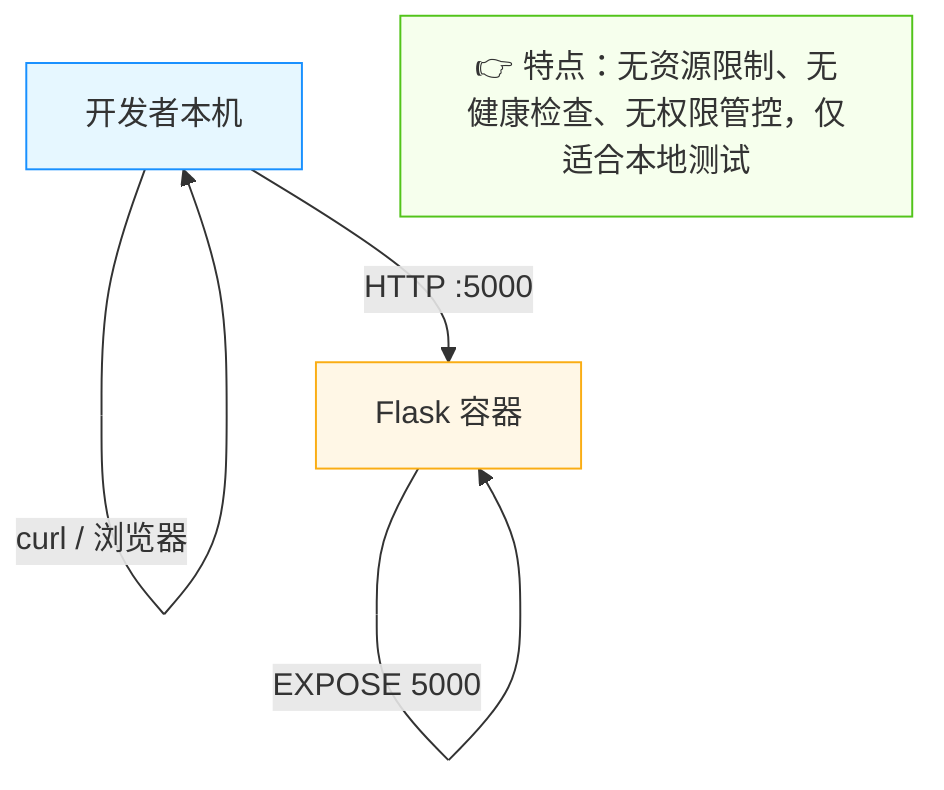
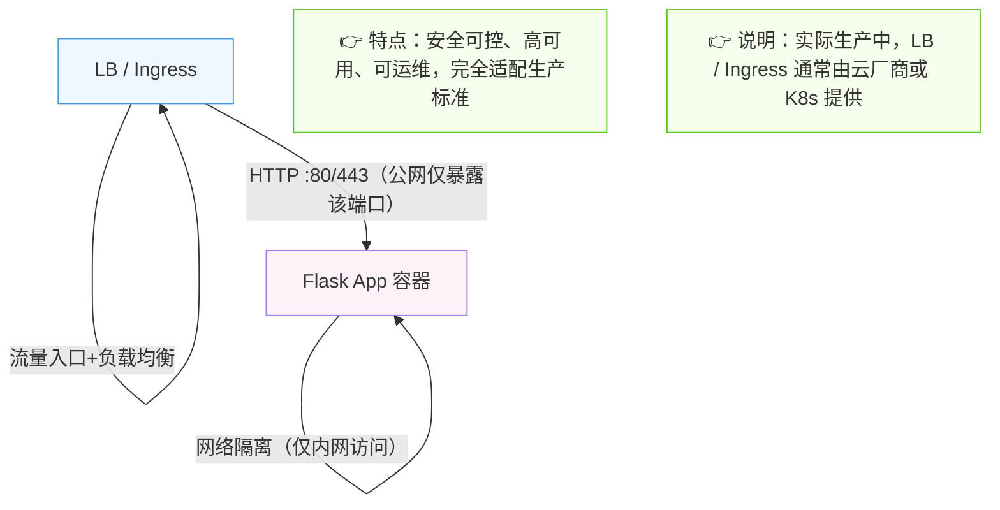
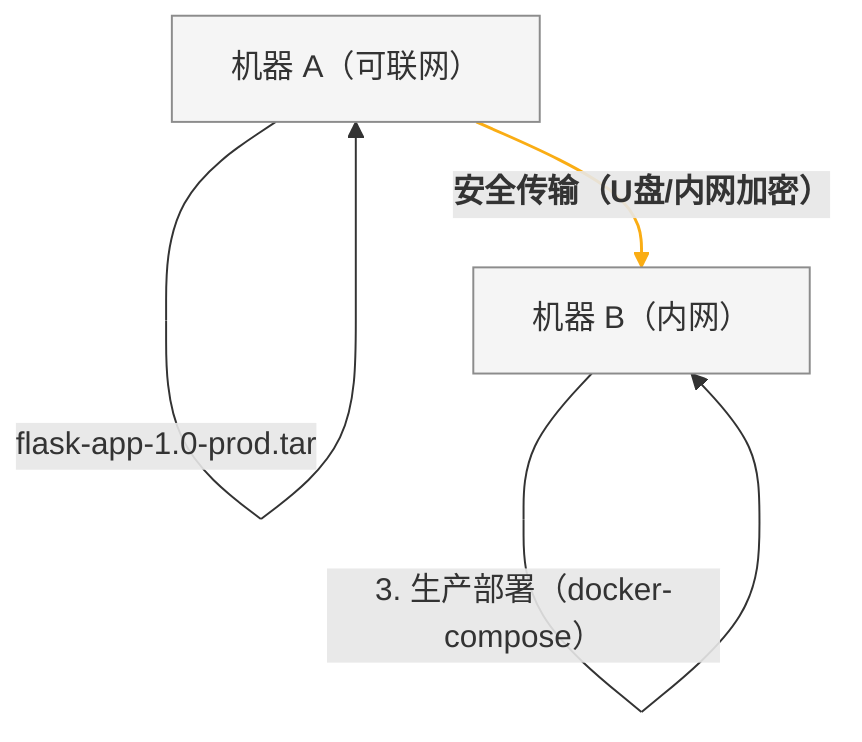

# 从零开始学构建Docker镜像：4种实用方法+生产级实践规范


*分类: Tutorial,Docker | 标签: Docker,tutorial,部署教程 | 发布时间: 2026-01-20 03:26:03*

> 本文偏向生产与工程实践，新手可跳过部分进阶章节（如CI/CD自动化、多阶段构建优化），优先掌握基础构建方法与核心规范。Docker镜像作为容器的“基石”，掌握镜像构建是玩转Docker的核心技能。本文先完成Docker环境搭建，再拆解4种构建方法与实战案例，同时补充**安全声明、生产规范与禁用场景**，适配个人开发、团队协作及准生产环境需求，帮助建立正确的技术认知与实践边界。

本文偏向生产与工程实践，新手可跳过部分进阶章节（如CI/CD自动化、多阶段构建优化），优先掌握基础构建方法与核心规范。Docker镜像作为容器的“基石”，掌握镜像构建是玩转Docker的核心技能。本文先完成Docker环境搭建，再拆解4种构建方法与实战案例，同时补充**安全声明、生产规范与禁用场景**，适配个人开发、团队协作及准生产环境需求，帮助建立正确的技术认知与实践边界。

# 环境准备

在学习镜像构建前，需先确保目标服务器（或本地机器）已安装Docker环境，这是所有操作的基础。

## Docker环境安装

推荐使用以下一键安装脚本，适配主流Linux发行版（CentOS、Ubuntu、Debian等），无需手动配置依赖：

```bash

bash <(wget -qO- https://xuanyuan.cloud/docker.sh)
```

## 验证安装结果

执行安装脚本后，通过以下命令验证Docker是否安装成功：

```bash

docker --version
```

若输出类似 `Docker version 26.0.0, build 2ae903e` 的版本信息，说明Docker环境已成功安装，可继续后续操作。

# 一、标准姿势：用Dockerfile构建（99%生产场景推荐）

Dockerfile是构建镜像的“标准化剧本”，通过纯文本指令定义构建过程，具备**可复现、可维护、易协作、可审计**的特点，是生产环境的唯一推荐方式。

## 核心规范与前置准备

- **必加 .dockerignore 文件**：避免将.git目录、node_modules、日志文件、本地配置等无关文件打入镜像，减小体积并规避敏感信息泄露。
- 示例内容：.dockerignore
```plaintext
.git
.gitignore
node_modules
*.log
.env
.venv
```

- **非root用户优先**：生产镜像必须使用普通用户运行应用，避免容器被入侵后获得root权限，引发全网风险。

- **镜像体积控制**：优先使用slim/alpine基础镜像，通过多阶段构建剥离构建依赖，清理包管理器缓存。

## 核心步骤

1. 编写Dockerfile与.dockerignore文件；

2. 执行构建命令：`docker build -t 镜像名:标签 构建上下文`；

3. 验证结果：`docker images | grep 镜像名`。

## 基础案例（快速上手，非生产级）

以下示例仅用于开发/学习场景，生产环境需补充非root用户、镜像瘦身、安全校验等配置。

```dockerfile

# 基于国内源的Ubuntu 22.04基础镜像（解决DockerHub访问问题）
FROM docker.xuanyuan.run/ubuntu:22.04

# 更新源并安装curl工具（替换国内apt源，加速安装）
RUN sed -i 's/archive.ubuntu.com/mirrors.aliyun.com/g' /etc/apt/sources.list \
    && apt update && apt install -y curl \
    # 清理缓存，减小镜像体积（最佳实践）
    && rm -rf /var/lib/apt/lists/*

# 容器启动后默认进入bash终端
CMD ["bash"]
```

构建命令：

```bash

# 在Dockerfile所在目录执行
docker build -t myubuntu:curl .
```

验证：运行容器并检查curl是否安装成功

```bash

docker run --rm myubuntu:curl curl --version
```

## 实战案例：生产级Python Flask Web应用镜像

适配生产场景，集成非root用户、多阶段构建、生产级启动器（gunicorn）、国内源加速，规避安全风险。

### 步骤 1：准备应用文件

```bash

mkdir flask-demo && cd flask-demo
```

**app.py**

```python

from flask import Flask

app = Flask(__name__)

@app.route("/")
def hello():
    return "Hello Docker! This is a Production-Grade Flask App."
```

**requirements.txt**

```plaintext

flask==2.3.3
gunicorn==21.2.0  # 生产级WSGI服务器，替代Flask内置调试服务器
```

**.dockerignore**

```plaintext

.git
.gitignore
__pycache__/
*.pyc
.env
.venv
node_modules
*.log
```

**说明**：生产环境始终通过 Gunicorn / uWSGI 等 WSGI Server 启动，`if __name__ == "__main__"` 仅用于本地直接运行调试，在容器化生产部署中不应作为启动入口，故app.py中未保留该逻辑。

### 步骤2：编写生产级Dockerfile（多阶段构建）

```dockerfile

# 第一阶段：构建阶段（剥离构建依赖，减小最终镜像体积）
FROM docker.xuanyuan.run/python:3.10-slim AS builder

# 设置pip国内源，加速依赖安装
RUN mkdir -p /root/.pip \
    && echo "[global]\nindex-url = https://pypi.tuna.tsinghua.edu.cn/simple" > /root/.pip/pip.conf

# 安装依赖到临时目录
WORKDIR /build
COPY requirements.txt .
RUN pip install --no-cache-dir -r requirements.txt -t ./vendor \
    && rm -rf /root/.cache/pip

# 第二阶段：运行阶段（仅保留运行时依赖，非root用户运行）
FROM docker.xuanyuan.run/python:3.10-slim

# 1. 安装必要工具（仅root用户可操作，安装后切换普通用户）
RUN apt update && apt install -y --no-install-recommends curl \
    && rm -rf /var/lib/apt/lists/* \
    # 2. 创建普通用户（生产必备，规避root风险）
    && useradd -m -u 1001 appuser  # 指定UID，便于权限管控

# 切换为普通用户，后续操作均无root权限
USER appuser

# 3. 复制构建阶段的依赖
WORKDIR /app
COPY --from=builder /build/vendor ./vendor
ENV PYTHONPATH=/app/vendor  # 配置依赖路径
# 4. 配置gunicorn worker数量（环境变量，支持动态覆盖）
ENV WORKERS=2

# 5. 复制应用代码（普通用户仅有权限操作/app目录）
COPY --chown=appuser:appuser app.py .  # 明确文件权限归属

# 6. 暴露端口（语义声明，非安全边界，不限制访问）
EXPOSE 5000  # 仅用于文档化和工具识别，生产需通过网络策略控制端口访问

# 7. 生产级启动配置（支持环境变量展开与优雅退出）
# 注意：JSON 形式的 ENTRYPOINT / CMD 不会进行环境变量展开，涉及变量时需通过 shell 执行
CMD ["sh", "-c", "gunicorn --bind 0.0.0.0:5000 --workers ${WORKERS} --graceful-timeout 30 app:app"]
```

### 步骤3：构建并验证（本地测试用）

以下运行方式仅用于本地验证镜像是否可用，生产环境请使用docker-compose/Kubernetes，并补充资源限制、重启策略与健康检查。

```bash

# 构建镜像（Tag规范：版本号+环境，禁用latest）
docker build -t flask-app:1.0-prod .

# 本地验证运行（仅测试，无生产级配置）
docker run -d -p 5000:5000 --name flask-prod-test flask-app:1.0-prod

# 验证访问与用户权限
curl http://localhost:5000  # 输出预期内容
docker exec -it flask-prod-test whoami  # 输出appuser，确认非root运行

# 清理测试容器
docker stop flask-prod-test && docker rm flask-prod-test
```

**生产部署补充**：使用docker-compose示例（核心配置）：

```yaml

# docker-compose.prod.yml
version: '3.8'
services:
  flask-app:
    image: flask-app:1.0-prod
    user: 1001  # 与镜像内UID一致，强化权限管控
    ports:
      - "5000:5000"
      # 说明：ports仅用于本地验证或内网部署，
      # 公网生产环境应通过 LB / Ingress / Service 暴露服务，避免直接映射端口
    restart: always  # 生产必备：容器异常自动重启
    # 单机docker-compose生效的资源限制（非Swarm模式）
    mem_limit: 512m  # 内存限制
    cpus: 0.5        # CPU限制
    # 说明：在Docker Compose v3中，mem_limit / cpus仅在非Swarm模式生效；
    # Swarm/Kubernetes需使用对应平台的资源声明方式
    # 若使用Docker Swarm，需替换为以下deploy配置：
    # deploy:
    #   resources:
    #     limits:
    #       cpus: '0.5'
    #       memory: 512M
    healthcheck:  # 健康检查（适配镜像内环境，无curl依赖，推荐写法）
      test: ["CMD", "python", "-c", "import urllib.request; urllib.request.urlopen('http://localhost:5000/')"]
      interval: 30s
      timeout: 10s
      retries: 3
    networks:  # 网络隔离，仅允许指定服务访问
      - app-net
networks:
  app-net:
    driver: bridge
```

# 二、临时方案：从已有容器“手搓”镜像（仅调试用）

**严禁用于生产环境！严禁作为正式镜像构建手段！不满足审计、复现、CI/CD要求！**

该方式仅适用于个人调试、问题复盘、临时保存环境状态，生成的镜像为“黑盒”，无构建记录、不可追溯，企业安全审计将直接驳回。

## 核心步骤

1. 启动并进入容器：`docker run -it 国内源基础镜像 bash`；

2. 在容器内手动操作（装软件、改配置）；

3. 另开终端提交镜像：`docker commit 容器ID 新镜像名:标签`。

## 基础案例（仅调试，无生产价值）

```bash

# 1. 启动国内源的Ubuntu容器（调试用，默认root，仅本地操作）
docker run -it --name nginx-temp docker.xuanyuan.run/ubuntu:22.04 bash

# 2. 在容器内手动安装Nginx（调试过程，无记录可追溯）
sed -i 's/archive.ubuntu.com/mirrors.aliyun.com/g' /etc/apt/sources.list \
    && apt update && apt install -y nginx && rm -rf /var/lib/apt/lists/*

# 3. 另开终端，查询容器ID
docker ps  # 输出示例：CONTAINER ID 为 abc123456789

# 4. 提交镜像（仅保存调试状态，不可用于上线）
docker commit abc123456789 mynginx:test-only  # 标签注明test-only，规避误用
```

# 三、离线方案：从tar包导入镜像（迁移/离线部署）

适配内网环境、无网络服务器场景，核心分为“极简镜像导入”和“完整镜像迁移”，生产优先选择完整镜像迁移。

## 场景1：导入rootfs包（制作极简镜像，生产需二次加固）

rootfs是Linux根文件系统，导入后无Dockerfile层级，无法进行漏洞扫描、SBOM生成与镜像溯源，适合制作超精简基础镜像；生产使用前需补充非root用户、安全配置，否则无法通过安全审计。

```bash

# 从国内镜像站获取精简rootfs.tar包后导入
docker import rootfs.tar myminios:v1.0

# 生产加固：基于该镜像编写Dockerfile，添加非root用户、权限管控后再使用
# 严禁直接将rootfs导入的镜像用于生产
```

## 场景2：加载完整镜像（推荐，生产级迁移）

用`docker save`导出完整镜像（保留层级、标签、用户配置），`docker load`导入，是跨机器迁移的标准生产方式。

### 实战案例：跨机器迁移生产级Flask镜像

```bash

# 机器A（可联网，构建镜像后导出）
docker save -o flask-app-1.0-prod.tar flask-app:1.0-prod  # 导出完整镜像
# 通过U盘/内网传输tar包到机器B（内网服务器）

# 机器B（内网，导入后直接使用）
docker load -i flask-app-1.0-prod.tar
# 生产部署：使用docker-compose启动，沿用生产级配置
docker-compose -f docker-compose.prod.yml up -d
```

# 四、进阶技巧：自定义Dockerfile/传参构建（生产级灵活适配）

适配多环境（测试/预发/生产）、多版本构建需求，结合CI/CD流程实现自动化构建，规避手动操作风险。

## 技巧1：指定非默认Dockerfile（多环境隔离）

```bash

# 测试环境Dockerfile：Dockerfile.test
# 生产环境Dockerfile：Dockerfile.prod（前文案例）
docker build -f Dockerfile.prod -t flask-app:1.0-prod .  # 明确构建生产环境镜像
```

## 技巧2：传递构建参数（多版本构建，CI/CD适配）

### 实战案例：构建不同版本的Node.js生产级镜像

```dockerfile

# Dockerfile
# 注意：ARG 在 FROM 前声明需 Docker 17.05+，老版本 Docker 不支持该语法
ARG NODE_VERSION=18  # 构建参数，默认Node 18
# 基于国内源的alpine镜像（体积更小，生产推荐）
FROM docker.xuanyuan.run/node:${NODE_VERSION}-alpine

# 生产配置：创建非root用户、设置npm国内源
RUN addgroup -g 1001 -S nodejs \
    && adduser -S nodejs -u 1001 \
    && npm config set registry https://registry.npmmirror.com  # npm国内源
USER nodejs  # 切换非root用户

WORKDIR /app
COPY --chown=nodejs:nodejs package*.json ./
RUN npm ci --only=production  # 生产级安装，仅安装依赖，无devDependencies
COPY --chown=nodejs:nodejs . .

EXPOSE 3000
CMD ["node", "server.js"]
```

构建命令（适配CI/CD自动化传递参数）：

```bash

# 构建Node 18生产镜像
docker build --build-arg NODE_VERSION=18 -t node-app:18-prod .
# 构建Node 20生产镜像
docker build --build-arg NODE_VERSION=20 -t node-app:20-prod .
```

## CI/CD中自动化构建补充

生产环境需通过CI/CD（Jenkins、GitLab CI等）自动化构建镜像，核心规范：

- 镜像Tag：使用`版本号-环境-commit哈希`（如v1.0-prod-abc123），严禁使用latest（无法追溯版本）；

- 构建校验：添加Dockerfile语法检查、镜像安全扫描（如Trivy），高危漏洞阻断构建；

- 镜像推送：构建完成后推送至私有镜像仓库（如Harbor），开启仓库认证与权限管控。

# 五、生产级核心规范与风险边界

## 国内环境适配规范

1. 镜像源：优先使用`docker.xuanyuan.run`、阿里云镜像仓库，避免直接访问DockerHub；
企业生产环境建议使用自建Harbor仓库或云厂商官方镜像仓库，并开启镜像签名与漏洞扫描，确保镜像来源可信。

2. 包管理器源：apt/yum/pip/npm同步替换国内源，提升构建速度，避免依赖拉取失败；

3. 全局加速：Docker守护进程配置全局镜像加速（如阿里云加速器），无需每次手动替换镜像地址。

## 安全红线（严禁触碰）

1. 🔴 严禁生产镜像使用root用户运行应用，必须创建普通用户并指定UID；

2. 🔴 严禁用`docker commit`生成的镜像上线，无审计、无复现能力；

3. 🔴 严禁直接使用rootfs导入的镜像生产，需二次加固（加用户、限权限）；

4. 🔴 严禁暴露容器端口到公网，需通过LB/Ingress+网络策略管控访问。

## 四种构建方式适用场景对照表

|构建方式|适用场景|生产可用性|核心优势|核心风险/限制|
|---|---|---|---|---|
|Dockerfile构建（多阶段）|生产/预发/测试全环境、团队协作、CI/CD自动化|✅ 推荐（完全适配）|可复现、可审计、体积小、安全可控|需编写Dockerfile，学习成本略高|
|docker commit|个人本地调试、问题复盘、临时保存环境|❌ 禁用（无生产价值）|操作快捷、无需编写Dockerfile|黑盒镜像、不可追溯、无安全管控|
|rootfs导入|制作极简基础镜像、内网特殊环境|⚠️ 需二次加固（部分适配）|镜像体积极小、自定义程度高|无层级、需手动补安全配置|
|docker save/load|跨机器迁移、内网离线部署、完整镜像复用|✅ 推荐（完全适配）|保留镜像完整信息、迁移无损耗|tar包体积较大，需安全传输|
# 六、文字版架构图（开发vs生产对照）

## 1. 开发环境（Flask示例，仅本地验证）


## 2. 生产环境（Flask示例，推荐形态）


## 3. 镜像迁移流程（生产级）


# 七、常见踩坑与镜像Tag规范

## 7.1 常见踩坑指南

- **alpine + glibc 问题**：alpine镜像体积极小，但基于musl libc而非glibc，部分依赖glibc的软件（如部分Python/C++扩展）会运行失败。解决方案：使用slim镜像，或在alpine中手动安装glibc。

- **pip编译依赖失败**：安装需要编译的Python包（如pandas）时，slim/alpine镜像可能缺少gcc、make等编译工具。解决方案：构建阶段安装编译依赖（apt install gcc make），运行阶段剥离；或直接使用含编译工具的基础镜像。

- **时区/字符集问题**：容器默认时区多为UTC，字符集可能非UTF-8，导致日志乱码、时间计算错误。解决方案：Dockerfile中添加`RUN ln -snf /usr/share/zoneinfo/Asia/Shanghai /etc/localtime && echo Asia/Shanghai > /etc/timezone`配置时区，设置`ENV LANG=C.UTF-8`指定字符集。

## 7.2 镜像Tag规范示例

生产环境镜像Tag需具备“可追溯、易区分”特性，严禁使用latest，推荐规范：

```plaintext

# 格式：版本号-环境-commit哈希（可选：构建时间）
flask-app:1.0-prod-abc123          # 生产环境，版本1.0，对应代码commit abc123
flask-app:1.0-test-def456          # 测试环境，版本1.0，对应代码commit def456
flask-app:1.0-dev-ghi789-20260120  # 开发环境，版本1.0，构建时间2026年1月20日

# 临时镜像标记（仅调试用）
flask-app:test-only-xxx            # 明确标注test-only，规避误用于生产
```

# 八、总结

本文围绕“开发可用、生产合规”核心，覆盖Docker镜像构建的全场景方法与工程规范，兼顾安全审计、运维管控与可追溯性，核心原则需牢记：

1. 环境先行：先通过一键脚本安装Docker并验证，国内环境优先配置镜像源加速，企业级场景需搭建Harbor等可信镜像仓库，确保镜像来源可追溯；

2. 规范为要：生产级镜像必须采用Dockerfile多阶段构建、非root用户运行，禁用`docker commit`与直接导入rootfs的方式，镜像Tag遵循“版本-环境-commit”规范，规避黑盒镜像风险；

3. 风险可控：严格区分开发与生产配置，端口暴露需通过LB/Ingress管控，补充资源限制、健康检查与优雅退出配置，提前规避权限泄露、依赖缺失等问题；

4. 细节为王：关注Docker版本兼容性、基础镜像特性与工具依赖，规避alpine glibc、时区乱码等常见踩坑点；掌握CMD/ENTRYPOINT环境变量展开规则（JSON形式不展开变量，需通过shell执行），通过添加优雅超时、动态配置等写法，提升镜像生产适配性。

掌握以上方法与规范，可高效覆盖从开发调试到生产部署的全场景镜像构建需求，同时满足企业安全审计与运维管控要求，真正实现“构建即合规”，为容器化落地筑牢基础。

