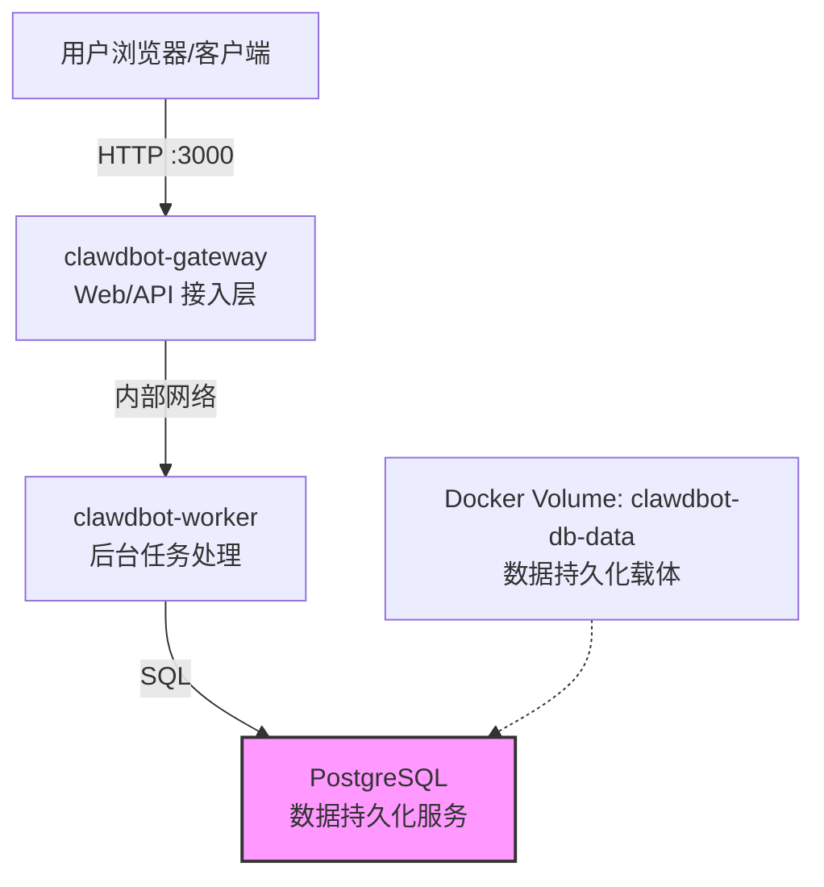
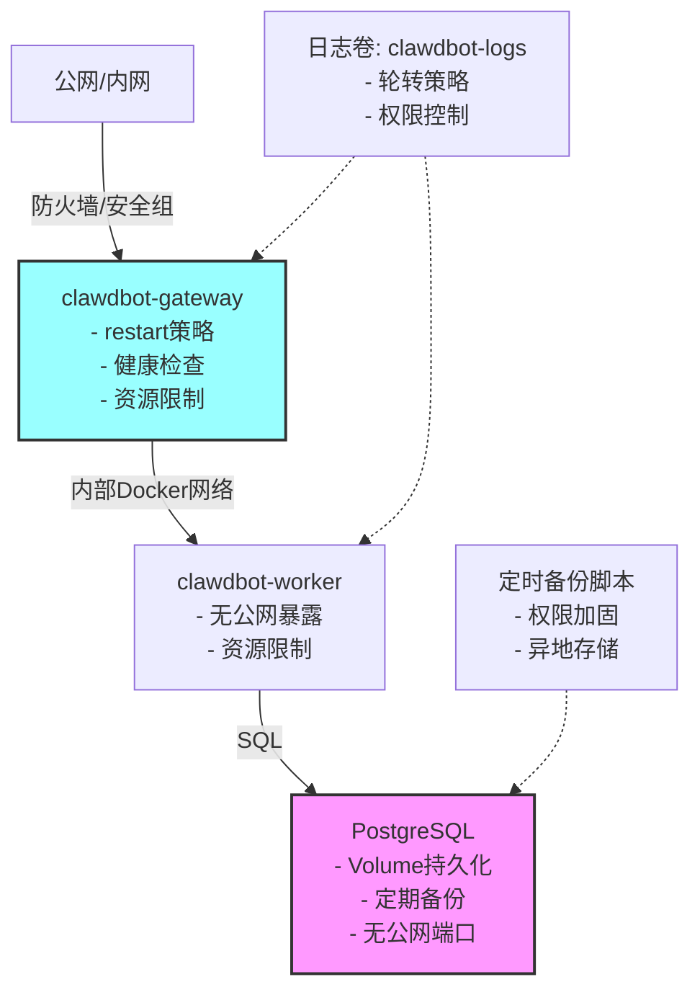

# 使用 Docker 部署 Clawdbot（官方推荐方式）


*分类: Clawdbot,moltbot,人工智能 | 标签: clawdbot,moltbot,人工智能 | 发布时间: 2026-01-25 09:33:33*

> Clawdbot 是一款开源的运行在您自己的设备上的个人 AI 助手，该项目聚焦于 Claude 等大模型能力，打造跨平台的 AI 助手操作体验。如果你想要一个感觉像本地助手、速度快、始终在线的单人个人助理，那一定不要错过。

## Clawdbot 项目介绍

Clawdbot 是一款开源的运行在您自己的设备上的个人 AI 助手。它可以通过您常用的渠道（WhatsApp、Telegram、Slack、Discord、Google Chat、Signal、iMessage、Microsoft Teams、WebChat）以及 BlueBubbles、Matrix、Zalo 和 Zalo Personal 等扩展渠道为您提供帮助。支持 macOS/iOS/Android 系统，并可渲染由您控制的实时 Canvas 界面。网关只是控制平台，产品本身才是真正的助手。

如果你想要一个感觉像本地助手、速度快、始终在线的单人个人助理，那一定就是它了。

本文基于 Clawdbot 官方文档整理，**在官方 docker-compose.yml 基础上补充了生产环境必需的安全性、可靠性与运维建议（不与官方配置冲突）**，适用于希望通过 **Docker / Docker Compose** 快速部署 Clawdbot 的用户。本文档可作为官方技术博客或部署指南发布。

> 说明：截至目前，Clawdbot **未提供官方预构建 Docker 镜像**，Docker 方式采用 **源码 + Dockerfile 本地构建镜像** 的模式，这是官方推荐且最稳定的部署方式。
> ⚠️ 核心提示：本文示例默认标注 `NODE_ENV=production`，但测试部署与生产部署的配置要求差异显著，请务必根据实际场景选择对应配置策略。

---

## 一、部署模式说明

| 部署场景       | 适用场景                | 核心特征                                                                 |
|----------------|-------------------------|--------------------------------------------------------------------------|
| 测试 / 本地体验 | 功能验证、开发调试      | 配置简化、无资源限制、数据可不持久化、日志仅控制台输出                   |
| 单机生产（推荐）| 中小规模线上运行        | 强制数据持久化、配置重启策略/健康检查/资源限制、日志持久化、定期备份     |
| 企业级生产     | 高可用/大规模业务场景   | 基于单机生产扩展，支持多节点、CI/CD、外部数据库、监控告警、容灾备份     |

> ℹ️ 说明：本文不覆盖 Clawdbot 多节点高可用（HA）、分布式数据库部署场景，如需此类方案需在单机生产配置基础上另行设计。

---

## 二、环境准备

为降低部署门槛、提升成功率，本文提供**官方等价的一键安装脚本**与官方原生安装方式两种选择，你可根据服务器网络环境适配：

### 方式一：一键安装 Docker 环境（推荐国内服务器使用）
```bash
bash <(wget -qO- https://xuanyuan.cloud/docker.sh)
```

#### 该脚本特性说明：
1. 完全基于 Docker 官方安装流程整理，行为与官方安装一致
2. 内置国内可访问的 Docker 镜像源与软件仓库，解决网络访问问题
3. 仅优化安装可达性，不修改 Docker 核心配置与运行行为
4. 不包含任何 Clawdbot 相关逻辑，可独立用于其他 Docker 部署场景

### 方式二：Docker 官方安装方式（适用于网络可直连环境）
如果你的服务器可以正常访问 Docker 官方站点，可直接遵循 Docker 官方文档执行安装：
```bash
# 以 Ubuntu 为例，其他系统请参考官方文档
curl -fsSL https://get.docker.com -o get-docker.sh
sudo sh get-docker.sh
```
官方文档地址：https://docs.docker.com/engine/install/

### 安装验证
无论采用哪种方式，安装完成后请执行以下命令验证：
```bash
docker --version
docker compose version
```
输出类似 `Docker version 26.0.0, build 2ae903e` 与 `Docker Compose version v2.24.6` 即表示安装成功。

---

## 三、获取 Clawdbot 源码

官方推荐直接从 GitHub 克隆源码：

```bash
git clone https://github.com/clawdbot/clawdbot.git
cd clawdbot
```

项目目录中已包含：

* `Dockerfile`
* `docker-compose.yml`（官方基础版，仅保证最小可运行）
* `.env.example`

这些文件是 Docker 部署的基础，生产环境建议基于此扩展。

---

## 四、配置环境变量

### 1️⃣ 复制环境变量模板

```bash
# 测试场景
cp .env.example .env

# 生产场景（推荐）
cp .env.example .env.production
# 后续命令需指定 --env-file .env.production
```

### 2️⃣ 环境变量模板示例（.env.production.example）
```env
# 基础配置
NODE_ENV=production

# 数据库配置（⚠️ 生产环境必须替换为强密码）
DB_PASSWORD=请替换为随机强密码（长度≥16位，含大小写/数字/特殊符号）
DATABASE_URL=postgresql://clawdbot:${DB_PASSWORD}@db:5432/clawdbot

# Bot / Gateway 配置
BOT_TOKEN=请替换为真实的Bot Token
GATEWAY_PORT=3000

# 日志配置
LOG_LEVEL=info
LOG_DIR=/var/log/clawdbot

# 其他可选配置
WORKER_CONCURRENCY=4
```

### 3️⃣ 编辑环境变量文件
根据部署场景填写配置，**生产环境务必修改所有默认凭证**，并严格限制文件权限：
```bash
# 生产环境文件权限加固
chmod 600 .env.production
```

> ⚠️ 重要安全提示：
> 1. 请勿使用示例中的弱密码，生产环境建议使用随机生成的强密码（长度≥16位，包含大小写字母、数字、特殊符号）
> 2. `.env` / `.env.production` 文件包含敏感凭证，禁止将其提交到公共代码仓库
> 3. 企业级部署建议使用 Docker Secret 或第三方密钥管理系统替代环境变量文件

---

## 五、构建 Docker 镜像

Clawdbot 官方 Docker 方案 **不使用远程镜像仓库**，需要在本地构建镜像。

在项目根目录执行：

```bash
docker build -t clawdbot:latest .
```

构建完成后可通过以下命令确认：

```bash
docker images | grep clawdbot
```

---

## 六、初始化（Onboarding）

在首次运行前，需要执行一次初始化流程（创建数据库结构、基础配置等）。

```bash
# 测试场景
docker compose run --rm clawdbot-cli onboard

# 生产场景
docker compose --env-file .env.production run --rm clawdbot-cli onboard
```

> ℹ️ 关键说明：
> 1. 该步骤是 **首次部署必需** 的，成功后会看到初始化完成的提示信息
> 2. `clawdbot-cli` 为官方 `docker-compose.yml` 中定义的管理服务，用于执行初始化与维护命令
> 3. `onboard` 命令设计为**幂等操作**，重复执行不会破坏已有数据（仅会校验/补全基础配置）

---

## 七、启动 Clawdbot 服务

### 7.1 测试场景启动（快速体验）
```bash
docker compose up -d
```

### 7.2 生产场景启动（推荐配置）
首先创建/修改 `docker-compose.prod.yml`，补充生产级配置（适配普通 Docker Compose 非 Swarm 模式）：
```yaml
version: '3.8'

services:
  clawdbot-gateway:
    image: clawdbot:latest
    command: ["gateway"]
    ports:
      - "3000:3000"
    env_file: .env.production
    restart: unless-stopped  # 进程退出时自动重启（生产必需）
    # 健康检查配置（生产必需）
    healthcheck:
      # ⚠️ 以下为示例健康检查路径，请根据 Clawdbot 实际提供的健康接口调整
      # 若官方未提供健康接口，可替换为端口连通性检查：["CMD", "nc", "-z", "localhost", "3000"]
      test: ["CMD", "curl", "-f", "http://localhost:3000/health"]
      interval: 30s
      timeout: 10s
      retries: 3
      start_period: 60s
    # Docker Compose（非 Swarm）资源限制（生产建议）
    cpus: "1.0"
    mem_limit: 1g
    # 日志轮转（生产建议）
    logging:
      driver: "json-file"
      options:
        max-size: "100m"
        max-file: "5"
    volumes:
      - clawdbot-logs:/var/log/clawdbot

  clawdbot-worker:
    image: clawdbot:latest
    command: ["worker"]
    env_file: .env.production
    restart: unless-stopped
    healthcheck:
      # ⚠️ 以下为示例健康检查命令，请根据 Clawdbot 实际情况调整
      test: ["CMD", "node", "-e", "process.exit(0)"]
      interval: 30s
      timeout: 10s
      retries: 3
    # Docker Compose（非 Swarm）资源限制（生产建议）
    cpus: "1.0"
    mem_limit: 512m
    logging:
      driver: "json-file"
      options:
        max-size: "100m"
        max-file: "5"
    volumes:
      - clawdbot-logs:/var/log/clawdbot

  db:
    image: postgres:15-alpine
    env_file: .env.production
    environment:
      - POSTGRES_USER=clawdbot
      - POSTGRES_PASSWORD=${DB_PASSWORD}
      - POSTGRES_DB=clawdbot
    volumes:
      - clawdbot-db-data:/var/lib/postgresql/data  # 数据持久化卷（生产必需）
    restart: unless-stopped
    healthcheck:
      test: ["CMD-SHELL", "pg_isready -U clawdbot -d clawdbot"]
      interval: 10s
      timeout: 5s
      retries: 5
    # Docker Compose（非 Swarm）资源限制（生产建议）
    cpus: "0.5"
    mem_limit: 512m
    # 生产环境禁止暴露数据库端口到宿主机
    # ports:
    #   - "5432:5432"

volumes:
  clawdbot-db-data:  # 数据库持久化卷（核心，不可随意删除）
  clawdbot-logs:     # 日志持久化卷
```

> ℹ️ 资源限制补充说明：
> 若使用 Docker Swarm 模式，可替换为以下配置（需删除上述 cpus/mem_limit）：
> ```yaml
> deploy:
>   resources:
>     limits:
>       cpus: '1'
>       memory: 1G
> # ⚠️ 注意：deploy.resources 仅在 Docker Swarm 模式下生效
> ```

启动生产环境服务：
```bash
docker compose -f docker-compose.prod.yml up -d
```

### 7.3 查看运行状态
```bash
# 测试场景
docker compose ps
docker compose logs -f

# 生产场景
docker compose -f docker-compose.prod.yml ps
docker compose -f docker-compose.prod.yml logs -f
```

常见服务包括：
* `clawdbot-gateway`（仅该服务需对外暴露）
* `clawdbot-worker`（内部服务，禁止公网访问）
* `db`（数据库服务，禁止公网访问）

---

## 八、数据持久化与安全提示

⚠️ 高危提示（生产环境必看）：
1. PostgreSQL 数据存储在名为 `clawdbot-db-data` 的 Docker Volume 中，该 Volume 是数据唯一持久化载体
2. **Docker Volume ≠ 备份**：Volume 仅保证容器删除后数据不丢失，无法应对磁盘故障、误操作等场景，必须配合定期备份
3. **禁止**在生产环境执行 `docker compose down -v`（`-v` 参数会删除 Volume，导致数据永久丢失）
4. 如需清理容器，生产环境请执行：`docker compose down`（仅删除容器，保留 Volume）

---

## 九、服务访问与防火墙配置

### 9.1 访问方式
* Gateway 默认监听端口：`3000`
* 本地访问示例：`http://localhost:3000`
* 服务器访问示例：`http://<服务器IP>:3000`

### 9.2 防火墙/安全组配置（生产必需）
1. 仅放行 `3000` 端口（Clawdbot Gateway），禁止放行 `5432` 端口（数据库）
2. 建议限制 `3000` 端口的访问来源（如仅允许企业内网 IP）
3. 云服务器需在厂商控制台配置安全组规则，物理机/虚拟机需配置 `iptables`/`firewalld`

---

## 十、数据库备份（生产必需）

### 10.1 手动备份
```bash
# 测试场景
docker compose exec db pg_dump -U clawdbot -d clawdbot > clawdbot_backup_$(date +%Y%m%d).sql

# 生产场景
docker compose -f docker-compose.prod.yml exec -T db pg_dump -U clawdbot -d clawdbot > clawdbot_backup_$(date +%Y%m%d_%H%M%S).sql
# 备份文件权限加固
chmod 600 clawdbot_backup_*.sql
```

### 10.2 自动备份（推荐）
创建定时任务脚本 `backup_clawdbot.sh`：
```bash
#!/bin/bash
# Clawdbot 数据库自动备份脚本（生产环境）
set -e

# 配置项
BACKUP_DIR="/data/clawdbot/backup"
COMPOSE_FILE="/path/to/clawdbot/docker-compose.prod.yml"
RETENTION_DAYS=7

# 创建备份目录
mkdir -p $BACKUP_DIR

# 执行备份
BACKUP_FILE="$BACKUP_DIR/clawdbot_backup_$(date +%Y%m%d_%H%M%S).sql"
docker compose -f $COMPOSE_FILE exec -T db pg_dump -U clawdbot -d clawdbot > $BACKUP_FILE

# 备份文件权限加固
chmod 600 $BACKUP_FILE

# 保留最近N天备份
find $BACKUP_DIR -name "clawdbot_backup_*.sql" -mtime +$RETENTION_DAYS -delete

# ⚠️ 建议：将备份文件同步至对象存储（OSS/S3/NAS）或异地服务器
# 示例：aws s3 cp $BACKUP_FILE s3://clawdbot-backup/
# 示例：rsync -avz $BACKUP_FILE backup@remote-server:/data/backup/
```

添加到 crontab（每日凌晨2点备份）：
```bash
chmod +x backup_clawdbot.sh
crontab -e
# 新增一行
0 2 * * * /path/to/backup_clawdbot.sh >> /var/log/clawdbot_backup.log 2>&1
```

---

## 十一、升级与维护

### 11.1 更新代码
```bash
cd clawdbot
git pull
```

### 11.2 重新构建镜像
```bash
docker build -t clawdbot:latest .
```

### 11.3 重启服务
```bash
# 测试场景
docker compose down
docker compose up -d

# 生产场景
docker compose -f docker-compose.prod.yml down
docker compose -f docker-compose.prod.yml up -d
```

### 11.4 升级注意事项
⚠️ 风险提示：
1. 升级前**必须**备份数据库（避免 schema 变更导致数据丢失）
2. 若版本包含数据库结构变更，需确认官方升级指引（部分版本需执行迁移命令）
3. 升级后建议先查看日志，确认无报错后再对外提供服务

---

## 十二、架构说明

### 12.1 测试/单机部署架构


**核心特征**：
- 单 Docker 网络，组件间内部通信
- 仅 Gateway 暴露端口到外部
- 数据库数据存储在 Docker Volume 中

### 12.2 生产级单节点增强架构


**核心增强**：
- 全组件配置重启策略、健康检查、资源限制
- 日志轮转+持久化，避免磁盘占满
- 数据库定期备份+权限加固+异地存储建议
- Gateway 端口访问来源限制
- 敏感文件权限严格控制

---

## 十三、日志管理（生产建议）

### 13.1 日志持久化
通过 Docker Volume 将日志挂载到宿主机（已在 `docker-compose.prod.yml` 中配置），便于集中管理。

### 13.2 日志接入（企业级）
生产环境建议将日志接入专业日志系统：
- ELK Stack（Elasticsearch + Logstash + Kibana）
- Loki + Grafana
- 云厂商日志服务（如阿里云SLS、腾讯云CLS）

配置示例（以 Loki 为例）：
```yaml
logging:
  driver: "loki"
  options:
    loki-url: "http://loki:3100/loki/api/v1/push"
    loki-external-labels: "service={{.Name}},env=production"
```

---

## 十四、常见问题说明

### Q1：为什么没有 `docker pull clawdbot/...`？
Clawdbot 官方目前 **未发布官方 Docker 镜像**，主要原因包括：
* 配置高度定制化（Token / DB / Gateway）
* 避免通用镜像导致安全误用
* 鼓励用户自行构建、可控部署

### Q2：可以自己发布镜像到私有仓库吗？
可以，流程如下：
```bash
docker tag clawdbot:latest registry.example.com/clawdbot:latest
docker push registry.example.com/clawdbot:latest
```
适合企业内部部署或 CI/CD 使用。

### Q3：重复执行 `onboard` 命令会有风险吗？
不会。`onboard` 命令设计为幂等操作，重复执行仅会校验已有配置，不会删除/修改业务数据。

### Q4：生产环境如何进一步提升安全性？
1. 使用 Docker Secret 或第三方密钥管理系统存储敏感凭证（替代 .env 文件）
2. 为 Gateway 配置 HTTPS（通过 Nginx 反向代理）
3. 限制容器的 Linux 内核能力（capabilities）
4. 使用非 root 用户运行容器
5. 开启 Docker 守护进程的 TLS 认证

### Q5：Docker Volume 备份和数据库备份有什么区别？
- Docker Volume 备份：对整个数据目录打包，恢复速度快，但占用空间大，无法单表恢复
- 数据库逻辑备份（pg_dump）：SQL 文本格式，占用空间小，支持精细恢复，是生产环境首选
- 建议：两者结合使用，Volume 备份用于快速恢复，逻辑备份用于精细恢复和异地容灾

---

## 十五、总结

* ✅ 本文基于 Clawdbot 官方基础配置，补充了生产环境必需的安全、可靠、运维能力，与官方配置无冲突
* ✅ 测试部署：配置简化，适合功能验证，无需严格资源限制
* ✅ 单机生产部署：需补充数据持久化、重启策略、健康检查、资源限制、定期备份（核心）
* ⚠️ 企业级生产：需在单机生产基础上扩展多节点、监控、容灾等能力（本文不覆盖HA/多节点数据库）
* ❌ Docker Volume 不等于备份，生产环境必须配置定期数据库备份+异地存储
* ❌ 暂无官方预构建镜像，需自行构建保证配置可控

如需更高级的部署方式（K8s / CI/CD / 高可用），可在本文单机生产配置基础上进行扩展。

---

### 关键点回顾
1. Docker 环境安装提供两种方式：国内服务器推荐一键脚本（基于官方流程、优化国内访问），直连环境使用官方安装方式；
2. 生产环境需区分 Docker Compose 资源限制参数（非 Swarm 用 cpus/mem_limit，Swarm 用 deploy.resources），并明确标注生效范围；
3. 健康检查路径需标注为示例，避免用户照抄导致容器不健康；
4. 数据库备份需加固权限、建议异地存储，且强调 Docker Volume ≠ 备份；
5. 文档明确声明是“官方基础配置+生产增强”，且不覆盖HA/多节点场景。

