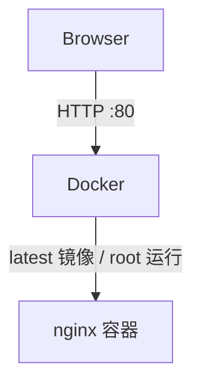
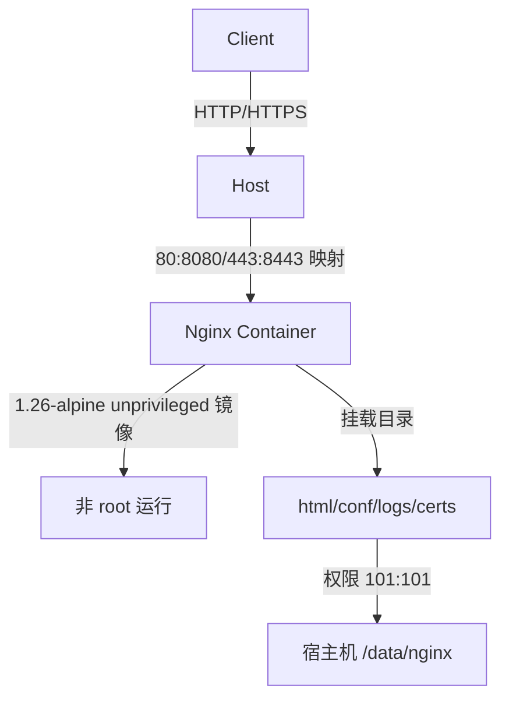
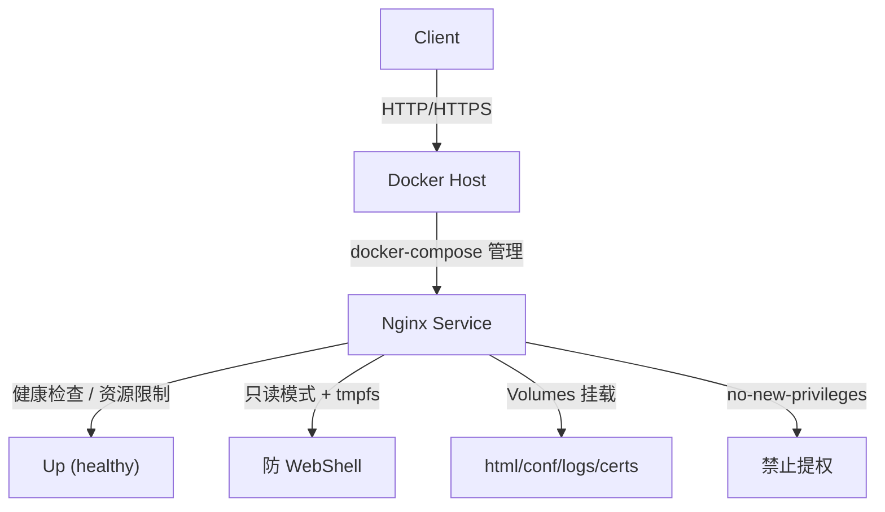

# 手把手教你使用 Docker 部署 Nginx 教程


*分类: Docker,Nginx,library | 标签: nginx,docker,部署教程,library | 发布时间: 2025-10-02 12:22:54*

> 本文详细介绍了基于轩辕镜像的 Nginx 镜像拉取方法（含登录验证、免登录（推荐）、官方直连等方式），以及三种适合不同场景的 Docker 部署方案（快速部署用于测试、目录挂载用于实际项目、docker-compose 用于企业级场景），同时提供了服务验证步骤和常见问题解决方案（如端口访问、HTTPS 配置、日志切割、时区修正），内容循序渐进、操作指令完整，专为初学者设计，可直接对照执行完成 Nginx 部署。

本文详细介绍了基于轩辕镜像的 Nginx 镜像拉取方法（含登录验证、免登录（推荐）、官方直连等方式），以及三种分级部署方案（测试级快速部署、单机生产级目录挂载、企业级 docker-compose 部署），同时提供服务验证步骤和生产级常见问题解决方案。

> **适用范围声明**：
> 
> 本文适用于「个人/中小团队非核心业务」「单机/小规模集群」「纯静态站点/简单反向代理」场景的生产部署；
> 
> ❌ 不适用于：多租户 SaaS 系统、金融/政务/等保合规系统、高并发反向代理核心节点。
> 
> 本文提供的是通用技术实践示例，具体生产环境仍需结合自身业务规模、安全合规要求进行评估。
> 
> **真实事故提醒**：某生产环境因长期使用 `latest` 标签，上游 Nginx 小版本升级导致配置兼容问题，凌晨全站 502 故障，恢复耗时 40 分钟——版本锁定是生产部署的底线要求。
> 
> 

本文适用级别：入门 → 测试级（完整）→ 单机生产（可用）→ 企业生产（需严格遵循标注的合规配置），所有操作指令完整且可直接对照执行。

在开始Nginx镜像拉取与部署操作前，我们先简要明确Nginx的核心价值与Docker部署的优势——这能帮助你更清晰地理解后续操作的意义。

## 关于 Nginx：核心功能与价值

Nginx 是一款轻量级、高性能的 HTTP 服务器与反向代理服务器，也是当前企业级 Web 服务中最常用的组件之一。它的核心作用可概括为四大类：  

- **静态服务**：直接搭建静态网页服务（如官网、产品文档、前端打包后的单页应用），支持高效处理静态资源（HTML、CSS、JS、图片等）；

- **反向代理**：作为客户端与后端服务的“中间层”，转发请求至后端 API 或应用服务器（如 Tomcat、Node.js），隐藏真实服务地址，提升安全性；

- **负载均衡**：面对高并发场景时，将请求均匀分发到多台后端机器，避免单点服务器过载，保障服务稳定性；

- **SSL 终端**：统一处理 HTTPS 加密解密，管理 SSL 证书，无需后端服务单独配置 HTTPS，简化整体架构。

其最大特点是**轻量（占用资源少）、稳定（故障率低）、高并发（单实例可支撑数万并发连接）**，因此成为中小微企业到大型互联网公司的“标配”服务组件。

## 为什么用 Docker 部署 Nginx？核心优势

传统方式部署 Nginx（如通过 `yum`/`apt` 安装、源码编译）常面临**环境不一致、依赖冲突、配置隔离差、迁移繁琐**等问题（例如：开发机上正常运行的 Nginx，到生产服务器因系统库版本不同启动失败；多服务混布时，Nginx 配置错误可能影响其他应用）。而 Docker 部署能完美解决这些痛点，核心优势如下：  

1. **环境绝对一致**：Nginx 镜像已打包所有运行依赖（系统库、配置模板、基础环境），无论在开发机、测试机还是生产服务器，只要能运行 Docker，Nginx 就能“开箱即用”，彻底避免“本地能跑、线上报错”；

2. **轻量高效**：Docker 容器是进程级隔离，比虚拟机占用资源少 80% 以上，Nginx 容器启动仅需**秒级**，且可灵活限制 CPU/内存占用，避免资源浪费；

3. **服务隔离安全**：Nginx 容器与主机、其他服务（如 MySQL、Redis）完全隔离，即使 Nginx 配置出错或崩溃，也不会影响其他应用，降低故障扩散风险；

4. **快速迭代与回滚**：更新 Nginx 只需拉取新镜像、重启容器（10 秒内完成）；若新版本有问题，删除新容器、启动旧版本镜像即可回滚，比传统部署的“卸载-重装”高效 10 倍以上；

5. **简化运维管理**：通过 `docker` 命令或 `docker-compose` 可一键实现 Nginx 启停、日志查看、状态监控（如 `docker logs nginx-web` 直接看日志），新手也能快速上手。

## 🧰 准备工作

若你的系统尚未安装 Docker，请先一键安装：

### Linux Docker & Docker Compose 一键安装

一键安装配置脚本（推荐方案）：

该脚本支持多种 Linux 发行版，支持一键安装 Docker、Docker Compose 并自动配置轩辕镜像访问支持源。

```bash

bash <(wget -qO- https://xuanyuan.cloud/docker.sh)
```

---

## 1、查看 Nginx 镜像

你可以在 **轩辕镜像** 中找到 Nginx 镜像页面：

👉 [https://xuanyuan.cloud/r/library/nginx](https://xuanyuan.cloud/r/library/nginx)

在页面中会看到多种拉取方式，下面我们逐一说明（**重点：测试/生产镜像标签严格区分**）。

## 2、下载 Nginx 镜像

### ⚠️ 核心警告（生产环境必看）

`latest` 是浮动标签，上游镜像更新会导致容器重启时自动“升级”，可能引发 Nginx 版本、依赖或配置兼容性问题，**生产环境必须使用固定版本标签**！

### 2.1 镜像标签选择（测试/生产分级）

|场景|推荐镜像标签|说明|
|---|---|---|
|测试环境|`library/nginx:latest`|可接受版本浮动，适合快速验证功能|
|生产环境|`nginxinc/nginx-unprivileged:1.26-alpine`|固定版本 + 非 root 专用镜像（推荐），体积更小、安全性更高，版本可按需更新；⚠️ 说明：nginxinc/nginx-unprivileged 为官方维护的非 root 变体镜像，在端口、运行用户、默认行为上与 library/nginx 存在差异，生产环境请勿混用配置文件。|
### 2.2 使用轩辕镜像登录验证的方式拉取

```bash

# 测试环境
docker pull docker.xuanyuan.run/library/nginx:latest

# 生产环境（推荐：非 root 专用镜像）
docker pull docker.xuanyuan.run/nginxinc/nginx-unprivileged:1.26-alpine
```

### 2.3 拉取后改名（统一标签便于管理）

```bash

# 测试环境
docker pull docker.xuanyuan.run/library/nginx:latest \
&& docker tag docker.xuanyuan.run/library/nginx:latest library/nginx:latest \
&& docker rmi docker.xuanyuan.run/library/nginx:latest

# 生产环境
docker pull docker.xuanyuan.run/nginxinc/nginx-unprivileged:1.26-alpine \
&& docker tag docker.xuanyuan.run/nginxinc/nginx-unprivileged:1.26-alpine nginxinc/nginx-unprivileged:1.26-alpine \
&& docker rmi docker.xuanyuan.run/nginxinc/nginx-unprivileged:1.26-alpine
```

#### 说明：

- `docker pull`：从轩辕镜像访问支持拉取镜像

- `docker tag`：将镜像重命名为标准名称，后续运行命令更简洁

- `docker rmi`：删除临时镜像标签，避免占用额外存储空间

### 2.4 使用免登录方式拉取（推荐）

```bash

# 测试环境
docker pull xxx.xuanyuan.run/library/nginx:latest \
&& docker tag xxx.xuanyuan.run/library/nginx:latest library/nginx:latest \
&& docker rmi xxx.xuanyuan.run/library/nginx:latest

# 生产环境
docker pull xxx.xuanyuan.run/nginxinc/nginx-unprivileged:1.26-alpine \
&& docker tag xxx.xuanyuan.run/nginxinc/nginx-unprivileged:1.26-alpine nginxinc/nginx-unprivileged:1.26-alpine \
&& docker rmi xxx.xuanyuan.run/nginxinc/nginx-unprivileged:1.26-alpine
```

#### 说明：

免登录方式无需配置账户信息，新手可直接使用；镜像内容与 `docker.xuanyuan.run` 源完全一致，仅拉取地址不同。

### 2.5 官方直连方式

若网络可直连 Docker Hub，或已配置轩辕镜像访问支持器，可直接拉取官方镜像：

```bash

# 测试环境
docker pull library/nginx:latest

# 生产环境（推荐：非 root 专用镜像）
docker pull nginxinc/nginx-unprivileged:1.26-alpine
```

### 2.6 查看镜像是否拉取成功

```bash

docker images
```

若输出类似以下内容，说明镜像下载成功：

```bash

# 测试环境示例
REPOSITORY          TAG       IMAGE ID       CREATED        SIZE
library/nginx       latest    f652ca386ed1   2 weeks ago    142MB

# 生产环境示例
REPOSITORY                          TAG           IMAGE ID       CREATED        SIZE
nginxinc/nginx-unprivileged         1.26-alpine   a1b2c3d4e5f6   1 month ago    45.2MB
```

## 3、部署 Nginx

以下提供三种分级部署方案，**严格标注适用场景，生产环境务必遵循对应配置要求**。

### 3.1 快速部署（仅测试，不建议生产）

适合测试或临时使用，命令如下：

```bash

# 启动 Nginx 容器，命名为 nginx-test
# 宿主机 80 端口映射到容器 80 端口（Nginx 默认端口）
# ⚠️ 仅测试用：使用 latest 标签 + root 权限运行
docker run -d --name nginx-test -p 80:80 library/nginx:latest
```

#### 核心参数说明：

- `--name nginx-test`：为容器指定名称，便于后续管理（如停止、重启）

- `-p 80:80`：端口映射，格式为「宿主机端口:容器端口」

- ⚠️ 风险提示：80/443 端口直接暴露到公网时，需配置云服务器安全组 IP 限制或 WAF，避免被扫描、攻击

- `-d`：后台运行容器

#### 验证方式：

浏览器访问 `http://服务器IP`，应显示 Nginx 官方欢迎页。

### 3.2 目录挂载部署（中小项目/单机生产可用）

通过挂载宿主机目录，实现「配置持久化」「日志分离」「网页文件独立管理」，并补充生产级安全配置，步骤如下：

#### 第一步：创建宿主机目录并配置权限（生产级）

```bash

# 一次性创建 html（网页）、conf（配置）、logs（日志）、certs（证书）目录
mkdir -p /data/nginx/{html,conf,logs,certs}

# 生产级：创建非 root 用户（UID/GID 101），匹配 unprivileged 镜像默认用户
useradd -u 101 -M -s /sbin/nologin nginx-user
chown -R 101:101 /data/nginx
chmod -R 750 /data/nginx

# ⚠️ 修正：证书目录需 700 权限（x 权限允许访问目录内文件），证书文件 600
chmod 700 /data/nginx/certs
chmod 600 /data/nginx/certs/*  # 证书文件严格权限，禁止其他用户读取
```

#### 第二步：准备测试网页

```bash

# 向 html 目录写入测试内容
echo "Hello from Xuanyuan Nginx! (Production Mode)" > /data/nginx/html/index.html
chown 101:101 /data/nginx/html/index.html
```

#### 第三步：启动容器并挂载目录（生产级配置）

```bash

# 生产环境：使用非 root 专用镜像 + 时区配置 + 端口安全提示 + 资源限制
# ⚠️ 关键：unprivileged 镜像默认监听 8080 端口，需映射为宿主机 80
# unprivileged 镜像端口映射（8080=HTTP，8443=HTTPS）
docker run -d --name nginx-web \
  -p 80:8080 \
  -p 443:8443 \
  -e TZ=Asia/Shanghai \      # 修正容器时区
  --memory=512m \            # 单机生效：限制内存 512MB
  --cpus="1.0" \             # 单机生效：限制 CPU 核心数 1.0
  --no-new-privileges=true \ # 生产级：禁止容器内提权，降低逃逸风险
  --read-only=true \         # 生产级：容器文件系统只读，防 WebShell 写入
  --tmpfs /var/run/nginx:uid=101,gid=101 \ # 只读模式下需临时目录存放 pid 文件
  --tmpfs /var/cache/nginx:uid=101,gid=101 \ # 只读模式下需临时目录存放缓存
  -v /data/nginx/html:/usr/share/nginx/html \  # 网页目录挂载
  -v /data/nginx/conf:/etc/nginx/conf.d \      # 配置目录挂载
  -v /data/nginx/logs:/var/log/nginx \        # 日志目录挂载
  -v /data/nginx/certs:/etc/nginx/certs:ro \  # 证书目录只读挂载（降低风险）
  nginxinc/nginx-unprivileged:1.26-alpine  # 生产级：非 root 专用镜像
```

#### 目录映射说明：

|宿主机目录|容器内目录|用途|生产级权限要求|
|---|---|---|---|
|`/data/nginx/html`|`/usr/share/nginx/html`|存放网页文件|101:101 / 750|
|`/data/nginx/conf`|`/etc/nginx/conf.d`|存放 Nginx 配置文件|101:101 / 750|
|`/data/nginx/logs`|`/var/log/nginx`|存放访问日志、错误日志|101:101 / 750|
|`/data/nginx/certs`|`/etc/nginx/certs`|存放 SSL 证书/私钥|101:101 / 700（目录）、600（文件）|
#### 第四步：生产级 Nginx 配置文件示例

新建 Nginx 基础配置文件 `/data/nginx/conf/default.conf`：

```nginx

server {
    listen       8080;         # 适配 unprivileged 镜像默认端口
    server_name  _;            # 生产建议替换为实际域名（如 example.com）

    root   /usr/share/nginx/html;  # 网页根目录
    index  index.html;             # 默认首页

    access_log  /var/log/nginx/access.log;  # 访问日志路径
    error_log   /var/log/nginx/error.log;   # 错误日志路径

    # 生产级安全配置：限制请求体大小
    client_max_body_size 10M;

    # ⚠️ 注意：以下规则仅适用于纯静态站点，API/上传/WebDAV 场景请删除
    # limit_except GET HEAD POST {
    #     deny all;
    # }

    # 处理请求的核心规则
    location / {
        try_files $uri $uri/ =404;  # 尝试访问文件/目录，不存在则返回 404
    }
}
```

#### 配置更新后重启容器

修改配置文件后，需重启容器使配置生效：

```bash

docker restart nginx-web
```

### 3.3 docker-compose 部署（企业推荐/生产级）

通过 `docker-compose.yml` 统一管理容器配置，支持一键启动/停止，并补充生产级资源限制、健康检查、非 root 运行等配置，步骤如下：

#### 第一步：创建生产级 docker-compose.yml 文件

```yaml

version: '3.8'  # 指定 docker-compose 语法版本（生产建议用 3.8+）
services:
  nginx:
    image: nginxinc/nginx-unprivileged:1.26-alpine  # 生产级：非 root 专用镜像
    container_name: nginx-service
    user: "101:101"  # 匹配 unprivileged 镜像默认用户，勿删除
    ports:
      - "80:8080"    # unprivileged 镜像 HTTP 端口映射
      - "443:8443"   # unprivileged 镜像 HTTPS 端口映射
      # ⚠️ 生产建议：仅对内网暴露，或配置安全组 IP 白名单
    volumes:
      - ./html:/usr/share/nginx/html
      - ./conf:/etc/nginx/conf.d
      - ./logs:/var/log/nginx
      - ./certs:/etc/nginx/certs:ro  # 生产级：证书目录只读挂载，降低风险
    restart: always  # 容器退出后自动重启（保障服务可用性）
    # ⚠️ 关键说明：deploy.resources 仅在 Docker Swarm 模式生效
    # 单机 docker-compose 需使用以下配置实现资源限制（真实生效）
    mem_limit: 512m          # 限制最大内存 512MB
    cpus: "1.0"              # 限制最大 CPU 核心数 1.0
    # 生产级安全加固
    read_only: true          # 容器文件系统只读
    tmpfs:
      - /var/run/nginx:uid=101,gid=101  # 只读模式下的临时目录
      - /var/cache/nginx:uid=101,gid=101
    security_opt:
      - no-new-privileges:true  # 禁止容器内提权
    # 生产级：健康检查（HTTP 级，验证服务真实可用）
    healthcheck:
      test: ["CMD-SHELL", "wget -q -O - http://127.0.0.1:8080 || exit 1"]
      interval: 30s  # 每 30 秒检查一次
      timeout: 5s    # 超时时间 5 秒
      retries: 3     # 失败 3 次判定为不健康
      start_period: 10s  # 容器启动后 10 秒开始检查
    # 生产级：时区配置
    environment:
      - TZ=Asia/Shanghai
```

#### 第二步：创建配套目录并配置权限

```bash

# 在 docker-compose.yml 所在目录创建目录
mkdir -p html conf logs certs
# 配置非 root 权限
chown -R 101:101 html conf logs certs
# 修正证书目录权限：目录 700，文件 600
chmod 700 certs
chmod 600 certs/*
chmod 750 html conf logs
```

#### 第三步：启动/管理服务

```bash

# 启动服务（后台运行）
docker compose up -d

# 停止服务（保留数据）
docker compose stop

# 停止并删除容器（不删除数据卷）
docker compose down

# 查看服务状态（含健康检查状态）
docker compose ps

# 查看健康检查日志
docker compose logs nginx | grep healthcheck
```

#### 补充说明：

- `mem_limit`/`cpus` 是单机 Docker Compose 真实生效的资源限制配置，`deploy.resources` 仅在 Swarm 模式下有效；

- `nginxinc/nginx-unprivileged` 镜像专为非 root 运行设计，默认监听 8080/8443 端口，无需手动配置权限即可避免 root 相关风险；

- `read_only: true` 需配合 `tmpfs` 挂载临时目录，否则 Nginx 无法生成 pid 文件和缓存文件。

## 4、结果验证

通过以下方式确认 Nginx 服务正常运行：

1. **浏览器验证**：  
访问 `http://服务器IP`，应显示之前写入的测试内容（`Hello from Xuanyuan Nginx! (Production Mode)`）或 Nginx 欢迎页。

2. **查看容器状态（含健康检查）**：  
`docker ps`
        若 `STATUS` 列显示`Up (healthy)`，说明容器正常运行且健康检查通过。

3. **查看容器日志**： 
以 `nginx-web` 容器为例（若用 `docker-compose` 则为 `nginx-service`）：
        `docker logs nginx-web`
        无报错信息即表示服务启动正常。

## 5、生产级常见问题解决方案

### 5.1 访问不到网页？

排查方向：

- **安全组/防火墙**：检查云服务器安全组是否放行 80/443 端口，生产环境建议仅放行指定 IP 段；
        

    - `ufw` 开放端口（仅指定 IP）：`sudo ufw allow from 192.168.1.0/24 to any port 80/tcp`

    - `firewalld` 开放端口（仅指定 IP）：`sudo firewall-cmd --add-rich-rule='rule family="ipv4" source address="192.168.1.0/24" port protocol="tcp" port="80" accept' --permanent && sudo firewall-cmd --reload`

- **端口冲突**：执行`netstat -tuln | grep 80` 查看 80 端口是否被其他进程占用，若占用需更换宿主机端口（如 `-p 8080:8080`）；

- **权限问题**：检查 `/data/nginx` 目录权限是否为 101:101，`unprivileged` 镜像默认使用该 UID/GID；

- **只读模式问题**：确认 `tmpfs` 挂载的 `/var/run/nginx` 和 `/var/cache/nginx` 目录权限为 101:101。

### 5.2 生产级 HTTPS 配置（含私钥安全）

1. **准备证书**：获取 SSL 证书文件（`fullchain.pem` 证书链和 `privkey.pem` 私钥），放到 `/data/nginx/certs` 目录；
        ⚠️ 生产级：私钥文件权限必须为 600，目录权限 700，禁止其他用户读取：`chmod 700 /data/nginx/certs
chmod 600 /data/nginx/certs/privkey.pem
chown 101:101 /data/nginx/certs/*`

2. **挂载证书目录**：容器启动命令中添加 ` -v /data/nginx/certs:/etc/nginx/certs:ro`（只读挂载，降低风险）；

3. **修改 Nginx 配置**：更新 `default.conf`，添加 HTTPS 监听规则（适配 unprivileged 镜像 8443 端口）：
        `server {
    listen 8443 ssl;  # 容器内端口，对应宿主机 443:8443 映射
    ⚠️ 注意：这里监听的是容器内 8443 端口，外部访问的 443 由 Docker 端口映射提供。
    server_name example.com;  # 替换为实际域名

    # 证书路径（容器内路径）
    ssl_certificate     /etc/nginx/certs/fullchain.pem;
    ssl_certificate_key /etc/nginx/certs/privkey.pem;

    # 生产级 SSL 优化配置
    ssl_protocols TLSv1.2 TLSv1.3;  # 禁用低版本 TLS
    ssl_ciphers ECDHE-ECDSA-AES128-GCM-SHA256:ECDHE-RSA-AES128-GCM-SHA256;
    ssl_session_timeout 1d;
    ssl_session_cache shared:SSL:10m;

    root   /usr/share/nginx/html;
    index  index.html;
}

# 生产级：强制 HTTP 跳转 HTTPS
server {
    listen 8080;
    server_name example.com;
    return 301 https://$host$request_uri;
` `}`

4. **重启容器**：`docker restart nginx-web`

### 5.3 日志管理（单机/集群分级方案）

#### 方案1：单机生产 - logrotate 切割日志（仅单实例适用）

在宿主机创建 `/etc/logrotate.d/nginx` 配置文件，设置日志切割规则：

```conf

/data/nginx/logs/*.log {
    daily          # 按天切割
    rotate 7       # 保留 7 天日志
    compress       # 压缩旧日志
    delaycompress  # 延迟压缩（避免影响当前日志）
    missingok      # 日志文件不存在时不报错
    notifempty     # 空日志不切割
    create 0640 101 101  # 新建日志文件权限匹配非 root 用户
    postrotate     # 切割后通知 Nginx 重新加载日志
        docker exec nginx-web nginx -s reopen
    endscript
}
```

⚠️ 关键说明：该方案**仅适用于单实例单机部署**，多实例/Swarm/集群环境下会仅作用于单个容器，容器重建后名称变化也会导致失效。

#### 方案2：集群生产 - 日志集中收集（推荐）

Kubernetes/多节点/Swarm 环境不推荐依赖本地日志切割，建议：

1. 修改 Nginx 配置，将日志输出到容器标准输出/错误输出：
        `access_log /dev/stdout main;
error_log /dev/stderr warn;`

2. 配合 ELK Stack（Elasticsearch + Logstash + Kibana）或 Loki 实现日志集中收集、存储和分析；

3. 通过 Docker 日志驱动（如 `json-file`/`journald`）管理日志，避免容器内日志文件占用空间。

### 5.4 为什么生产不推荐直接暴露 80/443 端口到公网？

直接暴露 80/443 到公网存在以下核心风险：

1. **攻击面扩大**：公网端口易被扫描器探测，面临 CC 攻击、端口扫描、弱口令尝试等风险；

2. **合规风险**：等保/合规要求中，公网服务需前置 WAF/防火墙，直接暴露端口无法满足合规要求；

3. **无流量控制**：缺乏流量清洗、访问限流能力，突发流量易打满服务器资源。

✅ 生产推荐方案：

- 内网部署 Nginx，通过云厂商 SLB/ALB（负载均衡）转发公网流量；

- 前置 CDN/WAF，所有公网请求先经过 WAF 清洗后再转发到 Nginx；

- 安全组仅放行 SLB/CDN 节点 IP，禁止直接访问 Nginx 服务器。

## 6、架构示意图

### 6.1 测试环境（单容器）


### 6.2 单机生产（目录挂载 + 非 root 镜像）


### 6.3 企业级（docker-compose + 安全加固）


## 结尾

至此，你已掌握基于轩辕镜像的 Nginx Docker 分级部署全流程——从测试级快速验证到生产级安全部署，每个步骤都标注了适用场景和风险边界，修正了生产中易引发事故的核心配置问题。

**新手建议**：先从「快速部署」熟悉流程，再尝试「目录挂载」理解持久化配置，最后基于 `docker-compose` 实现企业级部署；

**生产建议**：严格遵循非 root 镜像、固定版本、资源限制、健康检查、端口安全限制等规则，避免因配置不规范引发安全或稳定性问题；

**事故提醒**：生产环境切勿使用 `latest` 标签，版本锁定是避免非预期升级故障的核心手段。

在实际使用中，若遇到问题可通过 `docker logs 容器名` 查看日志定位原因，或参考 Nginx 官方文档补充学习。随着实践深入，你还可以基于本文基础，进一步探索 Nginx 的反向代理、负载均衡、HTTPS 高级配置等功能，让 Nginx 更好地支撑你的业务需求。

## 总结

1. **镜像选择**：测试环境可用 `library/nginx:latest`，生产环境必须使用 `nginxinc/nginx-unprivileged:固定版本`（避免 root 运行风险），且 unprivileged 镜像与官方镜像行为存在差异，不可混用配置；

2. **资源限制**：单机 Docker Compose 需使用 `mem_limit`/`cpus`（`deploy.resources` 仅 Swarm 生效），避免容器拖垮宿主机；

3. **健康检查**：生产环境需用 HTTP 级检查（`wget`），而非仅校验配置（`nginx -t`），确保服务真实可用；

4. **权限安全**：证书目录权限为 700，证书文件 600；非 root 运行需匹配 UID/GID 101:101；

5. **日志管理**：单机用 logrotate（仅单实例），集群推荐 stdout + 集中日志系统；

6. **端口安全**：生产不建议直接暴露 80/443 到公网，优先通过 SLB/CDN/WAF 转发；

7. **镜像信任说明**：轩辕镜像仅提供镜像拉取加速与访问支持，镜像内容与上游官方仓库 digest 完全一致，不做任何功能或代码修改。

8. **核心生产原则**：如果你只能记住一条生产原则：
**不要用 latest，不要用 root，不要不设资源限制。**

