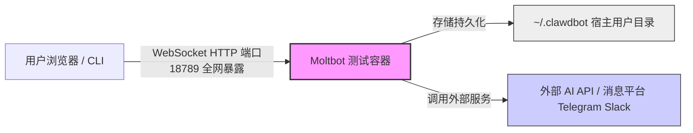
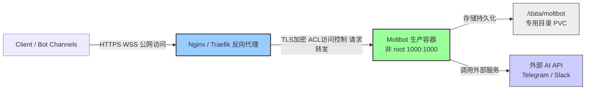
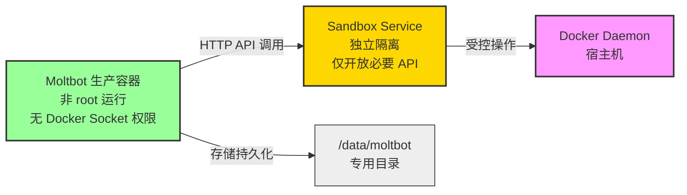

# Clawdbot/Moltbot Docker容器化部署指南：打造个人AI助手的完整方案


*分类: Moltbot,Clawdbot,人工智能 | 标签: moltbot,Clawdbot,人工智能 | 发布时间: 2026-01-29 12:58:46*

> Moltbot 是一款面向个人用户的自托管 AI 助手容器化应用。它支持在用户自有设备或服务器上运行，兼容多种操作系统与平台，帮助用户构建完全可控的个人 AI 助手环境。

## 概述
Moltbot 是一款面向个人用户的自托管 AI 助手容器化应用。它支持在用户自有设备或服务器上运行，兼容多种操作系统与平台，帮助用户构建完全可控的个人 AI 助手环境。

Moltbot 可通过多种主流通信渠道进行交互，包括 WhatsApp、Telegram、Slack、Discord、Signal、iMessage 等，实现统一入口的智能对话体验。同时支持语音交互、实时画布控制等高级能力，满足日常沟通、信息处理与自动化协作等多种使用场景。

Moltbot 的核心架构围绕"Gateway"控制平面构建，整合了多渠道消息处理、AI模型集成、技能扩展等能力，适合需要个人化、本地化AI助手的用户。

本指南将详细介绍如何通过Docker容器化方式部署 Moltbot，明确区分测试环境与生产环境，规避安全风险，实现快速启动和稳定运行。

## 适用人群说明
### 适合部署人群
- 独立开发者 / Bot 玩家，用于个人学习、功能验证
- 内部工具 / 私有AI助手部署，面向小范围内部使用
- 单租户部署场景，无需多用户隔离和高并发支撑

### 不适合部署人群
- 需要SaaS多租户架构，支持大规模用户同时使用
- 高并发公网开放API场景，对可用性、扩展性要求极高
- 无基础Docker/K8s运维经验，追求"零配置"生产部署的用户

## 环境准备
### Docker环境安装
为降低部署门槛、提升成功率，本文提供**官方等价的一键安装脚本**与官方原生安装方式两种选择，你可根据服务器网络环境适配：

#### 方式一：一键安装 Docker 环境（推荐国内服务器使用）
```bash
bash <(wget -qO- https://xuanyuan.cloud/docker.sh)
```

##### 该脚本特性说明
1. 完全基于 Docker 官方安装流程整理，行为与官方安装一致
2. 内置国内可访问的 Docker 镜像源与软件仓库，解决网络访问问题
3. 仅优化安装可达性，不修改 Docker 核心配置与运行行为
4. 不包含任何 Clawdbot 相关逻辑，可独立用于其他 Docker 部署场景

#### 方式二：Docker 官方安装方式（适用于网络可直连环境）
如果你的服务器可以正常访问 Docker 官方站点，可直接遵循 Docker 官方文档执行安装：
```bash
# 以 Ubuntu 为例，其他系统请参考官方文档
curl -fsSL https://get.docker.com -o get-docker.sh
sudo sh get-docker.sh
```
官方文档地址：https://docs.docker.com/engine/install/

#### 安装验证
无论采用哪种方式，安装完成后请执行以下命令验证：
```bash
docker --version
docker compose version
```
输出类似 `Docker version 26.0.0, build 2ae903e` 与 `Docker Compose version v2.24.6` 即表示安装成功。

## 镜像准备
### 拉取 Moltbot 镜像
#### 快速体验（测试环境）
可直接拉取latest标签镜像，用于快速验证功能：
```bash
docker pull xxx.xuanyuan.run/moltbot/moltbot:latest
```

#### 生产级部署（推荐）
**关键警告**：版本锁定，避免使用latest

如果你在生产环境使用latest，你不是在“快速迭代”，是在“赌运气”。

生产环境务必指定具体稳定版本，防止自动更新引入不兼容变更，可从 Moltbot 镜像标签列表获取可用版本：
```bash
# 示例：锁定v1.0.0版本，替换为实际稳定版本
docker pull xxx.xuanyuan.run/moltbot/moltbot:v1.0.0
```

## 容器部署
### 快速体验（5分钟跑起来，测试环境）
该方案适用于本地测试、功能验证，允许root运行，配置简化，不追求极致安全，仅用于快速上手。

#### 基础部署命令
```bash
docker run -d \
  --name moltbot-test \
  -p 18789:18789 \  # 默认暴露全网，仅用于本地测试
  -v ~/.clawdbot:/root/.clawdbot \
  -e AGENT_MODEL="anthropic/claude-opus-4-5" \
  -e LOG_LEVEL="info" \
  --restart unless-stopped \
  xxx.xuanyuan.run/moltbot/moltbot:latest
```

#### 参数说明（测试环境专属补充）
- 挂载目录~/.clawdbot:/root/.clawdbot：仅测试环境使用，容器以root运行，数据持久化到宿主用户目录
- 端口18789:18789：无绑定本地回环地址，全网可访问，禁止用于公网服务器
- 无资源限制、无访问认证：简化配置，快速启动

#### 注意事项
该方案仅用于本地/内网测试，请勿部署在公网可访问的服务器上

测试完成后，建议删除容器和挂载目录：`docker rm -f moltbot-test && rm -rf ~/.clawdbot`

### 生产级部署（安全、稳定、可监控，推荐）
该方案适用于长期运行、公网部署（需配合反向代理），强制非root运行，规避各类安全风险，配置优化且可扩展。

#### 前提假设
以下生产部署示例，基于以下假设成立（若镜像不满足，需自行调整）：
1. 镜像内存在 UID=1000 的普通用户
2. clawdbot 默认使用 $HOME/.clawdbot 作为配置/数据目录
3. 该普通用户的 $HOME=/home/moltbot

**验证方法**：拉取镜像后，可通过以下命令确认实际情况：
```bash
# 查看镜像内用户信息
docker run --rm xxx.xuanyuan.run/moltbot/moltbot:v1.0.0 cat /etc/passwd | grep 1000

# 查看clawdbot默认配置目录
docker run --rm xxx.xuanyuan.run/moltbot/moltbot:v1.0.0 clawdbot config show | grep "config path"
```

**兜底方案**（若镜像不支持非root用户）：

仍以root运行，但通过以下参数降低安全风险（仅作为临时替代，非最优选择）：
```bash
# 兜底方案：root运行+安全限制
--read-only \          # 容器root文件系统只读，防止恶意篡改
--security-opt no-new-privileges \  # 禁止提升权限，限制漏洞利用
-v /data/moltbot:/root/.clawdbot \  # 仍挂载专用目录，避免宿主用户目录污染
```

#### 前置准备
1. 创建专用数据目录，配置正确属主（UID 1000:1000，对应宿主普通用户）
```bash
mkdir -p /data/moltbot \
         /data/moltbot/logs \
         /data/moltbot/credentials
chown -R 1000:1000 /data/moltbot
```
2. 创建安全环境变量文件（避免明文注入密码）
```bash
# 创建.env.moltbot文件，存储敏感配置
cat > .env.moltbot << EOF
AGENT_MODEL=anthropic/claude-opus-4-5
LOG_LEVEL=info
GATEWAY_AUTH_MODE=password
GATEWAY_PASSWORD=your_secure_random_password_123  # 替换为强密码
LOG_ROTATION_MAX_SIZE=100M
LOG_ROTATION_MAX_FILES=10
EOF
# 配置最小权限，仅当前用户可读取
chmod 600 .env.moltbot
chown 1000:1000 .env.moltbot
```
**说明**：.env.moltbot 仅在宿主机被 Docker 读取，不要求 UID 匹配；chown 1000:1000 仅用于统一权限语义，可选。

#### 方案1：docker run 命令部署
```bash
docker run -d \
  --name moltbot-prod \
  # 仅绑定本地回环地址，外部无法直接访问，通过反向代理转发
  -p 127.0.0.1:18789:18789 \
  # 可选：浏览器控制端口，同样绑定本地回环
  -p 127.0.0.1:18791:18791 \
  # 持久化存储：专用目录+非root挂载路径
  -v /data/moltbot:/home/moltbot/.clawdbot \
  -v /data/moltbot/logs:/home/moltbot/.clawdbot/logs \
  -v /data/moltbot/credentials:/home/moltbot/.clawdbot/credentials \
  # 安全注入环境变量，避免明文泄露
  --env-file .env.moltbot \
  # 非root用户运行，规避权限扩大风险
  --user 1000:1000 \
  # 资源限制，根据服务器配置调整
  --memory 8g \
  --memory-swap 8g \
  --cpus 4 \
  # 健康检查（兼容curl/wget，添加注意说明）
  --health-cmd "wget -qO- http://localhost:18789/health >/dev/null || exit 1" \
  --health-interval 30s \
  --health-timeout 10s \
  --health-retries 3 \
  # 容器重启策略
  --restart unless-stopped \
  # 生产环境锁定镜像版本，替换为实际稳定版本
  xxx.xuanyuan.run/moltbot/moltbot:v1.0.0
```
**注意**：healthcheck 示例依赖 wget（兼容无curl场景），若镜像未内置wget/curl，请根据实际情况调整（如使用nc）。

#### 方案2：Docker Compose 部署（推荐，更易管理）
Docker Compose 适合 单机长期运行、可维护性优先 的部署场景。对于多节点高可用或弹性扩缩容需求，应考虑 Kubernetes。

1. 创建docker-compose.yml文件
```yaml
version: '3.8'

services:
  moltbot:
    container_name: moltbot-prod
    image: xxx.xuanyuan.run/moltbot/moltbot:v1.0.0  # 锁定稳定版本
    restart: unless-stopped
    user: "1000:1000"
    ports:
      - "127.0.0.1:18789:18789"
      - "127.0.0.1:18791:18791"
    volumes:
      - /data/moltbot:/home/moltbot/.clawdbot
      - /data/moltbot/logs:/home/moltbot/.clawdbot/logs
      - /data/moltbot/credentials:/home/moltbot/.clawdbot/credentials
    env_file:
      - .env.moltbot
    # 资源限制配置（注意：非Swarm模式下deploy.resources不生效）
    deploy:
      resources:
        limits:
          cpus: '4'
          memory: 8G
    # 健康检查（兼容无curl场景，修正CMD语法风险，采用CMD-SHELL支持shell运算符）
    healthcheck:
      test: ["CMD-SHELL", "wget -qO- http://localhost:18789/health >/dev/null || exit 1"]
      interval: 30s
      timeout: 10s
      retries: 3
      start_period: 60s  # 给服务启动预留时间
    # 非Swarm模式资源限制补充（mem_limit/cpus 兼容普通docker compose）
    mem_limit: 8g
    memswap_limit: 8g
    cpus: '4'
```
**注意**：healthcheck 依赖wget，若镜像无相关工具请调整。

2. 启动容器
```bash
# 后台启动
docker compose up -d

# 查看启动日志
docker compose logs -f moltbot
```

**关键说明**：

deploy.resources 在非Swarm模式下不会生效。如使用 docker compose（非swarm），请通过 mem_limit / cpus 参数控制资源，上述配置已添加双写兼容。

### 生产级部署关键优化（解决高危问题）
1. **非root运行+专用数据目录**
采用--user 1000:1000，容器以普通用户运行，即使被入侵，也无法直接获取宿主机root权限；挂载目录/data/moltbot:/home/moltbot/.clawdbot，专用目录隔离，避免与宿主其他目录混淆，且属主匹配非root用户，无权限报错。

2. **安全注入敏感信息**
使用--env-file .env.moltbot，避免明文环境变量泄露，docker inspect无法直接查看密码，且.env.moltbot配置600权限，仅当前用户可读取。
可选进阶方案（Docker Swarm环境）：使用Docker Secrets
```bash
# 创建密码secret
echo "your_secure_random_password_123" | docker secret create moltbot_gateway_pwd -
# 部署时引用secret（需在Swarm集群中）
docker service create \
  --name moltbot-prod \
  --secret source=moltbot_gateway_pwd,target=/run/secrets/moltbot_gateway_pwd \
  -e GATEWAY_PASSWORD_FILE=/run/secrets/moltbot_gateway_pwd \
  # 其他参数省略...
  xxx.xuanyuan.run/moltbot/moltbot:v1.0.0
```

3. **删除错误参数，优化资源配置**
移除--disk-quota 20g（Docker run不支持该参数，硬错误）；如需限制容器存储，可通过宿主机LVM、XFS项目配额配置，或使用Docker专用存储卷并设置卷容量，日常确保/data目录有至少20GB可用空间即可。

4. **Docker Socket挂载风险警示及替代方案**
**高危警告**：挂载/var/run/docker.sock等同于给容器授予宿主机Docker的root权限，一旦MOLTBOT被恶意攻击或存在漏洞，攻击者可直接控制宿主机所有Docker资源，进而获取宿主机root权限！
- 非生产必需场景请勿挂载
- 若必须挂载，需满足：容器不暴露公网、启用严格访问控制、限制沙箱权限

**推荐替代方案**（拆分危险能力，企业级实践）：MOLTBOT <-> HTTP API <-> Sandbox Service <-> Docker Daemon
说明：将Docker操作能力拆分到独立的Sandbox Service（仅开放只读/有限操作API），MOLTBOT通过HTTP API调用沙箱服务，避免直接挂载Docker Socket，降低攻击面。

挂载命令（仅应急使用）：`-v /var/run/docker.sock:/var/run/docker.sock \`

5. **端口安全配置**
绑定本地回环地址127.0.0.1:18789:18789，外部无法直接访问，需通过Nginx/Trafik反向代理转发，提升安全性；仅暴露必要端口，关闭无用端口，减少攻击面。

### 架构图（Mermaid 格式）
#### 测试环境：单容器直连架构


#### 生产环境：安全隔离架构


#### Docker Socket 替代方案架构


## 功能测试
### 容器状态检查
#### 快速体验环境
```bash
# 查看容器运行状态
docker ps | grep moltbot-test

# 若容器未运行，查看错误日志
docker logs moltbot-test
```

#### 生产级环境
```bash
# docker run 部署
docker ps | grep moltbot-prod
docker logs moltbot-prod

# Docker Compose 部署
docker compose ps
docker compose logs -f moltbot
```

正常运行时，输出应类似：
```
CONTAINER ID   IMAGE                                        COMMAND                  CREATED         STATUS         PORTS                                        NAMES
a1b2c3d4e5f6   xxx.xuanyuan.run/moltbot/moltbot:v1.0.0     "docker-entrypoint.s…"   5 minutes ago   Up 5 minutes (healthy)   127.0.0.1:18789->18789/tcp, 127.0.0.1:18791->18791/tcp   moltbot-prod
```

### 服务访问测试
#### 快速体验环境
```bash
curl http://localhost:18789/health
```

#### 生产级环境
因绑定本地回环地址，仅能在宿主机上测试，或通过反向代理测试：
```bash
# 宿主机本地测试
curl http://127.0.0.1:18789/health
```

正常情况下应返回健康状态信息（具体响应格式请参考 [Moltbot 镜像文档（轩辕镜像）](https://xuanyuan.cloud/r/moltbot/moltbot)）。

### 基础功能验证
1. 进入容器执行命令：
```bash
# 测试环境
docker exec -it moltbot-test /bin/bash

# 生产环境（非root用户，无sudo权限）
docker exec -it moltbot-prod /bin/bash
```
2. 运行onboarding向导（推荐首次使用）：
```bash
clawdbot onboard
```
3. 启动Gateway服务（若未自动启动）：
```bash
clawdbot gateway --port 18789 --verbose
```
4. 发送测试消息：
```bash
clawdbot message send --to "+1234567890" --message "Hello from Moltbot"
```
5. 与AI助手交互：
```bash
clawdbot agent --message "What can you do?" --thinking high
```

## 生产环境额外优化
### 生产部署最小清单（Checklist）
- ☑ 锁定镜像版本，不使用latest标签
- ☑ 采用非root用户运行（或兜底方案+安全限制）
- ☑ 端口绑定本地回环地址，不直接暴露公网
- ☑ 配置反向代理+TLS加密（公网部署必选）
- ☑ 专用数据目录+定期备份
- ☑ 配置资源限制（内存、CPU）
- ☑ 安全注入敏感信息（env文件/Secrets）
- ☑ 配置健康检查（兼容镜像内置工具）

### 版本锁定与升级流程
#### 版本锁定核心原则
- 永不使用latest标签，始终指定具体版本（如v1.0.0）
- 建立版本测试流程，新版本先在测试环境验证，再推广到生产

#### 安全升级步骤
1. 备份数据（关键步骤，防止数据丢失）
```bash
# 打包专用数据目录，保留时间戳
tar -zcvf /data/moltbot_backup_$(date +%Y%m%d%H%M).tar.gz /data/moltbot
```
2. 停止旧容器
```bash
# docker run 部署
docker stop moltbot-prod && docker rm moltbot-prod

# Docker Compose 部署
docker compose down
```
3. 拉取新镜像（指定新稳定版本）
```bash
docker pull xxx.xuanyuan.run/moltbot/moltbot:v1.1.0
```
4. 启动新容器
- docker run 部署：修改镜像版本后重新执行部署命令
- Docker Compose 部署：修改docker-compose.yml中的image版本，然后启动
```bash
docker compose up -d
```
5. 验证功能
```bash
# 检查健康状态
docker compose ps
# 发送测试消息，验证核心功能
docker exec -it moltbot-prod clawdbot agent --message "Test upgrade"
```
6. 回滚方案（若升级失败）
```bash
# 停止新容器
docker compose down
# 恢复备份数据
rm -rf /data/moltbot && tar -zxvf /data/moltbot_backup_xxx.tar.gz -C /
# 启动旧版本容器（修改docker-compose.yml为旧版本v1.0.0）
docker compose up -d
```

### 定期备份策略
1. 创建备份脚本
```bash
cat > /usr/local/bin/moltbot_backup.sh << EOF
#!/bin/bash
# Moltbot 自动备份脚本
BACKUP_DIR=/data/backups
MOLT_DATA_DIR=/data/moltbot
DATE=\$(date +%Y%m%d%H%M)

# 创建备份目录
mkdir -p \$BACKUP_DIR

# 打包备份
tar -zcvf \$BACKUP_DIR/moltbot_backup_\$DATE.tar.gz \$MOLT_DATA_DIR

# 删除7天前的旧备份，释放磁盘空间
find \$BACKUP_DIR -name "moltbot_backup_*.tar.gz" -mtime +7 -delete
EOF
```
2. 赋予执行权限
```bash
chmod +x /usr/local/bin/moltbot_backup.sh
```
3. 配置定时任务（crontab）
```bash
# 每天凌晨2点执行备份
crontab -e
# 添加以下内容
0 2 * * * /usr/local/bin/moltbot_backup.sh >> /var/log/moltbot_backup.log 2>&1
```

### 公网部署：反向代理+TLS加密（Nginx示例）
若需公网访问 Moltbot，必须通过反向代理开启TLS加密，禁止直接暴露容器端口。

1. 安装Nginx
```bash
apt update && apt install -y nginx
```
2. 创建Nginx配置文件
```nginx
server {
    listen 443 ssl http2;
    server_name your-domain.com;  # 替换为你的域名

    # TLS 配置，使用Let's Encrypt证书
    ssl_certificate /etc/letsencrypt/live/your-domain.com/fullchain.pem;
    ssl_certificate_key /etc/letsencrypt/live/your-domain.com/privkey.pem;
    ssl_protocols TLSv1.2 TLSv1.3;
    ssl_ciphers ECDHE-RSA-AES256-GCM-SHA512:DHE-RSA-AES256-GCM-SHA512:ECDHE-RSA-AES256-GCM-SHA384:DHE-RSA-AES256-GCM-SHA384;
    ssl_prefer_server_ciphers on;

    # 限制访问频率，防止暴力攻击
    limit_req_zone \$binary_remote_addr zone=moltbot:10m rate=10r/s;
    limit_req zone=moltbot burst=20 nodelay;

    # 转发到MOLTBOT容器
    location / {
        proxy_pass http://127.0.0.1:18789;
        proxy_set_header Host \$host;
        proxy_set_header X-Real-IP \$remote_addr;
        proxy_set_header X-Forwarded-For \$proxy_add_x_forwarded_for;
        proxy_set_header X-Forwarded-Proto \$scheme;
        # WebSocket 支持
        proxy_http_version 1.1;
        proxy_set_header Upgrade \$http_upgrade;
        proxy_set_header Connection "upgrade";
        proxy_read_timeout 86400;
    }
}

# 重定向HTTP到HTTPS
server {
    listen 80;
    server_name your-domain.com;
    return 301 https://\$host\$request_uri;
}
```
3. 验证配置并重启Nginx
```bash
nginx -t
systemctl restart nginx
```

## Kubernetes部署思路（扩展方案）
Kubernetes 在此主要用于标准化部署、配置管理（ConfigMap / Secret）和滚动升级，而非横向扩容或高可用副本。对于需要标准化部署流程、统一配置管理的场景，可采用Kubernetes部署，核心组件如下：
- Deployment：管理 Moltbot Pod，实现副本管理、滚动升级
- PVC（PersistentVolumeClaim）：持久化/data/moltbot目录，避免数据丢失
- ConfigMap/Secret：存储非敏感配置（ConfigMap）和敏感配置（Secret，如网关密码）
- Service：暴露内部端口，通过Ingress实现外部访问（替代Nginx反向代理）
- HPA（Horizontal Pod Autoscaler）：根据资源使用率自动扩缩容

**状态说明**：

Moltbot 为强状态型应用，默认不支持多副本并发写同一数据目录。Kubernetes 部署建议 replicas=1。如需高可用，需官方支持外部存储 / 控制平面解耦后再扩展。

### 核心配置片段示例（PVC）
```yaml
apiVersion: v1
kind: PersistentVolumeClaim
metadata:
  name: moltbot-pvc
spec:
  accessModes:
    - ReadWriteOnce
  resources:
    requests:
      storage: 20Gi
  storageClassName: standard
```

## 故障排查
### 常见问题及解决方法
#### 1. 容器启动失败
**症状**：docker ps未显示moltbot容器，或状态为Exited

**排查步骤**：
```bash
# 查看启动日志
docker logs moltbot-prod

# 检查端口是否被占用
netstat -tulpn | grep 18789

# 尝试手动启动并查看实时日志（生产环境）
docker run --rm -it \
  -p 127.0.0.1:18789:18789 \
  -v /data/moltbot:/home/moltbot/.clawdbot \
  --user 1000:1000 \
  --env-file .env.moltbot \
  xxx.xuanyuan.run/moltbot/moltbot:v1.0.0
```

**常见原因**：
- 端口冲突：更换主机端口（如-p 127.0.0.1:18790:18789）
- 权限问题：检查/data/moltbot目录属主是否为1000:1000，执行`chown -R 1000:1000 /data/moltbot`
- 配置错误：删除/data/moltbot/config.json后重新初始化，或验证.env.moltbot文件格式是否正确
- 镜像用户假设不成立：镜像内无UID=1000用户，切换为兜底方案（root运行+安全限制）

#### 2. 服务无法访问
**症状**：curl访问http://127.0.0.1:18789无响应

**排查步骤**：
```bash
# 检查容器内服务状态
docker exec -it moltbot-prod curl http://localhost:18789/health

# 检查网络配置
docker inspect moltbot-prod | grep IPAddress

# 检查防火墙规则
ufw status | grep 18789
```

**常见原因**：
- 容器内服务未启动：手动启动clawdbot gateway
- 网络模式问题：尝试添加--network host参数（生产环境不推荐，仅排查用）
- 防火墙限制：开放对应端口（仅反向代理端口，如443，不开放18789）
- 健康检查失败：镜像未内置curl/wget，替换为wget或nc，修改健康检查命令

#### 3. 渠道连接失败（如Telegram/WhatsApp）
**症状**：无法接收或发送消息

**排查步骤**：
```bash
# 查看渠道日志
docker exec -it moltbot-prod tail -f /home/moltbot/.clawdbot/logs/channels.log

# 重新登录渠道
docker exec -it moltbot-prod clawdbot channels login
```

**常见原因**：
- 认证信息过期：重新登录渠道
- API密钥错误：检查.env.moltbot文件中的密钥配置
- 网络限制：确保容器可访问外部API（如Telegram API），关闭宿主机防火墙或配置出站规则
- 非root权限问题：渠道认证文件无法写入，检查/data/moltbot/credentials目录权限

## 获取帮助
如遇到其他问题，可参考以下资源：
- [Moltbot 镜像文档（轩辕镜像）](https://xuanyuan.cloud/r/moltbot/moltbot)
- [Moltbot 镜像标签列表（轩辕镜像）](https://xuanyuan.cloud/r/moltbot/moltbot/tags)

## 总结
### 核心要点回顾
1. 环境区分是关键：快速体验（简化配置、root运行、仅本地测试）与生产部署（非root、安全配置、长期稳定）严格拆分，避免安全风险。
2. 生产环境三大核心安全配置：专用数据目录+非root运行、环境文件/Secrets注入敏感信息、仅绑定本地回环地址+反向代理TLS。
3. 隐性假设需明示：镜像内用户、目录结构的假设必须明确，同时提供兜底方案和验证方法，避免镜像升级导致部署失败。
4. 健康检查需兼容：避免强依赖curl，提供wget兼容写法，提前提示镜像工具缺失的问题，防止容器误判为不健康。
5. 状态型应用多副本限制：Moltbot 不支持多副本共享数据目录，K8s部署需明确replicas=1，避免数据损坏。
6. 长期运行保障：版本锁定、定期备份、健康检查、滚动升级，确保服务不中断、数据不丢失。
7. 高危操作需警惕：Docker Socket挂载仅应急使用，公网部署必须通过反向代理加密，禁止直接暴露容器端口。

### 后续建议
1. 深入学习 Moltbot 的高级特性，如多代理路由、技能扩展和自动化任务，提升个人AI助手的实用性。
2. 根据实际使用需求调整AI模型和资源配置，平衡性能与成本，高负载场景可考虑升级服务器配置或采用Kubernetes扩缩容（需官方解耦后）。
3. 遵循安全最佳实践，定期更新镜像版本、修补宿主机漏洞，监控容器资源使用情况，防范恶意攻击。
4. 对于公网部署的实例，定期查看Nginx日志和 Moltbot 渠道日志，及时发现异常访问和功能故障。
5. 定期验证镜像用户、目录结构的假设是否成立，尤其是镜像升级后，避免隐性问题导致生产故障。

通过本指南部署的 Moltbot 可以作为个人AI助手的基础，既保证了快速上手的便捷性，又兼顾了生产环境的安全性和稳定性，可根据自身需求进一步扩展功能，实现更智能、更个性化的交互体验。

