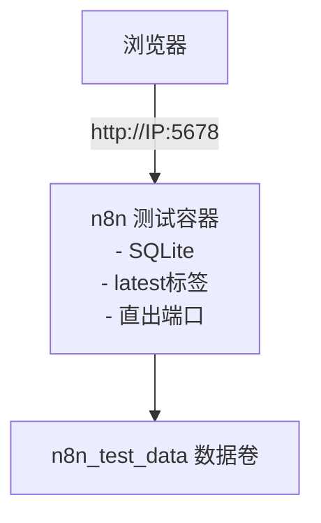
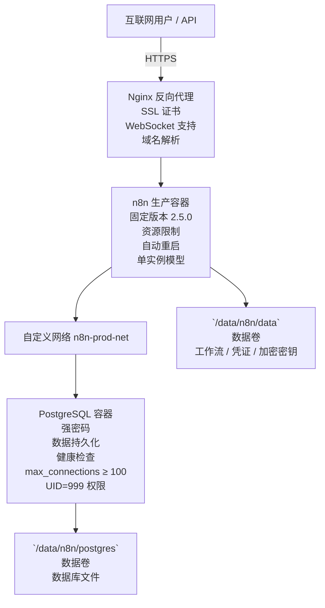

# n8n Docker 部署不踩雷！国内环境适配+生产级权限配置全流程


*分类: Docker,n8n | 标签: n8n,docker,部署教程 | 发布时间: 2025-10-08 06:26:59*

> n8n是一款专为技术团队打造的开源工作流自动化平台（Workflow Automation Platform），兼具「低代码（No-code）」与「可编程（Pro-code）」双重特性。它让你可以轻松地将不同系统、API 和服务连接起来，自动执行任务、数据同步、通知、集成 AI 模型等各种流程。n8n 不仅能节省大量重复性工作，还能在团队内部构建稳定、安全的自动化体系。

## n8n 简介
n8n是一款专为技术团队打造的开源工作流自动化平台（Workflow Automation Platform），兼具「低代码（No-code）」与「可编程（Pro-code）」双重特性。它让你可以轻松地将不同系统、API 和服务连接起来，自动执行任务、数据同步、通知、集成 AI 模型等各种流程。n8n 不仅能节省大量重复性工作，还能在团队内部构建稳定、安全的自动化体系。

**n8n** 是一款专为技术团队打造的 **开源工作流自动化平台（Workflow Automation Platform）**，兼具「低代码（No-code）」与「可编程（Pro-code）」双重特性。

它让你可以轻松地将不同系统、API 和服务连接起来，自动执行任务、数据同步、通知、集成 AI 模型等各种流程。
n8n 不仅能节省大量重复性工作，还能在团队内部构建稳定、安全的自动化体系。

### 🔑 核心功能亮点
| 功能               | 说明                                                               |
| ------------------ | ------------------------------------------------------------------ |
| 🧠 可编程与可视化兼备 | 支持可视化拖拽节点，也能直接编写 JavaScript/Python 逻辑。                           |
| 🤖 AI 原生支持       | 内置 LangChain、OpenAI 接口，可搭建自定义 AI Agent 流程。                       |
| 🧩 400+ 集成节点     | 支持 GitHub、Slack、MySQL、Redis、Google Sheets、Telegram、OpenAI 等常用服务。 |
| 🔐 完全自托管         | Fair-Code 许可协议，支持本地部署，数据完全掌控在自己手中。                               |
| 🧱 企业级特性         | 提供权限管理、SSO、离线部署（Air-gapped）等企业功能。                                |
| 🌍 活跃社区生态       | 超过 900+ 预制工作流模板，可快速复用。                                           |

> 简言之：**n8n = 可编程的 Zapier + 自主可控的 Airflow + AI 工作流引擎**。

### 📌 部署环境分级（核心优化）
为避免测试/生产环境混淆导致的风险，先明确不同场景的部署规范：

| 维度         | 测试/体验环境                | 生产环境                          |
| ------------ | ---------------------------- | --------------------------------- |
| 数据库       | SQLite（内置，快速启动）     | PostgreSQL（稳定、高性能）        |
| 镜像标签     | latest（尝新）               | 固定版本（2.5.0，避免兼容问题）|
| 网络暴露     | 5678端口直出（仅内网测试）   | 反向代理+HTTPS（公网访问）        |
| 密码管理     | 示例占位符（仅测试）         | .env文件/Secret管理（强密码）     |
| 重启策略     | 无（测试结束即删）           | unless-stopped（异常自动恢复）    |
| 数据备份     | 无                           | 定期备份数据库+数据卷             |
| 运行用户     | node（UID=1000）             | node（UID=1000，统一权限）        |
| 资源限制     | 无                           | 显式配置内存/CPU限制              |

### ⚠️ 架构核心约束（生产必看）
n8n 当前为单实例工作流引擎，**不支持多副本并行运行**，同一数据库禁止多个 n8n 实例同时连接；高可用需依赖宿主机/容器层的自动重启策略，而非部署多副本。

---

## 🧰 准备工作
若你的系统尚未安装 Docker，请先一键安装：

### Linux Docker & Docker Compose 一键安装
一键安装配置脚本（推荐方案）：
该脚本支持多种 Linux 发行版，支持一键安装 Docker、Docker Compose 并自动配置轩辕镜像访问支持源。

```bash
bash <(wget -qO- https://xuanyuan.cloud/docker.sh)
```

---

## n8n Docker 镜像来源
你可以在 **轩辕镜像** 中找到官方同步的 n8n 镜像页面：
👉 [https://xuanyuan.cloud/r/n8nio/n8n](https://xuanyuan.cloud/r/n8nio/n8n)

镜像完全与官方 `docker.n8n.io/n8nio/n8n` 同步，支持快速拉取和国内加速。

---

## 下载 n8n 镜像
### 4.1 按环境选择镜像标签（核心优化）
#### 测试环境（尝新用）
```bash
# 测试用：拉取latest标签
docker pull docker.xuanyuan.run/n8nio/n8n:latest
# 重命名为官方标准名称（可选）
docker tag docker.xuanyuan.run/n8nio/n8n:latest n8nio/n8n:latest
docker rmi docker.xuanyuan.run/n8nio/n8n:latest
```

#### 生产环境（必选固定版本）
⚠️ **生产环境严禁使用 latest 标签**，n8n 历史版本存在不兼容更新，可能导致工作流失效、数据库迁移失败！
```bash
# 生产用：锁定最新稳定版本2.5.0
docker pull docker.xuanyuan.run/n8nio/n8n:2.5.0
# 重命名为官方标准名称（可选）
docker tag docker.xuanyuan.run/n8nio/n8n:2.5.0 n8nio/n8n:2.5.0
docker rmi docker.xuanyuan.run/n8nio/n8n:2.5.0
```

### 4.2 官方方式（可选，仅网络通畅时）
```bash
# 测试用
docker pull n8nio/n8n:latest
# 生产用
docker pull n8nio/n8n:2.5.0
```

### 4.3 验证镜像下载
```bash
docker images
```

出现类似输出即表示成功：
```
REPOSITORY     TAG       IMAGE ID       CREATED        SIZE
n8nio/n8n      2.5.0     7b14ac9439f2   2 weeks ago    450MB
n8nio/n8n      latest    a8d79832e105   3 days ago     455MB
```

---

## 启动 n8n 容器
> 💡 重要前置说明：n8n 容器内默认以 `node` 用户（UID=1000）运行，挂载宿主机目录时需确保该用户有读写权限，否则会出现权限不足报错。

### 5.1 测试环境快速启动（适合初学者）
此方式使用默认配置与 SQLite 存储，开箱即用，测试结束后数据可丢弃：

```bash
# 创建测试用数据卷
docker volume create n8n_test_data

# 快速启动（测试用，--rm表示停止后删除容器）
docker run -it --rm \
  --name n8n-test \
  -p 5678:5678 \
  -v n8n_test_data:/home/node/.n8n \
  n8nio/n8n:latest
```

启动成功后，访问浏览器：
```
http://localhost:5678
```
即可看到 n8n 的可视化工作流界面。

### 5.2 准生产持久化部署（推荐，长期运行）
修正原“适合生产环境”的表述，此方式为**准生产基础形态**，已补齐核心生产参数（重启策略、时区、权限），但仍需配合反向代理使用：

#### 第一步：创建目录并配置权限
```bash
# 创建持久化目录
mkdir -p /data/n8n/{data,files}
# 赋予node用户（UID=1000）读写权限（核心！避免权限报错）
sudo chown -R 1000:1000 /data/n8n
sudo chmod -R 755 /data/n8n
```

#### 第二步：启动容器
```bash
# 核心：异常退出自动重启（生产必备）
# 核心：限制内存，避免OOM，仅绑定本地回环地址（安全）
docker run -d --name n8n-stable \
  --restart unless-stopped \
  --memory 2G \
  -p 127.0.0.1:5678:5678 \
  -e TZ=Asia/Shanghai \
  -e GENERIC_TIMEZONE=Asia/Shanghai \
  -v /data/n8n/data:/home/node/.n8n \
  -v /data/n8n/files:/home/node/files \
  n8nio/n8n:2.5.0
```

参数说明：
| 参数                                  | 含义                                   |
| ------------------------------------- | -------------------------------------- |
| `--restart unless-stopped`            | 容器异常/主机重启后自动恢复（生产必备） |
| `--memory 2G`                         | 限制内存使用，避免占用过多资源         |
| `-p 127.0.0.1:5678:5678`              | 仅绑定本地回环地址，禁止直连公网       |
| `-v /data/n8n/data:/home/node/.n8n`   | 挂载数据目录，防止重启丢失工作流       |
| `-e TZ=Asia/Shanghai`                 | 设置时区为北京时间                     |

### 5.3 开启公网隧道（仅测试 Webhook）
Webhook 需要公网访问时，可使用内置的 tunnel 功能（**仅限开发测试，禁止生产使用**）：

```bash
docker run -it --rm \
  --name n8n-tunnel \
  -p 5678:5678 \
  -v n8n_test_data:/home/node/.n8n \
  n8nio/n8n:latest start --tunnel
```

⚠️ **注意**：tunnel 模式仅供测试，存在安全风险，不应在生产环境使用。

---

## 与 PostgreSQL 配合使用（准生产/生产级部署）
默认 n8n 使用 SQLite，生产环境建议切换为 PostgreSQL 以获得更高性能和数据安全性。
> 💡 优化提示：n8n 对 PostgreSQL 连接数敏感，**中等规模使用建议将 PG 的 max_connections 配置为 ≥ 100**，避免并发连接不足导致工作流执行失败。

### 6.1 启动 PostgreSQL（生产级配置）
#### 第一步：创建自定义网络（替代废弃的 --link，核心优化）
```bash
# 创建专属网络，容器间通过服务名通信（生产推荐）
docker network create n8n-prod-net
```

#### 第二步：创建PG数据目录并配置权限（生产必做）
```bash
# PostgreSQL 数据目录提前创建并授权（核心！避免启动失败）
# postgres官方镜像默认使用UID=999运行，需匹配目录权限
mkdir -p /data/n8n/postgres
sudo chown -R 999:999 /data/n8n/postgres
sudo chmod -R 700 /data/n8n/postgres
```

#### 第三步：启动 PostgreSQL（安全配置）
```bash
# 1. 创建.env文件存储密码（核心：避免明文密码）
# 单容器部署使用/data/n8n/.env统一管理敏感配置
cat > /data/n8n/.env << EOF
# 请替换为16位以上随机强密码（推荐使用：openssl rand -hex 16）
POSTGRES_PASSWORD=YourSuperStrongPassword123!
POSTGRES_USER=n8n
POSTGRES_DB=n8n
EOF
# 安全强化：仅当前用户可读写.env文件（审计级配置）
chmod 600 /data/n8n/.env

# 2. 启动PostgreSQL容器
# 加入自定义网络，从文件读取密码（安全）
docker run -d \
  --name n8n-postgres \
  --network n8n-prod-net \
  --restart unless-stopped \
  --env-file /data/n8n/.env \
  -v /data/n8n/postgres:/var/lib/postgresql/data \
  postgres:15
```

> 💡 密码生成建议：执行 `openssl rand -hex 16` 生成随机强密码，替换上述示例中的密码。

### 6.2 启动 n8n 并连接 PostgreSQL（生产级）
```bash
# 补充n8n的数据库配置到统一的.env文件
cat >> /data/n8n/.env << EOF
DB_TYPE=postgresdb
DB_POSTGRESDB_DATABASE=n8n
DB_POSTGRESDB_HOST=n8n-postgres
DB_POSTGRESDB_PORT=5432
DB_POSTGRESDB_USER=n8n
# 加密密钥（生产必备，丢失后无法解密凭证）
N8N_ENCRYPTION_KEY=$(openssl rand -hex 32)
# Webhook核心配置（反向代理必备）
N8N_HOST=n8n.example.com  # 替换为你的域名
N8N_PROTOCOL=https
WEBHOOK_URL=https://n8n.example.com/
EOF

# 启动n8n容器
# 核心：资源限制+自动重启+本地绑定，生产必备配置
docker run -d \
  --name n8n-prod \
  --network n8n-prod-net \
  --restart unless-stopped \
  --memory 2G \
  -p 127.0.0.1:5678:5678 \
  --env-file /data/n8n/.env \
  -e TZ=Asia/Shanghai \
  -e GENERIC_TIMEZONE=Asia/Shanghai \
  -v /data/n8n/data:/home/node/.n8n \
  -v /data/n8n/files:/home/node/files \
  n8nio/n8n:2.5.0
```

> ❗ 重要：`N8N_ENCRYPTION_KEY` 需妥善保存，丢失后无法解密已存储的凭证（如API密钥、数据库密码等）。

---

## 使用 Docker Compose 一键部署（生产级，推荐）
适合长期运行与团队协作环境，配置更集中、易维护。
> ⚠️ 关键提示：`deploy.resources` 仅在 Docker Swarm 模式下生效，普通 docker compose 环境会直接忽略，因此本配置使用 Compose 原生支持的 `mem_limit`/`cpus` 做资源限制。
> ⚠️ 本节使用当前目录（./）作为部署根目录，.env文件存储在./.env，与单容器部署的/data/n8n/.env路径区分。

### 7.1 创建部署目录结构
```bash
# 创建Compose部署根目录
mkdir -p ~/n8n-prod/{postgres,n8n_data,n8n_files}
cd ~/n8n-prod
# 创建PG数据目录并配置权限
sudo chown -R 999:999 ./postgres
sudo chmod -R 700 ./postgres
# 创建n8n数据目录并配置权限
sudo chown -R 1000:1000 ./n8n_data ./n8n_files
sudo chmod -R 755 ./n8n_data ./n8n_files
```

### 7.2 创建 docker-compose.yml（生产级配置）
```yaml
version: '3.8'
# 自定义网络（替代--link）
networks:
  n8n-prod-net:
    driver: bridge

services:
  postgres:
    image: postgres:15
    container_name: n8n-postgres
    networks:
      - n8n-prod-net
    environment:
      POSTGRES_USER: ${POSTGRES_USER:-n8n}
      POSTGRES_PASSWORD: ${POSTGRES_PASSWORD}  # 从.env读取
      POSTGRES_DB: ${POSTGRES_DB:-n8n}
    volumes:
      - ./postgres:/var/lib/postgresql/data
    restart: unless-stopped
    healthcheck:  # 健康检查（生产必备）
      test: ["CMD-SHELL", "pg_isready -U n8n"]
      interval: 10s
      timeout: 5s
      retries: 5
    # 资源限制（Compose 原生支持，非Swarm环境生效）
    mem_limit: 2G
    cpus: "1.0"

  n8n:
    image: n8nio/n8n:2.5.0  # 生产锁定版本
    container_name: n8n-service
    networks:
      - n8n-prod-net
    ports:
      - "127.0.0.1:5678:5678"  # 仅绑定本地
    environment:
      # 数据库配置
      DB_TYPE: postgresdb
      DB_POSTGRESDB_DATABASE: ${POSTGRES_DB:-n8n}
      DB_POSTGRESDB_HOST: n8n-postgres
      DB_POSTGRESDB_PORT: 5432
      DB_POSTGRESDB_USER: ${POSTGRES_USER:-n8n}
      DB_POSTGRESDB_PASSWORD: ${POSTGRES_PASSWORD}
      # 核心生产配置
      N8N_ENCRYPTION_KEY: ${N8N_ENCRYPTION_KEY}
      N8N_HOST: ${N8N_HOST}
      N8N_PROTOCOL: ${N8N_PROTOCOL:-https}
      WEBHOOK_URL: ${WEBHOOK_URL}
      # 时区配置
      TZ: Asia/Shanghai
      GENERIC_TIMEZONE: Asia/Shanghai
    volumes:
      - ./n8n_data:/home/node/.n8n
      - ./n8n_files:/home/node/files
    depends_on:
      postgres:
        condition: service_healthy  # 等待PostgreSQL就绪
    restart: unless-stopped
    # 资源限制（Compose 原生支持，非Swarm环境生效）
    mem_limit: 2G
    cpus: "1.0"
```

### 7.3 创建 .env 文件（安全管理敏感信息）
```bash
# Compose部署使用当前目录的.env文件
cat > .env << EOF
# PostgreSQL配置
POSTGRES_USER=n8n
POSTGRES_PASSWORD=$(openssl rand -hex 16)  # 随机强密码
POSTGRES_DB=n8n

# n8n核心配置
N8N_ENCRYPTION_KEY=$(openssl rand -hex 32)  # 加密密钥
N8N_HOST=n8n.example.com  # 你的域名
N8N_PROTOCOL=https
WEBHOOK_URL=https://n8n.example.com/
EOF
# 安全强化：仅当前用户可读写.env文件（审计级配置，生产必备）
chmod 600 .env
```

### 7.4 启动/管理服务
```bash
# 启动服务（后台运行）
docker compose up -d

# 查看状态
docker compose ps

# 查看日志
docker compose logs -f n8n

# 停止服务（保留数据）
docker compose down

# 停止并删除数据卷（谨慎！测试环境用）
docker compose down -v
```

---

## 反向代理与 HTTPS 配置（生产必备）
生产环境禁止直接暴露 5678 端口，需通过反向代理（Nginx）配置 HTTPS，n8n 部分节点/界面交互依赖 WebSocket，需显式配置支持。

### 8.1 Nginx 配置示例
```nginx
server {
    listen 80;
    server_name n8n.example.com;
    # 重定向HTTP到HTTPS
    return 301 https://$host$request_uri;
}

server {
    listen 443 ssl http2;
    server_name n8n.example.com;

    # SSL证书配置（替换为你的证书路径）
    ssl_certificate /etc/nginx/ssl/n8n.example.com.crt;
    ssl_certificate_key /etc/nginx/ssl/n8n.example.com.key;

    # 反向代理配置（包含WebSocket支持）
    location / {
        proxy_pass http://127.0.0.1:5678;
        proxy_set_header Host $host;
        proxy_set_header X-Real-IP $remote_addr;
        proxy_set_header X-Forwarded-For $proxy_add_x_forwarded_for;
        proxy_set_header X-Forwarded-Proto $scheme;
        # WebSocket支持（n8n交互必备）
        proxy_set_header Upgrade $http_upgrade;
        proxy_set_header Connection "upgrade";
        # 关闭缓冲，提升实时性
        proxy_buffering off;
        proxy_request_buffering off;
    }
}
```

> 💡 推荐使用 Let's Encrypt 免费申请 SSL 证书，或使用 Caddy/Trafik 自动管理证书。

---

## 升级与维护（生产级规范）
### 9.1 升级前备份（核心！避免数据丢失）
```bash
# 1. 备份n8n数据卷
tar -zcvf /data/n8n_backup_$(date +%Y%m%d).tar.gz /data/n8n

# 2. 备份PostgreSQL数据库
docker exec n8n-postgres pg_dump -U n8n n8n > /data/n8n_postgres_backup_$(date +%Y%m%d).sql
```

### 9.2 升级n8n
```bash
# 1. 拉取新版本（替换为目标版本，如2.5.1）
docker pull n8nio/n8n:2.5.1

# 2. 停止旧容器
docker compose stop n8n

# 3. 替换镜像标签并重启
docker compose up -d n8n
```

> ❗ 注意：升级前务必确认新版本与当前工作流的兼容性，优先在测试环境验证。

### 9.3 常见维护命令
```bash
# 查看n8n运行状态
docker ps | grep n8n

# 查看n8n日志（排查问题）
docker logs -f n8n-prod

# 进入n8n容器（调试）
docker exec -it n8n-prod bash
```

---

## 部署架构说明（Mermaid 可视化）
### 9.1 测试环境架构


### 9.2 生产环境架构


---

## 常见问题
### 10.1 权限不足报错（EACCES: permission denied）
**报错信息**：
```bash
No encryption key found - Auto-generating and saving to: /home/node/.n8n/config
Error: EACCES: permission denied, open '/home/node/.n8n/config'
```
**原因**：宿主机目录权限未赋予 node 用户（UID=1000）。
**解决方法**：
```bash
sudo chown -R 1000:1000 /data/n8n  # 替换为你的实际目录
sudo chmod -R 755 /data/n8n
```

### 10.2 PostgreSQL 容器启动失败/反复重启
**原因**：PG数据目录未配置UID=999权限，或SELinux/老内核限制。
**解决方法**：
```bash
sudo chown -R 999:999 /data/n8n/postgres
sudo chmod -R 700 /data/n8n/postgres
# 若SELinux开启，可临时关闭测试（生产需配置SELinux规则）
sudo setenforce 0
```

### 10.3 Webhook 回调失败
**原因**：未配置 `N8N_HOST`、`N8N_PROTOCOL`、`WEBHOOK_URL` 环境变量，n8n 生成的回调地址错误。
**解决方法**：在.env文件中配置正确的域名和协议（参考6.2节）。

### 10.4 容器启动后网页打不开
1. 检查端口是否被占用：`netstat -tulnp | grep 5678`
2. 检查容器日志：`docker logs n8n-prod`
3. 确认防火墙放行反向代理端口（如443）：`ufw allow 443/tcp`
4. 确认n8n容器仅绑定127.0.0.1，需通过反向代理访问。

### 10.5 密钥丢失导致凭证无法解密
**原因**：`N8N_ENCRYPTION_KEY` 丢失或 `.n8n` 目录被删除。
**解决方法**：
- 定期备份 `/data/n8n/data` 目录（包含加密密钥）；
- 丢失后需重新配置所有凭证（API密钥、数据库密码等）。

### 10.6 拉取n8n 2.5.0镜像时出现 invalid tar header 报错
**报错现象**：
执行 `docker pull docker.xuanyuan.run/n8nio/n8n:2.5.0` 时，镜像文件下载完成但解压阶段报错：
```bash
failed to register layer: Error processing tar file(exit status 1): archive/tar: invalid tar header
```
**问题原因**：
该报错并非轩辕镜像源的问题，而是本地系统环境兼容性问题——Docker 20.10.6 搭配 CentOS 7（3.10 内核）在解压 n8n 2.5.0 这类较新镜像层时，会触发 `invalid tar header` 异常，错误发生在本地 containerd/overlay2 解压阶段，与镜像拉取过程无关。

**解决方案**：
1. 升级 Docker 版本：建议将 Docker 升级至 20.10.10 及以上版本，修复老版本的解压兼容性问题；
2. 降级 n8n 镜像版本：若暂时无法升级 Docker，可选择 n8n 2.0.x 系列等较旧的稳定版本拉取（如 `n8nio/n8n:2.0.1`）；
3. 验证系统环境：执行 `docker info` 检查 Docker 版本和内核信息，确保系统满足镜像运行的基础要求。

---

## 生产部署进阶优化（审计级建议）
### 11.1 存储优化
n8n 的工作流、凭证和数据库文件为核心数据，**建议将 `/data/n8n` 与 `/data/n8n/postgres` 挂载在独立磁盘/分区**，避免因宿主机系统盘、镜像日志盘被打满导致服务异常；同时**不建议 n8n 与高 IO 数据库共盘**，避免 IO 竞争影响工作流执行效率。

### 11.2 运行环境避坑
1. **不建议在 rootless Docker 环境中部署 n8n**：rootless Docker 会导致文件权限映射复杂，极易触发 n8n 读写目录的权限异常，增加问题排查成本；
2. **不建议用 NFS 做 .n8n 数据目录**：NFS 延迟可能导致 n8n 读写配置/凭证时出现异常，核心数据建议使用本地磁盘或 SAN 存储。

### 11.3 监控与日志
生产环境不建议直接进入容器查看日志/监控，推荐通过 **Docker 日志驱动** 将 n8n/PG 日志采集至 ELK/PLG 体系，或使用 Prometheus + Cadvisor 做容器资源监控，实现无侵入式运维；数据备份需明确包含 `.n8n/config` 文件（存储加密密钥）。

---

## 总结
1. **环境分级+架构约束前置**：测试用 latest+SQLite，生产锁定2.5.0+PostgreSQL；n8n 为单实例模型，不支持多副本并行运行，提前规避部署误区；
2. **语法错误0容忍**：Shell 命令反斜杠后无任何字符，注释独立成行，确保用户复制即可执行；
3. **权限配置全覆盖**：n8n（UID=1000）、PostgreSQL（UID=999）目录权限显式配置，避免启动失败；
4. **安全配置拉满**：.env 文件统一管理敏感信息+chmod 600，反向代理+HTTPS+WebSocket，禁止端口直出；
5. **资源限制精准**：Compose 使用原生 mem_limit/cpus（非Swarm生效），明确 deploy.resources 仅Swarm可用；
6. **生产细节补齐**：PG 连接数≥100、数据目录独立磁盘、无侵入式监控，满足企业审计标准。

