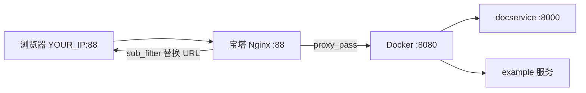

# onlyoffice Ubuntu Docker 容器化部署指南


*分类: Docker部署教程 | 标签: onlyoffice-documentserver,docker,部署教程 | 发布时间: 2025-12-10 06:46:38*

> onlyoffice 是一款功能丰富的容器化在线办公套件，提供文本、电子表格和演示文稿的查看与编辑功能，完全兼容Office Open XML格式（.docx、.xlsx、.pptx），并支持实时协作编辑。作为ONLYOFFICE生态系统的核心组件，DOCUMENTSERVER可独立部署或与Community Server、Mail Server集成，实现文档存储、共享、权限管理等扩展功能。

*本文基于 [onlyoffice/documentserver:9.4.0.1](https://xuanyuan.cloud/zh/r/onlyoffice/documentserver) 镜像，Ubuntu 24.04 服务器实测*

想在浏览器里在线预览、编辑 Word / Excel / PPT？**ONLYOFFICE Document Server**（社区版）提供开源的在线文档编辑引擎，可对接 Nextcloud、ownCloud 等网盘，也可单独部署做能力验证。

它**不是**完整的网盘或办公套件，而是「文档编辑后端服务」。本文带你从零完成一次完整部署：Docker 拉取与启动、欢迎页验证、内置 `/example/` 测试编辑、以及通过 **Nginx 反代 + sub_filter** 解决非 80 端口下的白屏与 400 错误。下文命令均在 Ubuntu 24.04、约 4GB 内存环境下实测通过。

国内用户从 Docker Hub 拉取 `onlyoffice/documentserver` 可能较慢，本文使用 [轩辕镜像](https://xuanyuan.cloud) 加速域 `docker.xuanyuan.run`。官方 Docker 文档见 [ONLYOFFICE/Docker-DocumentServer](https://github.com/ONLYOFFICE/Docker-DocumentServer)。

---

## 一、环境要求

| 项目 | 建议 |
|------|------|
| 操作系统 | Linux（本文 Ubuntu 24.04） |
| 内存 | ≥ 4 GB（偏低时首次启动更慢，converter 可能走 embedded 模式） |
| CPU | 双核 2 GHz+ |
| Swap | ≥ 2 GB |
| 磁盘 | 根分区至少 **20 GB 可用**（首次启动 + Docker 镜像 + 内置 PostgreSQL 占空间） |
| 端口 | 80 或 8080（80 被占用时映射到其他端口） |

> **踩坑提示**：ONLYOFFICE 首次启动会生成字体、主题、插件缓存，CPU 可能长时间 100%，**需 5～15 分钟**。期间请**不要**用 `Ctrl+C` 打断 `docker logs`，否则可能反复初始化。Community 版内置 PostgreSQL / RabbitMQ 数据写在 **Docker overlay（根分区 `/`）**，不在你挂载的 `lib` 目录里——根分区满会导致 `ENOSPC` 报错。

---

## 二、安装 Docker

若尚未安装 Docker，可使用轩辕镜像一键脚本（适用于 Linux 及国内云服务器）：

```bash
bash <(wget -qO- https://xuanyuan.cloud/docker.sh)
```

验证：

```bash
docker --version
docker compose version
```

更多安装说明见 [轩辕镜像使用手册](https://xuanyuan.cloud/usage)。

---

## 三、拉取 ONLYOFFICE 镜像

使用轩辕镜像加速域拉取 **9.4.0.1** 标签：

```bash
docker pull docker.xuanyuan.run/onlyoffice/documentserver:9.4.0.1
```

成功时终端显示：

```
Status: Downloaded newer image for docker.xuanyuan.run/onlyoffice/documentserver:9.4.0.1
```

| 官方镜像 | 轩辕镜像加速拉取 | 镜像说明 |
|----------|------------------|----------|
| `onlyoffice/documentserver:9.4.0.1` | `docker pull docker.xuanyuan.run/onlyoffice/documentserver:9.4.0.1` | [onlyoffice/documentserver](https://xuanyuan.cloud/zh/r/onlyoffice/documentserver) |

源码仓库 [ONLYOFFICE/DocumentServer](https://github.com/ONLYOFFICE/DocumentServer) 与 Docker 部署仓库 [ONLYOFFICE/Docker-DocumentServer](https://github.com/ONLYOFFICE/Docker-DocumentServer) 为不同项目，部署请以 Docker 仓库文档为准。

---

## 四、创建目录并启动容器

### 4.1 准备数据卷

```bash
mkdir -p /www/wwwroot/onlyoffice/{logs,data,lib}
```

若提示权限不足，可在路径前加 `sudo`，或改为 `$HOME/onlyoffice/{logs,data,lib}`，下文路径同步替换。

### 4.2 首次启动（8080 端口）

若宿主机 **80 端口已被占用**（如已有 Nginx / 宝塔），将容器 80 映射到 **8080** 即可：

```bash
docker run -i -t -d \
  --name onlyoffice-documentserver \
  --restart=always \
  -p 8080:80 \
  -v /www/wwwroot/onlyoffice/logs:/var/log/onlyoffice \
  -v /www/wwwroot/onlyoffice/data:/var/www/onlyoffice/Data \
  -v /www/wwwroot/onlyoffice/lib:/var/lib/onlyoffice \
  docker.xuanyuan.run/onlyoffice/documentserver:9.4.0.1
```

80 端口空闲时，把 `-p 8080:80` 改为 `-p 80:80`，浏览器访问 `http://YOUR_SERVER_IP` 即可。

查看启动日志（**耐心等待，勿中断**）：

```bash
docker logs -f onlyoffice-documentserver
```

期望依次出现：`Generating AllFonts.js...Done`、`Generating presentation themes...Done`、`ds:docservice: started`、`Version: 9.4.0` 等。

---

## 五、验证部署：打开欢迎页

核心服务就绪后，检查进程：

```bash
docker exec onlyoffice-documentserver supervisorctl status
```

期望 `ds:docservice`、`ds:converter` 为 **RUNNING**（启用 example 后还需 `ds:example` 为 RUNNING）。

**健康检查**（请用容器内 8000 端口，不要用宿主机 8080 的 `/info/info.json`，后者常返回 403）：

```bash
docker exec onlyoffice-documentserver curl -s http://127.0.0.1:8000/info/info.json | grep buildVersion
```

期望输出含 `"buildVersion"` 或版本号 **9.4.0**。

浏览器访问（将 `YOUR_SERVER_IP` 换成服务器局域网或公网 IP）：

```
http://YOUR_SERVER_IP:8080/welcome/
```

若看到 **ONLYOFFICE Docs Community Edition installed** 欢迎页，说明 Document Server 主体已部署成功：


从 7.2 版本起 **JWT 默认开启**。对接 Nextcloud 等应用时需要 JWT Secret，可在容器内执行：

```bash
docker exec onlyoffice-documentserver documentserver-jwt-status.sh
```

欢迎页也会提示通过容器内命令读取 `local.json` 中的 secret，请将输出中的 secret 妥善保存，下文配置 example 时用到（用 `<YOUR_JWT_SECRET>` 占位，勿泄露）。

---

## 六、启用测试示例 example

欢迎页底部的 **Testing before integration** 说明：内置 example 是简易文档管理系统，用于验证编辑器是否正常。**默认未开启**，需重建容器并加上环境变量：

```bash
docker exec onlyoffice-documentserver documentserver-prepare4shutdown.sh
docker stop onlyoffice-documentserver
docker rm onlyoffice-documentserver

docker run -i -t -d \
  --name onlyoffice-documentserver \
  --restart=always \
  -p 8080:80 \
  -e EXAMPLE_ENABLED=true \
  -e ALLOW_PRIVATE_IP_ADDRESS=true \
  -e ALLOW_META_IP_ADDRESS=true \
  -v /www/wwwroot/onlyoffice/logs:/var/log/onlyoffice \
  -v /www/wwwroot/onlyoffice/data:/var/www/onlyoffice/Data \
  -v /www/wwwroot/onlyoffice/lib:/var/lib/onlyoffice \
  docker.xuanyuan.run/onlyoffice/documentserver:9.4.0.1
```

- `EXAMPLE_ENABLED=true`：启用 `/example/` 测试页  
- `ALLOW_PRIVATE_IP_ADDRESS=true` / `ALLOW_META_IP_ADDRESS=true`：局域网 `192.168.x.x` 场景下避免私有 IP 被安全策略拦截  

等待 2～5 分钟后确认 example 进程：

```bash
docker exec onlyoffice-documentserver supervisorctl status | grep example
```

若为 `STOPPED`，可手动启动：

```bash
docker exec onlyoffice-documentserver supervisorctl start ds:example
```

欢迎页下方会出现 **GO TO TEST EXAMPLE** 按钮，或直接访问 `http://YOUR_SERVER_IP:8080/example/`：


> **安全提示**：example 仅供测试，**生产环境请勿开启**。正式上线前应关闭 `EXAMPLE_ENABLED` 并禁用 example 服务。

---

## 七、常见问题排错

### 7.1 磁盘满：ENOSPC / Server error

**现象**：访问 `/example/` 报 **Server error**；example 日志出现：

```text
Error: ENOSPC: no space left on device, mkdir '.../documentserver-example/files/...'
```

**原因**：根分区或 Docker 存储满，example 无法创建用户文件目录；同时可能伴随 `Request to meta/formats timed out`。

**排查**：

```bash
df -h /
df -i /
docker system df
```

**解决**：释放空间。实测中 `docker system prune -a` 可回收大量未使用镜像。执行前请确认无需要保留的停止容器与旧镜像。

```bash
docker system prune -a
```

释放后**完整重启容器**，并等待初始化完成，不要中途打断日志。

---

### 7.2 宿主机 `curl .../info/info.json` 返回 403

**现象**：

```bash
curl -s http://127.0.0.1:8080/info/info.json
# 返回 403 Forbidden HTML
```

**说明**：容器外层 Nginx 对 `/info/` 有访问限制，**不代表服务未启动**。请以容器内检查为准：

```bash
docker exec onlyoffice-documentserver curl -s http://127.0.0.1:8000/info/info.json
```

---

### 7.3 `languages.forEach is not a function`

**现象**：打开 `/example/` 出现模板错误页，`languages.forEach is not a function`；example 日志大量 `Request to meta/config timed out`。


**因果链**：

```text
example 请求 meta/config、meta/formats 超时
  → languages 未加载为数组
  → 渲染 index.ejs 时报 languages.forEach is not a function
```

**原因**：使用 `-p 8080:80` 且浏览器通过 `http://YOUR_SERVER_IP:8080` 访问时，example 会按 Host 去请求 `http://YOUR_SERVER_IP:8080/meta/config`；在**容器内部**没有 8080 端口（仅有 80 与 docservice 的 8000），该请求常**超时**（Docker hairpin 问题）。

**验证**（在宿主机执行）：

```bash
# 容器内 8000 正常
docker exec onlyoffice-documentserver curl -s -m 5 http://127.0.0.1:8000/meta/config | head -c 200

# 容器内访问宿主机映射 IP:8080 往往超时（复现 example 问题）
docker exec onlyoffice-documentserver curl -s -m 5 http://YOUR_SERVER_IP:8080/meta/config
```

**修复**：将 example 的 `siteUrl` 改为容器内 docservice 地址。进入容器写入配置：

```bash
docker exec -it onlyoffice-documentserver bash
```

在容器内执行（将 `<YOUR_JWT_SECRET>` 替换为 `documentserver-jwt-status.sh` 的输出）：

```bash
cat > /etc/onlyoffice/documentserver-example/local-production-linux.json << 'EOF'
{
  "server": {
    "siteUrl": "http://127.0.0.1:8000/",
    "exampleUrl": "http://127.0.0.1/example/",
    "configUrl": "meta/config",
    "formatsUrl": "meta/formats",
    "preloaderUrl": "web-apps/apps/api/documents/preload.html",
    "token": {
      "enable": true,
      "useforrequest": true,
      "algorithmRequest": "HS256",
      "secret": "<YOUR_JWT_SECRET>"
    }
  }
}
EOF

supervisorctl restart ds:example
exit
```

重启后刷新 `/example/`，列表页应恢复正常。

| 配置项 | 作用 |
|--------|------|
| `siteUrl: http://127.0.0.1:8000/` | example **在容器内**拉 meta/config |
| `exampleUrl: http://127.0.0.1/example/` | docservice **在容器内**下载 example 上的文档 |

> **注意**：此文件在**删除/重建容器后会丢失**。建议宿主机保存一份并挂载：  
> `-v /www/wwwroot/onlyoffice/example-local.json:/etc/onlyoffice/documentserver-example/local-production-linux.json`

---

### 7.4 编辑器白屏：浏览器无法加载 api.js

**现象**：example 列表页正常，点预览/编辑**白屏**；浏览器 F12 控制台：

```text
GET http://127.0.0.1:8000/web-apps/apps/api/documents/api.js  ERR_CONNECTION_REFUSED
DocsAPI is not defined
```

**原因**：上一步把 `siteUrl` 设为 `127.0.0.1:8000` 后，编辑器 HTML 里的 `api.js` 地址也变成容器内地址；**用户浏览器**访问的是自己电脑上的 `127.0.0.1:8000`，当然连不上。

**矛盾**：example 只有一个 `siteUrl`，需同时满足「容器内拉 meta」与「浏览器加载 api.js」——在 `-p 8080:80` 且 hairpin 不通时，**单靠改 JSON 无法两全**。

**解决方案**：保持 `siteUrl` 为 `http://127.0.0.1:8000/`，在 **Nginx 反代**中对 HTML/JS 响应做 **sub_filter**，把 `127.0.0.1:8000` 替换为浏览器可访问的对外地址（见第九节）。

---

### 7.5 日志中的其他提示（可忽略或知悉）

| 日志 | 说明 |
|------|------|
| `find: '/var/www/onlyoffice/Data/certs': No such file or directory` | HTTP 模式下无证书目录，可忽略 |
| `converter ... embedded mode` | 内存不足时 converter 降级，非致命 |
| `ds:metrics STOPPED` |  metrics 默认未启，不影响编辑 |

---

## 八、example 配置小结与列表页验证

完成 7.3 节 JSON 配置并重启 `ds:example` 后，访问：

```
http://YOUR_SERVER_IP:8080/example/
```

应看到 **Welcome to ONLYOFFICE Docs!** 测试首页，可新建 Document / Spreadsheet / Presentation，或上传文件：


若仍报错，请再次检查 example 日志：

```bash
docker exec onlyoffice-documentserver tail -30 /var/log/onlyoffice/documentserver-example/out.log
docker exec onlyoffice-documentserver tail -30 /var/log/onlyoffice/documentserver-example/err.log
```

---

## 九、宝塔 Nginx 反代（非 80 端口完整方案）

若希望通过 **88**（或其他端口）对外提供 ONLYOFFICE，而 Docker 仍监听 `127.0.0.1:8080` 或 `8080`，可在宝塔面板新建站点，**反向代理**到 `http://127.0.0.1:8080`。

### 9.1 架构说明



- 浏览器访问 `http://YOUR_SERVER_IP:88/example/`  
- Nginx 转发到 `127.0.0.1:8080`  
- 响应 HTML 中的 `http://127.0.0.1:8000` 由 **sub_filter** 替换为 `http://YOUR_SERVER_IP:88`  

### 9.2 推荐 location 配置

在站点配置中，将反代 `location` 设为（**勿重复** `proxy_set_header Host`）：

```nginx
location / {
    proxy_pass http://127.0.0.1:8080;

    proxy_http_version 1.1;
    proxy_set_header Host $http_host;
    proxy_set_header X-Real-IP $remote_addr;
    proxy_set_header X-Forwarded-For $proxy_add_x_forwarded_for;
    proxy_set_header X-Forwarded-Proto $scheme;
    proxy_set_header X-Forwarded-Host $http_host;
    proxy_set_header X-Forwarded-Port $server_port;

    proxy_connect_timeout 60s;
    proxy_send_timeout 600s;
    proxy_read_timeout 600s;

    proxy_set_header Upgrade $http_upgrade;
    proxy_set_header Connection $connection_upgrade;

    proxy_set_header Accept-Encoding "";
    gzip off;

    sub_filter 'http://127.0.0.1:8000' 'http://YOUR_SERVER_IP:88';
    sub_filter 'http://127.0.0.1/example' 'http://YOUR_SERVER_IP:88/example';
    sub_filter_once off;
    sub_filter_types text/html application/javascript application/json;
}
```

同时将 `#include enable-php-00.conf;` **注释掉**（纯反代站点不需要 PHP）。WebSocket 相关头建议只放在 `location` 内，不要重复写在 server 块外层。

保存后：

```bash
nginx -t && nginx -s reload
```

验证：

```bash
curl -s -o /dev/null -w "HTTP:%{http_code}\n" http://YOUR_SERVER_IP:88/example/
```

期望 **HTTP:200**。

### 9.3 Nginx 返回 400 Bad Request

**现象**：`curl http://127.0.0.1:8080/example/` 为 **200**，经 `:88` 反代为 **400**；错误页为 nginx 默认 400 HTML。

**实测根因**：`location` 内 **重复写了两段 proxy 头**，尤其是 **`proxy_set_header Host` 出现两次**，清理重复块后恢复 200。

**排查对比**：

```bash
# 直连 Docker 正常
curl -sI http://127.0.0.1:8080/example/

# 经反代异常
curl -s -o /dev/null -w "HTTP:%{http_code}\n" http://YOUR_SERVER_IP:88/example/
```

**建议**：每个 `proxy_set_header` 在 `location` 内**只写一次**；先使用最小反代配置确认 200，再逐步加回 sub_filter。

### 9.4 进阶：CSV 预览 CORS（可选）

docx 预览正常后，若 **CSV** 预览报 CORS，因转换后的 cache URL 为 `http://YOUR_SERVER_IP/cache/...`（缺 `:88`）。可在 sub_filter 中追加：

```nginx
sub_filter 'http://YOUR_SERVER_IP/cache' 'http://YOUR_SERVER_IP:88/cache';
sub_filter 'https://YOUR_SERVER_IP/cache' 'http://YOUR_SERVER_IP:88/cache';
```

或在 80 端口单独反代 `/cache/` 并加 CORS 头。本文实测以 docx 上传编辑为主，CSV 作可选优化。

### 9.5 生产建议：Docker 只绑本机

避免外网绕过 Nginx 直连 8080，可将端口映射改为：

```bash
-p 127.0.0.1:8080:80
```

对外**仅**通过 Nginx 域名或端口访问。

---

## 十、验证在线编辑

浏览器访问（反代后）：

```
http://YOUR_SERVER_IP:88/example/
```

上传 docx 或新建文档，应出现 **Loading the file**、**Conversion** 均成功，可点击 **EDIT** / **VIEW**：


上传成功后，example 首页会切换到 **Your documents** 文档列表，已传文件出现在表格中，可对每个文件进行编辑、预览或删除：


点击 **EDIT** 进入 Word 在线编辑器，文档内容正常加载，可修改文字、使用左侧评论/聊天等协作功能（界面为深色主题）：


除 docx 外，**Presentation** 同样可在线编辑。新建或上传 `.pptx` 后，幻灯片、表格等内容在浏览器中正常渲染：


命令行验证编辑器页是否已替换 api.js 地址（反代 + sub_filter 生效后）：

在 **Your documents** 列表中，还可对已有文档**一键转换格式**。点击文件行的转换按钮，在 **Converting file** 对话框中选择目标格式（如 PDF、TXT、EPUB、MD、ODT、RTF、PNG 等），转换完成后可 **DOWNLOAD** 下载、**VIEW** 预览或 **EDIT** 继续编辑：


```bash
curl -s "http://YOUR_SERVER_IP:88/example/editor?mode=view&fileName=test.docx&userid=uid-1" \
  | grep -o 'src="[^"]*api.js"'
```

期望类似 `src="http://YOUR_SERVER_IP:88/web-apps/.../api.js"`，而非 `127.0.0.1:8000`。

---

## 十一、对接 Nextcloud 与生产环境

### 11.1 对接 Nextcloud / ownCloud

1. 在 ONLYOFFICE 侧确认 JWT Secret：`documentserver-jwt-status.sh`  
2. 在网盘 ONLYOFFICE 应用设置中填写：  
   - Document Server 地址：`http://YOUR_SERVER_IP:88`（或你的域名）  
   - JWT Secret：与 ONLYOFFICE 一致  

### 11.2 生产环境 checklist

| 项 | 建议 |
|----|------|
| example | **关闭** `EXAMPLE_ENABLED`，勿在生产暴露 `/example/` |
| JWT | 使用固定 Secret，与对接应用配置一致 |
| 端口 | Docker 绑定 `127.0.0.1:8080`，外网走 Nginx 443 |
| 资源 | 建议 8GB+ 内存以提升 converter 性能 |
| 配置持久化 | 挂载 example JSON、数据卷，避免重建丢失 |

---

## 十二、常见问题 FAQ

**Q1：首次启动要等多久？**  
通常 5～15 分钟，视 CPU/内存而定。看到 `ds:docservice: started` 且 `buildVersion: 9.4.0` 即可认为主体就绪。

**Q2：4GB 内存够吗？**  
可以跑通测试，但首次初始化慢，converter 可能 WARN embedded mode。生产建议 8GB+。

**Q3：为什么不能用 `localhost` 访问 example？**  
example 与 docservice 回调依赖 Host / IP，局域网测试请用 **服务器 IP**（如 `http://YOUR_SERVER_IP:8080/example/`）。

**Q4：重建容器后 example 配置没了？**  
`local-production-linux.json` 在容器内，需重新写入或挂载宿主机文件。

**Q5：`supervisorctl restart ds:example` 后仍超时？**  
说明 URL 配置未改对，按 7.3 节设置 `siteUrl: http://127.0.0.1:8000/`。

**Q6：列表正常但编辑白屏？**  
按 7.4 节配置 Nginx sub_filter，或检查浏览器 F12 是否仍请求 `127.0.0.1:8000`。

**Q7：88 反代 400 但 8080 正常？**  
检查 Nginx 是否重复 `proxy_set_header Host`、是否误开 PHP、extension 目录是否有冲突规则（见 9.3 节）。

**Q8：如何更新镜像？**  

```bash
docker pull docker.xuanyuan.run/onlyoffice/documentserver:9.4.0.1
docker exec onlyoffice-documentserver documentserver-prepare4shutdown.sh
docker stop onlyoffice-documentserver && docker rm onlyoffice-documentserver
# 再执行第四节/第六节的 docker run（volume 数据保留）
```

---

## 总结

本文完成了 ONLYOFFICE Document Server 9.4.0.1 从镜像拉取到在线编辑验证的完整流程：

- 使用轩辕镜像加速拉取 `onlyoffice/documentserver:9.4.0.1`  
- Docker 映射 8080 端口并挂载 logs / data / lib  
- 启用 `EXAMPLE_ENABLED` 与私有 IP 相关环境变量  
- 通过 `siteUrl: http://127.0.0.1:8000/` 解决 meta 超时与 `languages.forEach` 报错  
- 通过 Nginx **sub_filter** 解决编辑器 api.js 白屏  
- 清理重复 proxy 头解决 Nginx **400 Bad Request**  
- 实测 docx 在线编辑、pptx 幻灯片编辑均可正常使用  

**延伸阅读：**

- [ONLYOFFICE Docker-DocumentServer](https://github.com/ONLYOFFICE/Docker-DocumentServer)  
- [onlyoffice/documentserver 镜像页](https://xuanyuan.cloud/zh/r/onlyoffice/documentserver)  
- [轩辕镜像首页](https://xuanyuan.cloud)  
- [Docker 一键安装脚本](https://xuanyuan.cloud/docker.sh)  

