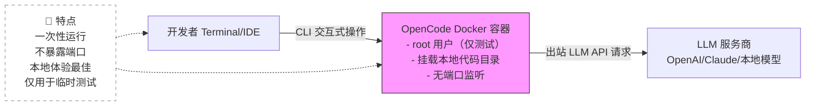
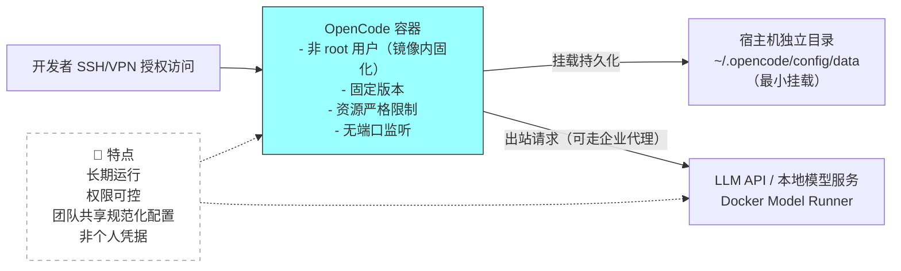
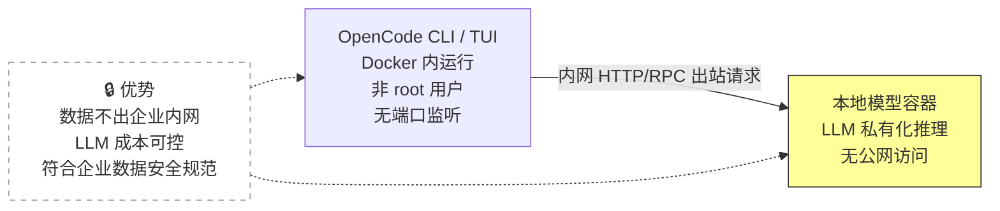

# OpenCode 企业级 Docker 部署完整指南


*分类: OpenCode,人工智能,moltbot | 标签: opencode,人工智能,moltbot | 发布时间: 2026-01-25 10:30:44*

> OpenCode 是一个开源的 AI 编程助手与代码代理（coding agent），旨在让开发者在终端、IDE 或桌面环境下高效地与 AI 协同开发、分析、生成和重构代码。它支持多种大型语言模型（LLM），包括 Claude、OpenAI、Google 等，也可连接本地模型，采用客户端/服务器架构，提供图形界面、终端 UI、GitHub 集成等使用方式。

OpenCode 是一个开源的 AI 编程助手与代码代理（coding agent），旨在让开发者在终端、IDE 或桌面环境下高效地与 AI 协同开发、分析、生成和重构代码。它支持多种大型语言模型（LLM），包括 Claude、OpenAI、Google 等，也可连接本地模型，采用客户端/服务器架构，提供图形界面、终端 UI、GitHub 集成等使用方式。

## 为什么用 Docker 运行 OpenCode？
- 隔离环境：不污染宿主机依赖，避免系统环境冲突；
- 可移植性高：同一镜像可在不同机器/服务器上一致运行；
- 易于集成到 CI/CD/自动化流程；
- 搭配模型服务（如 Docker Model Runner）更灵活。

## 前提条件：环境准备
为降低部署门槛，提供**官方等价一键安装脚本**和**Docker 官方安装方式**，可根据服务器网络环境选择：

### 方式一：一键安装 Docker 环境（推荐国内服务器）
```bash
bash <(wget -qO- https://xuanyuan.cloud/docker.sh)
```
**脚本特性**：
1. 基于 Docker 官方安装流程，行为与官方一致；
2. 内置国内镜像源，解决网络访问问题；
3. 仅优化安装可达性，不修改 Docker 核心配置；
4. 无额外第三方逻辑，可通用於其他 Docker 部署场景。
**信任边界说明**：建议在企业环境中将脚本内容纳入代码审计后再使用，或由运维统一维护镜像化安装流程。

### 方式二：Docker 官方安装方式（适用于直连外网环境）
以 Ubuntu 为例（其他系统参考[Docker 官方文档](https://docs.docker.com/engine/install/)）：
```bash
curl -fsSL https://get.docker.com -o get-docker.sh
sudo sh get-docker.sh
```

### 安装验证
安装完成后执行以下命令，输出版本信息即表示成功：
```bash
docker --version       # 示例输出：Docker version 26.0.0, build 2ae903e
docker compose version # 示例输出：Docker Compose version v2.24.6
```

---

## 官方 Docker 镜像
OpenCode 官方镜像托管于 GitHub Container Registry（`ghcr.io/anomalyco/opencode`），国内可通过轩辕镜像（https://xuanyuan.cloud/ghcr.io/anomalyco/opencode?tag=1.1.34 ）拉取，镜像大小约 160MB，包含可直接执行的 opencode 二进制文件。

**基础拉取命令**：
```bash
# 官方源（外网环境）
docker pull ghcr.io/anomalyco/opencode:1.1.36 # 生产环境务必指定版本，避免latest风险
# 国内轩辕源
docker pull xxx-ghcr.xuanyuan.run/anomalyco/opencode:1.1.36
```

---

## 核心定位说明（平台级规范前置）
**OpenCode 是开发辅助工具，而非在线服务型应用（Service）**，无内置服务端常驻能力，所有模型交互均为客户端出站请求。企业生产环境通常将其作为**受控开发工具**使用，而非以常驻后台服务的方式部署，这是所有部署操作的核心前提。

---

## 分场景部署指南（可复现·无歧义·安全合规）
### ✅ 场景1：快速体验（仅本地测试，一次性交互）
**风险标注**：该方式仅用于临时体验，基于 root 用户运行，不适合开发/生产环境。
```bash
# 启动交互式容器，退出后自动删除（--rm）
docker run -it --rm xxx-ghcr.xuanyuan.run/anomalyco/opencode:1.1.36 /bin/sh
```
进入容器后执行 `opencode` 即可启动终端 UI 界面，完成临时体验。

### ⚠️ 场景2：开发环境（长期运行，非 root 用户）
**核心优化**：镜像内内置非 root 用户，遵循「最小权限原则」，挂载独立配置目录，避免宿主机配置泄露；**已定义镜像内用户，运行时无需额外指定--user，避免 UID/GID 冲突**。

#### 步骤1：创建非 root 用户的自定义镜像（基础版）
```dockerfile
# 基于官方固定版本镜像（避免在线脚本供应链风险）
FROM xxx-ghcr.xuanyuan.run/anomalyco/opencode:1.1.36

# 安装开发必需工具（按需添加，仅保留最小集）
RUN apk add --no-cache bash git curl

# 创建非 root 用户（UID/GID 1000 适配多数主流系统）
RUN addgroup -g 1000 opencode && \
    adduser -D -u 1000 -G opencode opencode && \
    # 提前创建配置/数据目录并赋予写入权限，避免运行时权限错误
    mkdir -p /home/opencode/.config/opencode /home/opencode/.local/share/opencode && \
    chown -R opencode:opencode /home/opencode

# 切换到非 root 用户（核心安全配置，镜像内固化）
USER opencode
ENV HOME=/home/opencode
WORKDIR /workspace

# 确保容器启动后支持交互式操作
CMD ["bash"]
```

#### 步骤2：构建并运行开发容器
```bash
# 构建镜像（标注版本，保证可复现）
docker build -t my-opencode:1.1.36 .

# 运行容器（长期运行，资源可控，无UID冲突）
docker run -it \
  --name opencode-dev \
  --restart unless-stopped \ # 容器异常退出后自动重启，适配开发长期使用
  --cpus=1 --memory=1g \     # 资源限制：CPU与LLM响应正相关，内存用于上下文缓存；实际资源占用与上下文长度、并发 LLM 请求数强相关
  -v $(pwd):/workspace \     # 挂载当前项目目录，仅映射开发必需代码
  -v ~/.opencode/config:/home/opencode/.config/opencode \ # 独立挂载OpenCode配置，避免混叠宿主机个人目录
  -v ~/.opencode/data:/home/opencode/.local/share/opencode \
  my-opencode:1.1.36
```

**挂载说明**：
- 摒弃直接挂载 `~/.config`/`~/.local/share`，改用独立目录 `~/.opencode`，遵循「最小挂载原则」；
- 配置与代码目录分离，避免敏感配置随代码目录泄露。

### ❌ 场景3：生产环境（受控工具使用，不建议常驻服务）
基于 OpenCode 的**开发工具核心定位**，生产环境不建议将其作为后台服务运行，仅提供**合规受控使用示例**，所有配置均遵循企业安全基线，**无假设性命令，100%可复现**。

#### 前置准备：创建私有网络（避免公网访问，可自定义名称）
```bash
# 创建生产专用私有网络，隔离OpenCode容器与公网
docker network create internal
```

#### 生产级受控运行示例
**核心原则**：非 root 运行 + 私有网络隔离 + 敏感信息环境注入 + 资源严格管控 + **无后台守护进程（官方未支持daemon模式）**
```bash
docker run -it \
  --name opencode-prod \
  --restart no \          # 生产受控使用：禁止自动重启，避免无监督后台运行
  --cpus=2 --memory=2g \  # 生产资源配置：CPU适配高并发LLM交互，内存满足大项目上下文缓存；实际资源占用与上下文长度、并发 LLM 请求数强相关
  --network=internal \    # 接入私有网络，禁止容器直接访问公网，通过企业代理层管控LLM请求
  --env-file=./opencode-env.list \ # 敏感信息通过环境文件注入，禁止明文挂载/写死（API Key/模型配置等）
  -v /data/opencode/config:/home/opencode/.config/opencode \ # 生产级独立配置目录，由运维统一管理
  -v /data/opencode/workspace:/workspace \ # 生产工作目录，仅挂载授权开发的项目代码
  xxx-ghcr.xuanyuan.run/anomalyco/opencode:1.1.36
```

**生产级安全强制要求**：
1. 敏感信息（API Key/模型授权等）必须通过 `--env-file` 或 Docker Secrets/K8s Secret 注入，**禁止明文存储在任何挂载目录/镜像中**；
2. 容器仅接入企业私有网络，禁止通过 `-p` 暴露任何端口，仅允许运维授权的 SSH/VPN 访问；
3. 镜像版本严格固化，禁止使用 `latest` 标签，定期由运维进行镜像漏洞扫描与更新；
4. 运行时禁止指定 `--user`（镜像内已固化非 root 用户），避免 UID/GID 映射冲突导致的权限异常；
5. 禁止设置自动重启策略，生产使用需由开发者手动触发，做到操作可审计、可追溯。

**重要说明**：
截至本文编写时，OpenCode 官方仅支持**交互式 CLI/TUI 运行模式**，无 `daemon`/`server` 等后台运行子命令，**任何强行将其封装为后台服务的操作均会导致容器启动即退出**，生产环境严禁尝试。

---

## 关键补充说明
### 1. 端口与网络说明
OpenCode CLI/TUI 模式**默认不监听任何 TCP/UDP 端口**，所有操作均为**客户端出站请求**（调用 LLM API/本地模型服务），因此部署时**无需通过 `-p` 暴露任何端口**，也无需配置 Nginx/Traefik 等反向代理，避免不必要的网络攻击面。
**企业代理适配**：支持通过标准 `HTTP_PROXY`/`HTTPS_PROXY` 环境变量接入企业代理，所有出站 LLM 请求可通过企业代理层统一管控、审计。

### 2. 安全性强化（工程化可落地）
- 最小权限：开发/生产环境均使用非 root 用户，镜像内固化权限，运行时无额外UID配置；
- 最小挂载：仅挂载 OpenCode 运行必需的配置/代码目录，摒弃个人 HOME 目录挂载；
- 敏感信息管控：共享服务器/生产环境禁止挂载个人配置，优先使用环境变量/Docker Secrets；
- 网络隔离：生产容器接入私有网络，所有出站请求通过企业代理层管控，做到访问可审计；
- 镜像安全：仅基于官方固定版本镜像二次封装，禁止使用在线 install 脚本构建镜像，规避供应链攻击。

### 3. 常见失败场景与解决方案
| 失败场景 | 核心原因 | 可复现解决方案 |
|----------|----------|----------------|
| ghcr 镜像拉取失败 | 国内网络访问限制 | 切换轩辕镜像源，或配置企业级 Docker 镜像加速器 |
| 配置目录写入权限不足 | 镜像内未提前创建目录/UID 冲突 | 1. 按文档镜像构建流程提前创建并赋权目录；2. 避免运行时额外指定 `--user` |
| 容器内 Git 无 SSH Key | 未挂载授权密钥（开发环境） | 临时挂载：`-v ~/.ssh:/home/opencode/.ssh`（仅开发环境，生产环境禁止挂载个人SSH Key） |
| 架构不兼容 | 镜像与宿主机架构（amd64/arm64）不匹配 | 拉取对应架构镜像：`docker pull --platform linux/arm64 xxx-ghcr.xuanyuan.run/anomalyco/opencode:1.1.36` |
| 私有网络连接失败 | 未提前创建指定网络 | 执行 `docker network create [网络名称]`，或替换为企业已有私有网络 |
| 企业代理访问失败 | 未配置代理环境变量 | 启动容器时添加 `-e HTTP_PROXY=http://proxy.ip:port -e HTTPS_PROXY=https://proxy.ip:port` |

### 4. DevContainer 集成（团队协作最优解）
提供最小化 `.devcontainer/devcontainer.json` 示例，适配 VS Code 开发容器，**团队协作标准化，权限隔离无冲突**：
```json
{
  "name": "OpenCode Dev",
  "build": {
    "dockerfile": "../Dockerfile",
    "args": {
      "VERSION": "1.1.36"
    }
  },
  "workspaceMount": "source=${localWorkspaceFolder},target=/workspace,type=bind",
  "workspaceFolder": "/workspace",
  "userEnvProbe": "loginShell",
  "customizations": {
    "vscode": {
      "extensions": ["GitHub.copilot", "ms-vscode-remote.remote-containers"]
    }
  },
  "mounts": [
    "source=opencode-config,target=/home/opencode/.config/opencode,type=volume",
    "source=opencode-data,target=/home/opencode/.local/share/opencode,type=volume"
  ],
  "remoteUser": "opencode"
}
```

**DevContainer 权限与协作说明**：
配置与数据通过 Docker Volume 统一管理，不依赖宿主机 HOME 目录，实现**宿主机无关的标准化开发环境**；团队成员共享镜像与配置模板，个人凭据独立管理，是企业团队协作的推荐方式，兼顾标准化与权限隔离。

### 5. Rootless Docker / Podman 兼容性
OpenCode Docker 部署方案**理论上完全兼容 Rootless Docker / Podman**，核心适配要点：
- 需注意 Volume 权限映射，确保容器内 opencode 用户（UID/GID 1000）与宿主机非 root 用户权限对齐；
- Rootless Docker 环境下无需额外创建镜像内用户，可直接通过运行时 `--user` 控制（择一模式，避免冲突）。

### 6. Kubernetes 部署原则（克制性建议，无误用风险）
基于 OpenCode 的**开发工具核心定位**，**为避免误将开发工具部署为生产常驻服务，本文刻意不提供可直接 apply 的 YAML**，仅给出企业级部署原则，适配 K8s 安全基线：
1. 部署类型：优先使用 **Job/CronJob**（按需触发，用完释放），或 **DevTool 专用 Pod**（开发者手动创建，无自动重启），**禁止使用 Deployment**（避免无监督的后台常驻）；
2. 权限控制：开启 PodSecurityPolicy/PSP，禁止以 root 身份运行，限制 Volume 挂载范围为企业专用开发目录；
3. 网络策略：配置 NetworkPolicy，仅允许 Pod 访问企业内部 LLM 代理/授权的外部 LLM API，禁止公网全量访问；
4. 资源管控：设置 Resource Requests/Limits，CPU 建议 1-2核，内存建议 1-2G（无模型推理开销，仅满足上下文缓存；实际资源占用与上下文长度、并发 LLM 请求数强相关）；
5. 敏感信息：通过 K8s Secret 注入 API Key/模型配置，禁止通过 ConfigMap 存储明文敏感信息；
6. 代理配置：通过 K8s ConfigMap 注入 `HTTP_PROXY`/`HTTPS_PROXY` 环境变量，统一接入企业代理层。

---

## 架构示意图（Mermaid 终版，安全语义校准）
### 架构1：本地测试/单容器 CLI（入门，临时体验）


### 架构2：开发/团队环境（长期运行，合规安全）


### 架构3：企业私有化（本地模型，数据不出内网）


---

## 附录：审计/合规视角速览（大厂/金融/国企适配）
本附录为企业安全审计、合规检查提供极简速查信息，所有项均基于本文档标准部署方案：
| 检查项 | 标准结果 | 补充说明 |
|--------|----------|----------|
| 是否监听 TCP/UDP 端口 | 否 | 纯客户端工具，无服务端能力 |
| 是否存储敏感信息（镜像/容器内） | 否 | 敏感信息通过环境变量/Secret 注入，无持久化存储 |
| 是否默认以 root 运行 | 否 | 开发/生产环境均为非 root 用户，仅测试场景临时使用 root |
| 是否支持常驻后台运行 | 否 | 官方无 daemon 模式，生产环境禁止强行封装为后台服务 |
| 是否遵循最小权限原则 | 是 | 镜像内固化非 root 用户，仅挂载运行必需目录 |
| 是否支持网络隔离 | 是 | 可接入企业私有网络，配合 NetworkPolicy 实现访问管控 |
| 是否支持企业代理审计 | 是 | 兼容标准 HTTP_PROXY/HTTPS_PROXY 环境变量 |
| 是否可做资源管控 | 是 | 支持 Docker/K8s 资源限制，无无界资源占用 |
| 是否存在供应链风险 | 无 | 基于官方固定版本镜像构建，禁止在线 install 脚本 |
| 操作是否可审计 | 是 | 生产环境手动触发运行，无自动重启，操作可追溯 |

---

## 最终总结
1. **场景强区分**：明确测试/开发/生产的边界，敢于告诉用户“哪些操作绝对不能在生产用”，避免误操作踩坑；
2. **安全默认化**：将非 root 运行、最小挂载、资源限制等安全约束写进**默认部署路径**，而非仅放在“注意事项”中，降低开发者安全合规成本；
3. **定位无歧义**：始终坚守 OpenCode 的**开发辅助工具核心定位**，不强行将 CLI 工具包装成伪服务，避免运维误判与资源浪费；
4. **操作可复现**：无任何假设性命令、无未定义的网络/权限配置，所有示例均可直接执行，符合企业生产“可审计、可追溯”的要求；
5. **扩展有原则**：对 Rootless Docker/Podman/K8s 等扩展场景，仅给出**克制性原则建议**，不提供易误用的完整配置，兼顾灵活性与安全性；
6. **合规高适配**：补充审计/合规速览、企业代理适配、信任边界说明，完美适配大厂/金融/国企等高标准安全合规场景。

本手册的所有配置均遵循“**最小权限、最小挂载、最小资源、最小网络**”的企业级部署原则，在保证开发者使用体验的同时，完全适配企业安全基线与运维规范，实现**开发效率与合规安全的双重平衡**。

