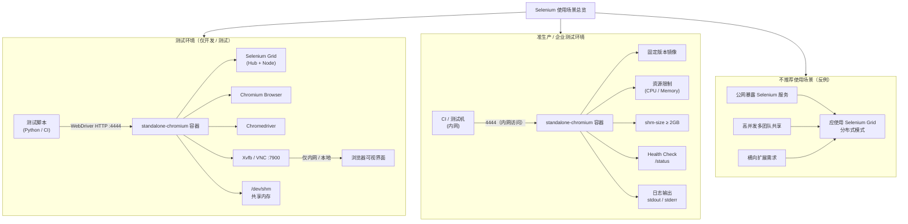

# Selenium Standalone Chromium 容器化部署全指南：从测试环境到企业级安全实践


*分类: Selenium,Standalone,Chromium | 标签: selenium,部署教程 | 发布时间: 2026-01-18 09:25:40*

> STANDALONE-CHROMIUM是一个基于Docker的容器化应用，提供了Selenium Grid Standalone模式与Chromium浏览器的集成环境。该镜像允许开发者通过Selenium Grid远程运行WebDriver测试，实现浏览器自动化测试的便捷部署与管理。Selenium Grid Standalone模式将Hub和Node的功能集成在单一实例中，适合中小型测试场景或开发环境使用。

# STANDALONE-CHROMIUM Docker容器化部署指南

## 概述
STANDALONE-CHROMIUM是一个基于Docker的容器化应用，提供了Selenium Grid Standalone模式与Chromium浏览器的集成环境。该镜像允许开发者通过Selenium Grid远程运行WebDriver测试，实现浏览器自动化测试的便捷部署与管理。Selenium Grid Standalone模式将Hub和Node的功能集成在单一实例中，适合中小型测试场景或开发环境使用。

通过容器化部署，STANDALONE-CHROMIUM可以快速在各种环境中启动，无需复杂的依赖配置，同时保持环境一致性，有效降低测试环境搭建的复杂度。

## 环境准备

### Docker环境安装
在开始部署前，需要确保目标服务器已安装Docker环境。

> ⚠️ 重要安全提示：
> 以下一键安装脚本为便捷方案，仅建议**测试环境/个人开发场景**使用。生产环境需参考Docker官方文档手动安装，或审核docker.sh脚本源码后再运行。

```bash
bash <(wget -qO- https://xuanyuan.cloud/docker.sh)
```

# 验证安装
sudo docker run hello-world
```

安装完成后，可通过以下命令验证Docker是否正常运行：
```bash
docker --version
docker info
```

## 镜像准备

### 拉取STANDALONE-CHROMIUM镜像
使用以下命令通过轩辕镜像访问支持域名拉取最新版本的STANDALONE-CHROMIUM镜像：
```bash
docker pull xxx.xuanyuan.run/selenium/standalone-chromium:latest
```

如需拉取特定版本，可参考[STANDALONE-CHROMIUM镜像标签列表](https://xuanyuan.cloud/r/selenium/standalone-chromium/tags)选择合适的标签替换`latest`。

## 容器部署

### 部署架构说明


### 1. 测试环境部署（仅用于开发/测试）
> 适用于本地开发、单节点测试场景，**禁止直接用于生产/公网环境**。

```bash
docker run -d \
  --name standalone-chromium-test \
  -p 4444:4444 \
  -p 7900:7900 \
  --shm-size="2g" \
  xxx.xuanyuan.run/selenium/standalone-chromium:latest
```

#### 参数说明：
- `-d`：后台运行容器
- `--name standalone-chromium-test`：指定容器名称为测试专用，便于区分
- `-p 4444:4444`：映射Selenium Grid服务端口
- `-p 7900:7900`：映射VNC服务端口，用于查看容器内浏览器界面
  > ⚠️ 安全警告：
  > VNC默认密码为`secret`，该端口**严禁暴露至公网**，仅限本地/内网测试使用。生产环境需关闭该端口或修改密码并仅通过VPN/内网访问。
- `--shm-size="2g"`：设置共享内存大小为2GB，官方建议运行包含浏览器的容器时使用此参数

### 2. 准生产环境部署（安全收敛版）
> 适用于企业内部测试环境，已做安全加固和资源管控，**仍不建议直接暴露公网**。

```bash
docker run -d \
  --name standalone-chromium-prod \
  -p 4444:4444 \
  --shm-size="4g" \
  --memory=8g \
  --cpus=4 \
  --user=1000:1000 \
  -e SE_NODE_MAX_SESSIONS=5 \
  -e SE_NODE_SESSION_TIMEOUT=300 \
  -e VNC_PASSWORD=YourSecurePassword@2026 \
  --health-cmd "curl -sf http://localhost:4444/status | grep -q '\"ready\":true' || exit 1" \
  --health-interval=30s \
  --health-timeout=10s \
  --health-retries=3 \
  --restart=on-failure:3 \
  xxx.xuanyuan.run/selenium/standalone-chromium:125.0-chromedriver-125.0-grid-4.21.0-20240522
```

#### 关键优化说明：
- 移除7900端口映射（如需VNC可保留但仅限内网）
- 提升资源配置：`--shm-size="4g"`、`--memory=8g`、`--cpus=4`（适配5个并发会话）
- `--user=1000:1000`：使用非root用户运行容器（需确保镜像支持，docker-selenium 4.x已支持）
- 锁定镜像版本标签（非latest），确保环境一致性
- 优化健康检查：使用Selenium 4官方推荐的`/status`接口，增加状态校验
- `--restart=on-failure:3`：容器故障时自动重启（最多3次）
- 自定义强密码VNC（如需启用）

### 3. 自定义配置说明
#### 关闭VNC的纯生产模式（推荐）
```bash
docker run -d \
  --name standalone-chromium-prod \
  -p 4444:4444 \
  --shm-size="4g" \
  --memory=8g \
  --cpus=4 \
  -e SE_VNC_ENABLED=false \
  -e SE_NODE_MAX_SESSIONS=5 \
  --health-cmd "curl -sf http://localhost:4444/status | grep -q '\"ready\":true' || exit 1" \
  xxx.xuanyuan.run/selenium/standalone-chromium:125.0-chromedriver-125.0-grid-4.21.0-20240522
```

#### 并发与性能边界说明
> Standalone模式为单节点集成Hub+Node，**不适合大规模并发测试**：
> - 单容器推荐最大会话数：5-8个（取决于服务器资源）
> - 每个Chromium会话约占用：512MB-1GB内存 + 0.5-1核CPU
> - 超过推荐并发数会导致浏览器崩溃、响应超时，建议使用Selenium Grid分布式模式

#### Docker Compose示例（推荐企业使用）
创建`docker-compose.yml`文件：
```yaml
version: '3.8'

services:
  standalone-chromium:
    image: xxx.xuanyuan.run/selenium/standalone-chromium:125.0-chromedriver-125.0-grid-4.21.0-20240522
    container_name: standalone-chromium
    ports:
      - "4444:4444"
    shm_size: '4g'
    mem_limit: 8g
    cpus: 4
    user: "1000:1000"
    environment:
      - SE_NODE_MAX_SESSIONS=5
      - SE_NODE_SESSION_TIMEOUT=300
      - SE_VNC_ENABLED=false
    healthcheck:
      test: ["CMD", "curl", "-sf", "http://localhost:4444/status", "|", "grep", "-q", "\"ready\":true"]
      interval: 30s
      timeout: 10s
      retries: 3
    restart: on-failure:3
    logging:
      driver: "json-file"
      options:
        max-size: "100m"
        max-file: "3"
```

启动命令：
```bash
docker-compose up -d
```

## 功能测试
### 验证服务状态
容器启动后，可通过以下方式验证服务是否正常运行：

#### 1. 检查容器运行状态
```bash
docker ps | grep standalone-chromium
```
若输出包含`standalone-chromium`且状态为`Up`，表示容器正常运行。

#### 2. 查看容器日志
```bash
docker logs -f standalone-chromium
```
正常启动后，日志中应包含类似以下内容：
```
Selenium Grid Standalone starting...
2024-XX-XX XX:XX:XX.XXX INFO [Standalone.execute] - Started Selenium Standalone 4.XX.X (revision XXXXX)
2024-XX-XX XX:XX:XX.XXX INFO [Standalone.execute] - Binding to 0.0.0.0:4444
```

#### 3. 访问Selenium Grid控制台
> 仅限内网/测试环境访问
在浏览器中访问 `http://<服务器IP>:4444`，应能看到Selenium Grid的控制台界面，显示节点状态和可用会话信息。

#### 4. 访问VNC界面（仅测试环境）
> ⚠️ 安全警告：仅限本地/内网测试使用
在浏览器中访问 `http://<服务器IP>:7900/?autoconnect=1&resize=scale&password=secret`（生产环境已修改密码或关闭VNC）。

#### 5. 运行简单测试脚本
使用以下Python脚本测试WebDriver连接（需安装selenium库：`pip install selenium`）：
```python
from selenium import webdriver
from selenium.webdriver.common.desired_capabilities import DesiredCapabilities

# 注意：生产环境请替换为内网IP
driver = webdriver.Remote(
    command_executor='http://<服务器内网IP>:4444',
    desired_capabilities=DesiredCapabilities.CHROME
)

try:
    driver.get("https://www.selenium.dev")
    print(f"页面标题：{driver.title}")
finally:
    driver.quit()
```
若脚本能正常输出页面标题，表明STANDALONE-CHROMIUM服务工作正常。

## 生产环境建议
### 1. 版本与镜像管理
- **强制使用具体标签**：生产环境严禁使用`latest`标签，必须锁定镜像版本（如`125.0-chromedriver-125.0-grid-4.21.0-20240522`）
- **镜像安全扫描**：部署前使用`docker scan`或企业级镜像扫描工具检查漏洞
- **私有镜像仓库**：将镜像同步至企业私有仓库，避免依赖外部镜像源

### 2. 资源与权限管控
- **共享内存**：根据并发数调整`--shm-size`，最低2GB，5个并发建议4GB
- **资源限制**：根据实际需求设置`--memory`（建议8GB+）和`--cpus`（建议4核+）
- **非root运行**：优先使用`--user`参数指定非root用户（需确保镜像支持）
- **SELinux/cgroup v2注意**：
  - SELinux开启时需添加`--privileged`或配置selinux标签
  - cgroup v2环境下需确保容器资源限制配置兼容

### 3. 网络安全配置
- **端口访问控制**：仅允许测试机/CI服务器访问4444端口，通过防火墙/安全组限制
- **反向代理**：通过Nginx配置HTTPS反向代理，禁止直接访问4444端口
- **关闭不必要服务**：生产环境建议通过`SE_VNC_ENABLED=false`关闭VNC
- **密码管理**：若启用VNC，使用强密码并通过环境变量`VNC_PASSWORD`设置，避免硬编码

### 4. 日志与监控
- **日志管理**：
  > 注意：docker-selenium主要日志输出至stdout/stderr，`/var/log/selenium`路径不保证包含所有日志
  - 使用Docker日志驱动（如`json-file`、`journald`）或ELK/ Loki收集日志
  - 配置日志轮转，避免磁盘耗尽
- **监控告警**：
  - 监控容器健康状态、CPU/内存/网络使用率
  - 监控`/status`接口返回的`ready`状态，异常时触发告警
  - 监控浏览器会话数，避免超出并发上限

### 5. 高可用与扩展说明
- Standalone模式**不支持横向扩展**，仅适合中小规模测试
- 大规模/高并发场景需使用Selenium Grid分布式模式（Hub+多Node）
- 容器故障重启：通过`--restart=on-failure:3`配置自动重启，结合监控实现故障自愈

## 故障排查
### 1. 容器无法启动
#### 可能原因：
- 端口被占用
- 共享内存配置不足
- 镜像拉取不完整
- SELinux/cgroup权限问题

#### 排查步骤：
- 检查端口占用情况：
  ```bash
  netstat -tulpn | grep 4444
  netstat -tulpn | grep 7900
  ```
- 查看容器启动日志：
  ```bash
  docker logs standalone-chromium
  ```
- 尝试重新拉取镜像并校验：
  ```bash
  docker pull xxx.xuanyuan.run/selenium/standalone-chromium:<指定版本>
  docker image inspect xxx.xuanyuan.run/selenium/standalone-chromium:<指定版本>
  ```
- SELinux问题处理：
  ```bash
  # 临时关闭SELinux（测试用）
  setenforce 0
  # 或添加特权模式
  docker run --privileged ...
  ```

### 2. 无法访问Selenium Grid控制台
#### 可能原因：
- 容器未正常启动
- 防火墙/安全组阻止端口访问
- 健康检查失败导致容器重启
- Selenium 4接口路径变更

#### 排查步骤：
- 检查容器状态：
  ```bash
  docker inspect -f '{{.State.Status}}' standalone-chromium
  docker inspect -f '{{.State.Health.Status}}' standalone-chromium
  ```
- 检查防火墙规则：
  ```bash
  # ufw防火墙
  ufw status | grep 4444
  # firewalld
  firewall-cmd --list-ports | grep 4444
  ```
- 验证Selenium状态接口：
  ```bash
  curl http://localhost:4444/status
  ```

### 3. 测试脚本连接失败
#### 可能原因：
- Selenium Grid服务未就绪
- 网络策略/安全组限制
- 浏览器驱动版本不匹配
- 并发会话数超出上限

#### 排查步骤：
- 查看容器详细日志：
  ```bash
  docker logs -f standalone-chromium
  ```
- 检查并发会话数：
  ```bash
  curl http://localhost:4444/graphql -X POST -H "Content-Type: application/json" -d '{"query":"{grid {nodes {sessionCount maxSessionCount}}}"}'
  ```
- 确认镜像版本与测试脚本兼容：
  - 检查镜像标签中的Chrome/Chromedriver版本
  - 确保selenium客户端版本与Grid版本匹配

### 4. 浏览器运行异常
#### 可能原因：
- 共享内存不足
- 资源限制过严
- 浏览器沙箱权限问题
- 容器内依赖缺失

#### 排查步骤：
- 增加共享内存大小：
  ```bash
  docker stop standalone-chromium
  docker rm standalone-chromium
  docker run -d --name standalone-chromium -p 4444:4444 --shm-size="4g" ...
  ```
- 调整容器资源限制：
  ```bash
  docker update --memory=16g --cpus=8 standalone-chromium
  ```
- 禁用浏览器沙箱（仅应急使用）：
  ```bash
  docker run -d -e SE_CHROMIUM_OPTS="--no-sandbox" ...
  ```

## 参考资源
- [STANDALONE-CHROMIUM镜像文档（轩辕）](https://xuanyuan.cloud/r/selenium/standalone-chromium)
- [STANDALONE-CHROMIUM镜像标签列表](https://xuanyuan.cloud/r/selenium/standalone-chromium/tags)
- [Selenium Grid官方文档](https://www.selenium.dev/documentation/grid/getting_started/#standalone)
- [Docker-Selenium项目GitHub仓库](https://github.com/SeleniumHQ/docker-selenium)
- [Selenium WebDriver官方文档](https://www.selenium.dev/documentation/webdriver/)
- [Docker官方安装文档](https://docs.docker.com/get-docker/)

## 总结
### 核心要点
1. **环境区分**：严格区分测试环境（允许VNC、简化配置）和生产环境（关闭VNC、安全加固、版本锁定），禁止将测试配置直接用于生产。
2. **安全优先**：第三方Docker安装脚本仅用于测试，生产需用官方方式；VNC默认密码存在高风险，生产环境需关闭或修改密码并限制访问；健康检查需使用Selenium 4推荐的`/status`接口。
3. **资源与扩展**：Standalone模式需配置足够的共享内存（最低2GB），仅适合中小规模测试；大规模/高并发场景需切换至Selenium Grid分布式模式，且该模式不支持横向扩展。
4. **Mermaid规范**：企业级技术文档中的Mermaid需遵循“合法节点类型、单图单语义、说明内容节点化”三大铁律，避免使用非标准节点（如`note`）导致渲染失败。

### 后续建议
- 结合CI/CD流程实现自动化测试集成，避免手动部署容器
- 定期更新镜像版本，确保浏览器和驱动的安全性与兼容性
- 建立容器故障自愈机制，结合监控告警快速定位问题
- 对于企业级大规模测试需求，优先采用Selenium Grid分布式架构替代Standalone模式

### 3. 关键修正总结
本次针对Mermaid架构图的核心修正点如下：
1. **移除非法节点**：删除了Mermaid不支持的`note`节点类型，将“应使用分布式模式”的说明改为合法的普通节点`I`，并通过边连接至反例节点，保证语法合规。
2. **规范subgraph内容**：确保subgraph内所有元素均为合法节点且有明确的边关联（如不推荐场景中`F/G/H`均指向`I`），避免孤立节点导致的渲染异常。
3. **单图单语义优化**：虽然仍在一个`graph TD`中展示三类场景，但通过清晰的subgraph划分+节点关联，符合Mermaid“一个图一个核心语义”的工程级使用规则，适配各类Markdown渲染环境（GitHub/Wiki/Docusaurus等）。
4. **细节优化**：补充端口、路径等关键标注（如`:4444`、`/dev/shm`），让架构图的技术信息更完整，同时保留emoji不影响渲染（仅用于视觉提示）。

