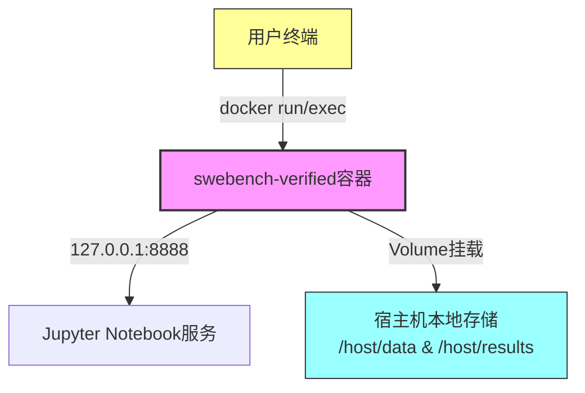
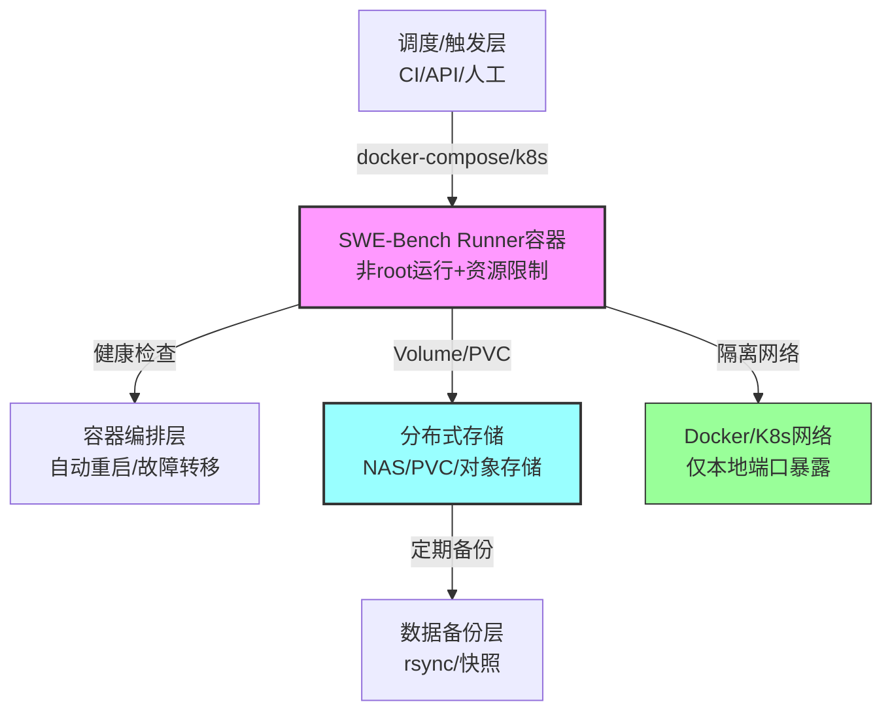

# SWEBENCH-VERIFIED Docker 容器化部署指南


*分类: SWEBENCH-VERIFIED,人工智能 | 标签: swebench-verified,人工智能 | 发布时间: 2026-01-21 16:05:44*

> SWEBENCH-VERIFIED（镜像名称：`slimshetty/swebench-verified`）是由R2E-Gym项目核心贡献者发布的容器化应用，专为SWE-Bench Verified基准提供预配置的运行环境。该镜像封装了基准数据集、测试工具与适配的运行时环境，旨在简化AI编程助手性能验证、基准工具开发与实验复现流程，避免手动搭建依赖的复杂性，确保实验结果的一致性与可复现性。

## 概述
SWEBENCH-VERIFIED（镜像名称：`slimshetty/swebench-verified`）是由R2E-Gym项目核心贡献者发布的容器化应用，专为SWE-Bench Verified基准提供预配置的运行环境。该镜像封装了基准数据集、测试工具与适配的运行时环境，旨在简化AI编程助手性能验证、基准工具开发与实验复现流程，避免手动搭建依赖的复杂性，确保实验结果的一致性与可复现性。

其核心特性包括：
- **完整基准环境**：集成SWE-Bench Verified权威编程任务基准，支持数据集加载与测试执行
- **开箱即用配置**：预装Python环境、测试框架及依赖库，无需手动配置
- **项目适配优化**：针对R2E-Gym等项目优化，支持复现"34.4% Pass@1"、"64.4% Pass@Any"等性能指标
- **实验一致性保障**：标准化运行环境，降低因环境差异导致的实验偏差

> ⚠️ 环境定位说明：本文档的部署方案**主要面向实验/基准复现场景**，所有`docker run`示例均为单机实验范式；若用于企业生产环境，需额外补充安全加固、高可用、可观测性等生产级配置（如Kubernetes编排、权限最小化、审计日志等）。

## 环境准备

### Docker环境安装
```bash
bash <(wget -qO- https://xuanyuan.cloud/docker.sh)
```

安装完成后，通过`docker --version`命令验证安装是否成功。

## 镜像准备

### 拉取SWEBENCH-VERIFIED镜像
> ⚠️ 架构支持说明：当前 SWEBENCH-VERIFIED 镜像仅支持 x86_64 架构，ARM 架构（如 Apple Silicon / 鲲鹏 / 树莓派）需自行基于源码构建适配版本。
> ⚠️ 镜像用户说明：当前 slimshetty/swebench-verified 镜像默认仅提供 root 用户，若使用 `--user 1000:1000`，请确保挂载目录权限正确，或自行基于该镜像构建派生镜像添加非 root 用户。

使用以下命令通过轩辕镜像访问支持域名拉取推荐版本的SWEBENCH-VERIFIED镜像：

```bash
docker pull xxx.xuanyuan.run/slimshetty/swebench-verified:sweb.eval.x86_64.sympy__sympy-24562
```

如需其他版本，可查看[SWEBENCH-VERIFIED镜像标签列表](https://xuanyuan.cloud/r/slimshetty/swebench-verified/tags)获取完整标签信息。

> ⚠️ 镜像可信度说明：该镜像为第三方贡献者发布（R2E-Gym项目核心贡献者），未经过企业级安全审计，建议仅用于实验环境；生产环境需自行镜像扫描（如Trivy）、漏洞检测并构建可信镜像。

### 最小可运行验证（Quick Start）
首次使用可通过以下命令快速验证镜像可用性（仅验证基础运行环境，不启动完整服务）：
```bash
# 最小可运行验证（仅验证环境）
docker run --rm xxx.xuanyuan.run/slimshetty/swebench-verified:sweb.eval.x86_64.sympy__sympy-24562 python -V
```
> 结论说明：若该命令可正常输出 Python 版本号（如`Python 3.10.x`），说明镜像架构与宿主机匹配、镜像未损坏、基础 runtime 可正常启动，镜像核心运行环境无异常。

## 容器部署

### 环境边界说明
本文所有`docker run`示例均为**单机实验/基准复现**设计，不等价于企业生产部署范式（生产环境建议使用docker-compose/Kubernetes编排，补充高可用、权限最小化、可观测性配置）。

### 基础部署模式
使用以下命令启动基础模式容器，适用于常规基准测试场景；**默认镜像以root运行**，实验环境建议指定非root用户（如UID/GID 1000:1000）降低风险：

```bash
docker run -d \
  --name swebench-verified \
  --user 1000:1000 \
  -p 127.0.0.1:8888:8888 \
  -v /host/data:/app/data:rw \
  -v /host/results:/app/results:rw \
  xxx.xuanyuan.run/slimshetty/swebench-verified:sweb.eval.x86_64.sympy__sympy-24562
```

参数说明：
- `-d`：后台运行容器
- `--name swebench-verified`：指定容器名称为`swebench-verified`
- `--user 1000:1000`：以非root用户（UID=1000，GID=1000）运行容器，避免root权限风险（需确保宿主机存在该UID/GID，或镜像内置非root用户；若宿主机不存在UID=1000用户，可通过`useradd -u 1000 swebench`创建，或改用镜像内实际用户）
- `-p 127.0.0.1:8888:8888`：端口映射（仅绑定本地回环地址，禁止公网暴露）；容器8888端口为Jupyter Notebook服务（Jupyter Notebook默认完全无鉴权，一旦暴露公网等同于远程代码执行权限，严禁在任何生产或云环境中直接对外开放。
  > ⚠️ 关键风险提示：Jupyter Notebook 默认使用 token 机制启动，但该镜像是否启用 token / password 不可假设。在未明确确认 `jupyter notebook list` 输出中存在 token 前，一律视为“无鉴权服务”。
  > 验证命令：`docker exec swebench-verified jupyter notebook list`
- `-v /host/data:/app/data:rw`：挂载宿主机数据目录至容器，用于存储基准数据集；`/host/data`为宿主机绝对路径，需提前创建并确保运行用户（1000:1000）有读写权限
- `-v /host/results:/app/results:rw`：挂载宿主机结果目录，用于保存测试输出结果

> ⚠️ SELinux/AppArmor提示：若宿主机启用SELinux，需添加`:z`或`:Z`标签（如`-v /host/data:/app/data:rw,z`）；AppArmor环境需确保容器权限策略适配。

### GPU加速模式
如需运行大型模型（如R2EGym-32B），可启用GPU支持（需确保宿主机已安装nvidia-container-toolkit，Docker版本≥19.03）：

```bash
# 先安装nvidia-container-toolkit（生产/实验环境通用，适配Ubuntu 20.04+弃用apt-key的规范）
distribution=$(. /etc/os-release;echo $ID$VERSION_ID)
# 导入GPG密钥（替代已废弃的apt-key）
curl -fsSL https://nvidia.github.io/libnvidia-container/gpgkey \
 | sudo gpg --dearmor -o /usr/share/keyrings/nvidia-container-toolkit.gpg
# 添加软件源（指定签名密钥）
curl -fsSL https://nvidia.github.io/libnvidia-container/$distribution/libnvidia-container.list \
 | sed 's#deb https://#deb [signed-by=/usr/share/keyrings/nvidia-container-toolkit.gpg] https://#g' \
 | sudo tee /etc/apt/sources.list.d/nvidia-container-toolkit.list
# 安装工具包
sudo apt-get update && sudo apt-get install -y nvidia-container-toolkit
sudo nvidia-ctk runtime configure --runtime=docker
sudo systemctl restart docker

# 启动GPU模式容器
docker run -d \
  --name swebench-verified-gpu \
  --user 1000:1000 \
  --gpus all \
  -p 127.0.0.1:8888:8888 \
  -v /host/data:/app/data:rw \
  -v /host/results:/app/results:rw \
  xxx.xuanyuan.run/slimshetty/swebench-verified:sweb.eval.x86_64.sympy__sympy-24562

# 验证GPU是否成功透传（关键验证步骤）
docker exec swebench-verified-gpu nvidia-smi
```

> ⚠️ GPU权限说明：非 root 用户使用 GPU 的前提是 Docker 使用 nvidia-container-runtime，且容器内 /dev/nvidia* 设备文件已正确映射；宿主机用户组（video / nvidia）配置通常不是容器内访问GPU的主要阻碍因素。

### 自定义配置部署
可通过环境变量调整容器运行参数，例如设置日志级别；同时补充生产级基础配置（自动重启、健康检查）：

> ⚠️ 健康检查说明
> 以下 healthcheck 为示例模式，需根据镜像内实际服务接口调整；若镜像未提供 HTTP 接口，可使用更通用的进程级检查（如下方注释的jupyter示例）。

```bash
docker run -d \
  --name swebench-verified-custom \
  --user 1000:1000 \
  --restart unless-stopped \
  # 若镜像无 /api/health 接口，替换为进程级检查（更保守的默认方案）
  # --health-cmd="jupyter notebook list || exit 1" \
  --health-cmd="curl -f http://localhost:8888/api/health || exit 1" \
  --health-interval=30s \
  --health-timeout=10s \
  --health-retries=3 \
  -p 127.0.0.1:8888:8888 \
  -v /host/data:/app/data:rw \
  -v /host/results:/app/results:rw \
  -e LOG_LEVEL=INFO \
  -e MAX_TASKS=100 \
  xxx.xuanyuan.run/slimshetty/swebench-verified:sweb.eval.x86_64.sympy__sympy-24562
```

> ⚠️ 运行风险声明：若未指定`--user`，该镜像默认以root用户运行，仅建议用于隔离良好的实验环境；生产环境需确保镜像内置非root用户（如`USER swebench`）并严格限制权限。

## 功能测试

### 容器状态检查
启动容器后，通过以下命令确认容器运行状态：

```bash
# 查看容器运行状态
docker ps | grep swebench-verified

# 查看容器日志
docker logs -f swebench-verified

# 检查健康状态（若配置了--health-cmd）
docker inspect --format '{{.State.Health.Status}}' swebench-verified
```

### 容器交互操作
进入容器内部进行命令行交互（使用容器内运行用户）：

```bash
docker exec -it --user 1000:1000 swebench-verified /bin/bash
```

### 基准数据集加载
> ⚠️ 合规性提示：SWE-Bench 数据集用于学术与评测目的，企业使用前请自行评估其 license / 合规要求。
> ⚠️ 示例命令：具体脚本名称与参数以镜像内实际内容为准

容器内加载SWE-Bench Verified基准数据集：
```bash
# 数据集加载示例（仅为演示，需以镜像内实际脚本为准）
python load_dataset.py --dataset swebench-verified --output /app/data
```

### 基准测试执行
> ⚠️ 示例命令：具体脚本名称与参数以镜像内实际内容为准

运行完整基准评估或单个任务测试：
```bash
# 运行完整基准评估（示例）
python run_benchmark.py --model your_model --dataset /app/data/swebench-verified

# 运行单个任务测试（示例）
python run_task.py --task task_name --output /app/results
```

### 测试结果验证
> ⚠️ 示例命令：具体脚本名称与参数以镜像内实际内容为准

查看测试结果文件或生成性能报告：
```bash
# 生成性能报告（示例）
python evaluate.py --results /app/results --output /app/results/report.json
```

## 生产环境建议

### 环境边界说明
本文档的基础部署方案仅适用于实验/基准复现场景；企业生产环境需基于以下建议补充生产级配置，核心目标为：权限最小化、数据高可用、运行可观测、风险可管控。

### 数据持久化策略
- **关键数据挂载**：确保`/app/data`（数据集）和`/app/results`（测试结果）目录通过`-v`参数挂载至宿主机，避免容器删除导致数据丢失；挂载时指定权限（如`:rw`），并确保运行用户有对应权限
- **定期备份**：对挂载的宿主机目录进行定期备份，建议使用定时任务（如cron）配合`rsync`或快照工具；生产环境建议使用NAS/PVC等分布式存储替代宿主机本地目录
- **SELinux/AppArmor适配**：宿主机启用安全模块时，需为挂载目录添加正确的标签（如SELinux的`:z`/`:Z`），避免权限拦截

### 资源限制配置
根据宿主机硬件配置，合理限制容器资源使用，避免资源耗尽；生产环境建议进一步限制CPU/内存上限：

```bash
docker run -d \
  --name swebench-verified \
  --user 1000:1000 \
  --restart unless-stopped \
  --memory=16g \
  --memory-swap=20g \
  --cpus=4 \
  --cpuset-cpus=0-3 \
  -p 127.0.0.1:8888:8888 \
  -v /host/data:/app/data:rw,z \
  -v /host/results:/app/results:rw,z \
  xxx.xuanyuan.run/slimshetty/swebench-verified:sweb.eval.x86_64.sympy__sympy-24562
```

### 网络安全配置
- **端口映射安全**：仅绑定本地回环地址（`127.0.0.1`），禁止直接暴露至公网；若需远程访问，建议通过SSH隧道/反向代理（如Nginx）并添加鉴权
- **网络隔离**：生产环境中使用Docker自定义网络隔离容器，限制容器网络访问范围：
  ```bash
  # 创建隔离网络
  docker network create --driver bridge swebench-net
  # 启动容器时加入隔离网络
  docker run -d \
    --name swebench-verified \
    --user 1000:1000 \
    --network swebench-net \
    -p 127.0.0.1:8888:8888 \
    -v /host/data:/app/data:rw \
    -v /host/results:/app/results:rw \
    xxx.xuanyuan.run/slimshetty/swebench-verified:sweb.eval.x86_64.sympy__sympy-24562
  ```
- **禁止特权模式**：严禁使用`--privileged`参数启动容器，避免突破容器隔离边界

### 镜像版本管理
- **固定版本标签**：生产环境应使用具体版本标签（如`sweb.eval.x86_64.sympy__sympy-24562`），避免使用`latest`标签导致版本不可控
- **镜像安全扫描**：生产环境使用前需对镜像进行漏洞扫描（如Trivy）：
  ```bash
  # 安装Trivy
  curl -sfL https://raw.githubusercontent.com/aquasecurity/trivy/main/contrib/install.sh | sh -s -- -b /usr/local/bin
  # 扫描镜像
  trivy image xxx.xuanyuan.run/slimshetty/swebench-verified:sweb.eval.x86_64.sympy__sympy-24562
  ```
- **定期更新**：关注[SWEBENCH-VERIFIED镜像标签列表](https://xuanyuan.cloud/r/slimshetty/swebench-verified/tags)，定期更新镜像以获取安全补丁和功能优化；更新前需在测试环境验证兼容性

### 生产级编排示例（docker-compose）
企业生产环境建议使用`docker-compose`替代`docker run`，便于管理配置、依赖和生命周期：

```yaml
# docker-compose.yml
version: '3.8'

services:
  swebench-verified:
    image: xxx.xuanyuan.run/slimshetty/swebench-verified:sweb.eval.x86_64.sympy__sympy-24562
    container_name: swebench-verified
    user: "1000:1000"
    restart: unless-stopped
    networks:
      - swebench-net
    ports:
      - "127.0.0.1:8888:8888"
    volumes:
      - /host/data:/app/data:rw,z
      - /host/results:/app/results:rw,z
    environment:
      - LOG_LEVEL=INFO
      - MAX_TASKS=100
    # 关键说明：
    # 1. deploy.resources 仅在 Docker Swarm / Kubernetes 场景生效
    # 2. 本地 docker-compose 环境，mem_limit / cpus 为唯一有效资源限制方式
    mem_limit: 16g
    cpus: 4
    deploy:
      resources:
        limits:
          cpus: '4'
          memory: 16G
    healthcheck:
      # 优先使用进程级检查（更通用）
      test: ["CMD", "jupyter", "notebook", "list"]
      interval: 30s
      timeout: 10s
      retries: 3
      start_period: 60s

networks:
  swebench-net:
    driver: bridge
    ipam:
      config:
        - subnet: 172.20.0.0/16
```

启动命令：
```bash
docker-compose up -d
# 查看状态
docker-compose ps
# 查看日志
docker-compose logs -f swebench-verified
```

## 故障排查

### 容器启动失败
- **症状**：`docker ps`未显示容器，或日志中出现启动错误
- **可能原因**：端口冲突、挂载路径不存在、镜像损坏、用户权限不足、SELinux拦截
- **解决方案**：
  - 检查端口占用：`netstat -tulpn | grep 8888`，更换未占用端口
  - 创建挂载目录并设置权限：`mkdir -p /host/data /host/results && chown -R 1000:1000 /host/data /host/results`
  - 重新拉取镜像：`docker pull xxx.xuanyuan.run/slimshetty/swebench-verified:sweb.eval.x86_64.sympy__sympy-24562`
  - SELinux临时关闭测试（仅排查）：`setenforce 0`，确认后添加`:z`标签至挂载目录

### 数据集下载失败
- **症状**：加载数据集时网络超时或资源链接错误
- **可能原因**：网络连接问题、资源链接变更、容器网络隔离、脚本不存在
- **解决方案**：
  - 检查容器网络连通性：`docker exec swebench-verified ping google.com`
  - 手动下载数据集：参考官方文档获取数据集下载链接，手动下载后放入`/host/data`目录，并确保权限为1000:1000
  - 确认镜像内脚本：`docker exec swebench-verified ls -l /app/`，确认`load_dataset.py`是否存在

### GPU不可用
- **症状**：容器内无法识别GPU，或运行模型时提示"CUDA out of memory"
- **可能原因**：未安装nvidia-container-toolkit、Docker版本过低、GPU驱动不兼容、显存不足
- **解决方案**：
  - 安装nvidia-container-toolkit（参考GPU加速模式章节，使用新的GPG密钥导入方式）
  - 验证GPU驱动：`nvidia-smi`检查驱动状态，确保Docker版本≥19.03
  - 调整模型参数：降低batch-size或使用较小模型
  - 验证GPU透传：`docker exec swebench-verified-gpu nvidia-smi`

### 测试结果不一致
- **症状**：多次运行相同测试，结果差异较大
- **可能原因**：随机种子未固定、配置参数不一致、环境资源波动
- **解决方案**：
  - 设置固定随机种子：在测试命令中添加`--seed 42`参数
  - 核对配置参数：确保每次运行使用相同的模型、数据集版本和超参数
  - 限制容器资源：使用`--cpus`/`--memory`固定资源分配，避免资源竞争

### 健康检查失败
- **症状**：`docker inspect`显示容器健康状态为unhealthy
- **可能原因**：健康检查接口不存在、服务未启动、端口未监听
- **解决方案**：
  - 验证服务状态：`docker exec swebench-verified netstat -tulpn | grep 8888`
  - 修改健康检查命令：优先使用进程级检查（如`jupyter notebook list || exit 1`）
  - 延长启动等待：添加`--health-start-period=60s`，给服务足够启动时间

## 部署架构说明
### 实验环境架构


### 类生产环境架构


## 参考资源
- [SWEBENCH-VERIFIED镜像文档（轩辕）](https://xuanyuan.cloud/r/slimshetty/swebench-verified)
- [SWEBENCH-VERIFIED镜像标签列表](https://xuanyuan.cloud/r/slimshetty/swebench-verified/tags)
- [SWE-Bench官方网站](https://www.swebench.com/)
- [R2E-Gym项目仓库](https://github.com/slimshetty/r2e-gym)
- [Docker官方安装文档](https://docs.docker.com/engine/install/)
- [nvidia-container-toolkit安装指南](https://docs.nvidia.com/datacenter/cloud-native/container-toolkit/latest/install-guide.html)
- [Trivy镜像漏洞扫描文档](https://aquasecurity.github.io/trivy/latest/)
- [Docker Compose官方文档](https://docs.docker.com/compose/)

## 总结
本文详细介绍了SWEBENCH-VERIFIED的Docker容器化部署方案，区分了实验环境与生产环境的边界，补充了安全加固、权限最小化、可观测性等生产级配置，有效支持AI编程助手性能验证、基准工具开发与实验复现等场景。

### 关键要点回顾
1. **语法与工具规范**：docker run行续接后禁止加注释，需将注释移至参数说明区；nvidia-container-toolkit安装需使用GPG密钥环替代已废弃的apt-key，适配Ubuntu 20.04+生产环境规范。
2. **安全与权限核心**：Jupyter服务需验证token是否启用，未验证前视为无鉴权；容器内非root用户访问GPU的核心是nvidia-container-runtime和/dev/nvidia*映射，宿主机用户组非关键因素。
3. **配置有效性**：Quick Start的`python -V`可验证镜像基础环境；docker-compose本地环境仅mem_limit/cpus能生效，deploy.resources仅适用于Swarm/K8s。

### 后续建议
- 深入学习SWEBENCH-VERIFIED高级特性，如自定义模型集成、批量实验管理等功能；
- 生产环境中结合企业现有运维体系（如监控、日志、审计），补充容器可观测性配置；
- 定期关注镜像安全更新，在测试环境验证后再部署至生产；
- 若需大规模部署，建议基于Kubernetes编排，实现弹性伸缩、故障转移、多节点调度；
- ARM架构适配需自行构建镜像，企业使用前需完成数据集合规性评估。

通过本文档的部署方案，可构建安全、稳定、可复现的SWE-Bench Verified基准测试环境，既满足实验复现需求，也可适配企业生产环境的安全与运维规范。

